# 1.1 环境配置


学习模型开发时，搭建环境可能会碰到很多曲折，这里提供一些通用的环境搭建安装方法，以便读者能够快速搭建出一套 AI 模型开发调试环境。

<br />

### 安装显卡驱动和开发库

本文只讲述 NVIDIA 显卡驱动的安装方法。

NVIDIA 显卡有多个系列，常用的有 Tensor 和 GeForce RTX 系列，两类显卡的驱动安装方式不一样，下面的章节会单独介绍如何安装驱动。

<br />

第一步，检测电脑是否正确识别显卡或已安装驱动。

打开设备管理器，点击 `显示适配器` ，查看设备列表是否存在显卡。

<br />


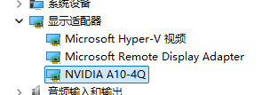

<br />


如果电脑已经识别出显卡，可以通过 NVIDIA GeForce Experience 或者在其它驱动管理工具更新到最新版本的驱动程序。

<br />

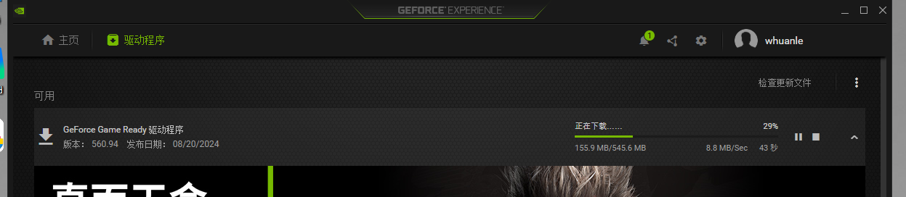

<br />

或者直接到官方驱动页面搜索显卡型号要安装的驱动程序，Nvida 官方驱动搜索下载页面：https://www.nvidia.cn/drivers/lookup/

<br />

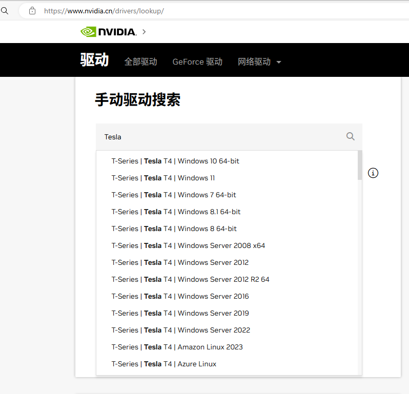

<br />

#### 对于 Tensor 系列显卡

例如在 Azure 等云平台创建 GPU 服务器后，如果显卡是 Tensor ，刚开机时可能识别不出显卡，需要先安装驱动之后才能显示显卡设备。

<br />

Windows 可参考该链接安装：https://learn.microsoft.com/zh-CN/azure/virtual-machines/windows/n-series-driver-setup

Linux 可参考该链接安装：https://learn.microsoft.com/zh-CN/azure/virtual-machines/linux/n-series-driver-setup

<br />

对于 Windows ，安装方法比较简单，只需要按照文档下载 GRID 程序安装包即可。

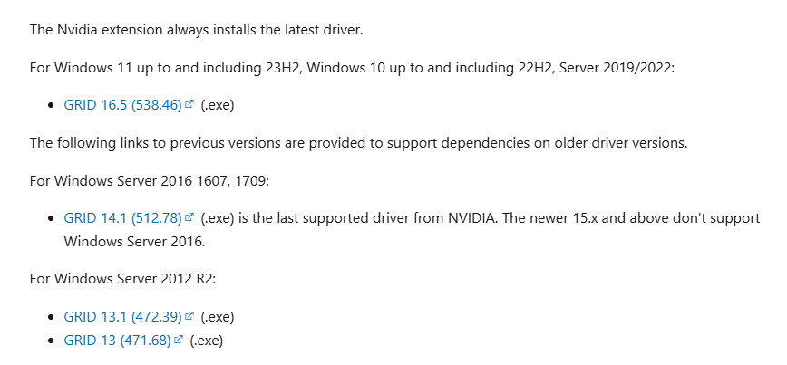

<br />

#### 对于 N 卡

对于 GeForce RTX 4060TI 、GeForce RTX 4070 等显卡，可以直接到官方下载驱动安装器：

https://www.nvidia.cn/geforce/drivers/

<br />

一般来说，家用主机的出厂时都会安装好的驱动的。

<br />

### 安装 CUDA 和 cuDNN

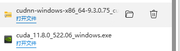

<br />

CUDA 是 NVIDIA 专为图形处理单元 (GPU) 上的通用计算开发的并行计算平台和编程模型。借助 CUDA，开发者能够利用 GPU 的强大性能显著加速计算应用。

简单来说 CUDA 就是支持 CPU 分发和 GPU 并行计算的编程模型，为了使用 CUDA ，需要安装开发工具包。

> CUDA 介绍：
>
> https://developer.nvidia.cn/cuda-zone
>
> https://developer.nvidia.com/zh-cn/blog/cuda-intro-cn/

<br />

CUDA 安装包下载地址：https://developer.nvidia.com/cuda-downloads

下打开安装包，根据提示操作安装即可，简洁安装会安装 C 盘，高级安装可以自定义安装位置，建议使用简洁安装，以免出现额外情况。

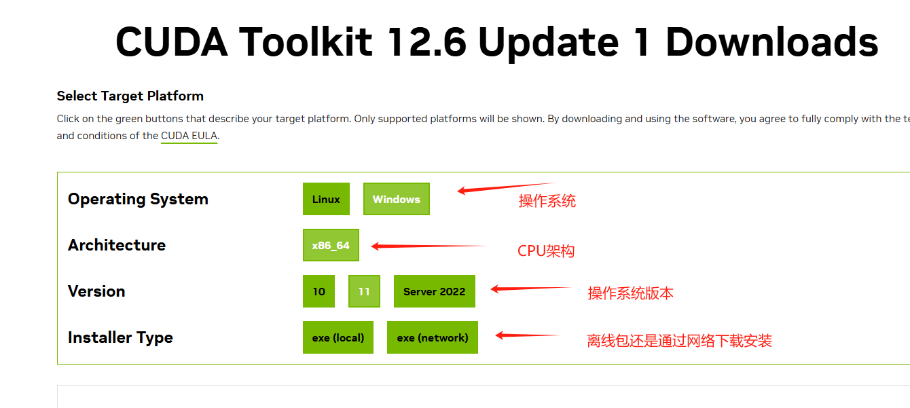

<br />

安装完成后，环境变量会多出两条记录：

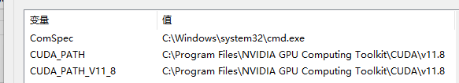

<br />

cuDNN 是基于 GPU 的深度学习加速库，下载文件后是一个压缩包。

下载地址：https://developer.nvidia.com/cudnn-downloads

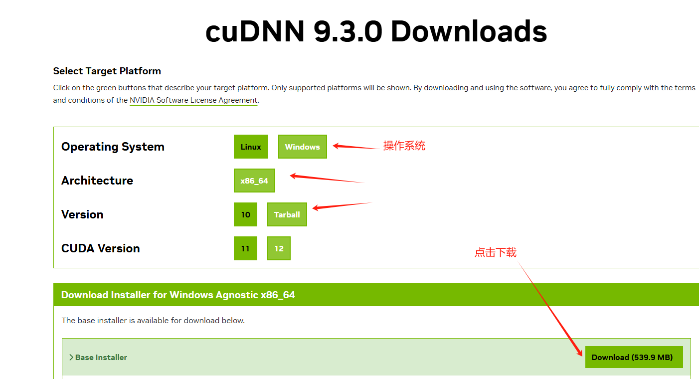

<br />

打开 `C:\Program Files\NVIDIA GPU Computing Toolkit\CUDA\`，找到版本目录，或者通过环境变量 `CUDA_PATH` 找到安装目录，将 cuDNN 压缩包的内容复制合并到 CUDA 目录。

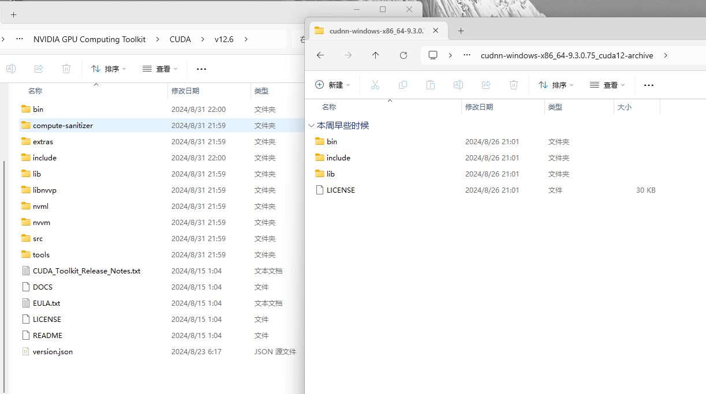

<br />

最后将 bin、lib、`lib\x64`、include、libnvvp 五个目录添加到环境变量 Path 中。

> 也不知道具体到底需要多少环境变量，加就是了。

<br />

### 安装 Miniconda

Miniconda 是一个 Python 包管理器，能够在系统中创建多个环境隔离的 Python 环境。

下载地址：https://docs.anaconda.com/miniconda/

<br />

下载完成后，搜索 miniconda3 快捷菜单，以管理员身份运行，点击可以打开控制台，菜单列表会有 cmd 和 powershell 两个快捷链接，建议使用 powershell 入口。

> 后续执行 conda 命令，都要使用管理员身份运行。

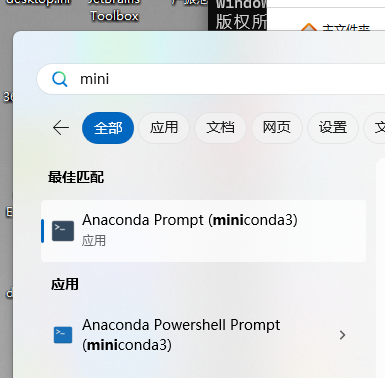

<br />

配置国内源加速下载：

```bash
conda config --add channels https://mirrors.tuna.tsinghua.edu.cn/anaconda/pkgs/free/
```

<br />

执行 `conda env list` 目录查看默认环境安装目录。

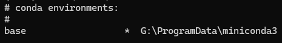

<br />

如果电脑已经安装过 Python 并且添加了环境变量，则不要将 `G:\ProgramData\miniconda3` 添加到环境变量中，因为这样会导致环境缭乱。

如果电脑还没有安装过 Python ，则可以直接将 `G:\ProgramData\miniconda3` 、`G:\ProgramData\miniconda3\Scripts` 添加到环境变量中。

<br />

笔者电脑卸载了手动安装的 Python，只使用 miniconda3 提供的环境。

<br />

如果 Python、pip 使用的是自行安装的，直接执行命令安装依赖包的时候，跟 miniconda3 环境是隔离的。如果需要在 miniconda3 环境安装依赖包，需要打开 miniconda3 控制台执行 pip 命令，这样安装的包才会出现在 miniconda3 环境中。

一个环境中安装依赖包后，不同的项目可以共用已下载的依赖包，不需要每个项目单独下载一次。

<br />

### 安装 PyTorch 和 Transformers

Flax、PyTorch 或 TensorFlow 都是深度学习框架，而 Transformers 底层可以使用 Flax、PyTorch 或 TensorFlow 深度学习框架，实现模型加载、训练等功能。

<br />

PyTorch 安装参考文档：https://pytorch.org/get-started/locally/

<br />

可以安装 GPU 版本(CUDA)或 CPU 版本，然后复制下方提示的安装命令。

.png)

<br />

```bash
conda install pytorch torchvision torchaudio pytorch-cuda=12.4 -c pytorch -c nvidia
```

<br />

然后还需要执行命令安装 Transformers 和一些依赖库。

```bash
pip install protobuf 'transformers>=4.30.2' cpm_kernels 'torch>=2.0' gradio mdtex2html sentencepiece accelerate
```

<br />

### 使用 Modelscope 下载加载模型

ModelScope 是阿里云主导的一个国内 AI 模型社区，提供了各类模型和数据集以及开发工具库，由于 huggingface 上手难度稍大以及国外网络原因，这里使用 Modelscope 下载和加载模型。

<br />

安装 modelscope：

```bash
pip install modelscope
```

<br />

### PyCharm 项目配置

PyCharm 是最常用的 Python 编程工具，因此这里讲解如何在 PyCharm 中配置 miniconda3 环境。

<br />

打开 PyCharm ，在设置中添加 miniconda3 的环境，步骤如图所示。

<br />

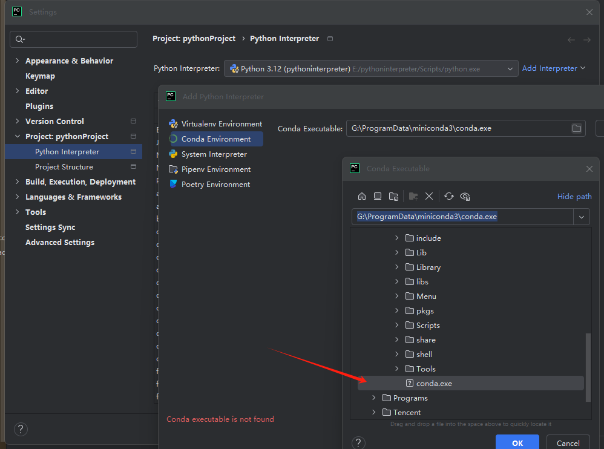

.png)

<br />

然后创建一个项目，在项目中选择基于 conda 的环境。

<br />

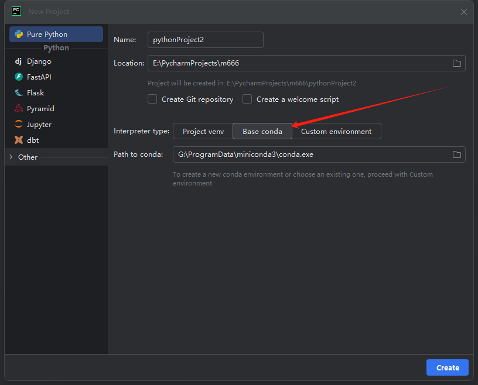

<br />

### 模型加载和对话

在项目目录下创建 main.py 文件。

<br />

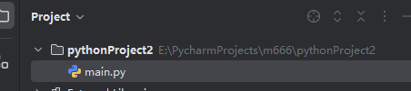

<br />

将以下代码贴到 main.py，然后运行代码，会自动下载模型、加载模型和对话。

<br />

```python
from modelscope import AutoTokenizer, AutoModel, snapshot_download

# 下载模型
# ZhipuAI/chatglm3-6b 模型仓库
# D:/modelscope 模型文件缓存存放目录
model_dir = snapshot_download("ZhipuAI/chatglm3-6b",cache_dir="D:/modelscope", revision="v1.0.0")

# 加载模型
# float 是 32，half 是16 位浮点数，内存可以减少一半
tokenizer = AutoTokenizer.from_pretrained(model_dir, trust_remote_code=True)
model = AutoModel.from_pretrained(model_dir, trust_remote_code=True).half().cuda()
model = model.eval()

# 开始对话
response, history = model.chat(tokenizer, "你好", history=[])
print(response)
response, history = model.chat(tokenizer, "晚上睡不着应该怎么办", history=history)
print(response)

```

<br />

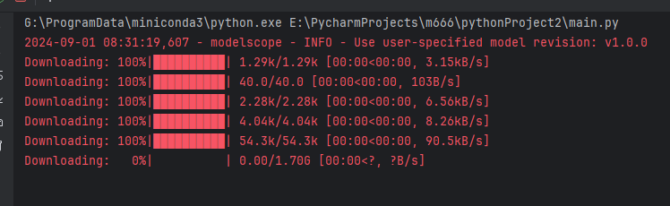

<br />

`"ZhipuAI/chatglm3-6b"` 指的是 `ZhipuAI` 仓库的 `chatglm3-6b` 模型，可以通过 ModelScope 查看社区已上传的各类模型：

https://www.modelscope.cn/models

<br />

`revision="v1.0.0"` 下载版本号跟仓库分支名称一致，可以填写不同分支名称下载不同的版本。

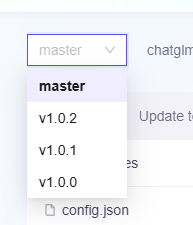

<br />

### CPU 和 GPU

如果出现以下报错，可能安装的是 CPU 而不是 GPU 版本的 PyTorch。

```
    raise AssertionError("Torch not compiled with CUDA enabled")
AssertionError: Torch not compiled with CUDA enabled
```

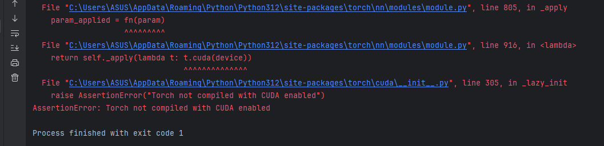

<br />

执行代码：

```python
import torch
print(torch.__version__)
```

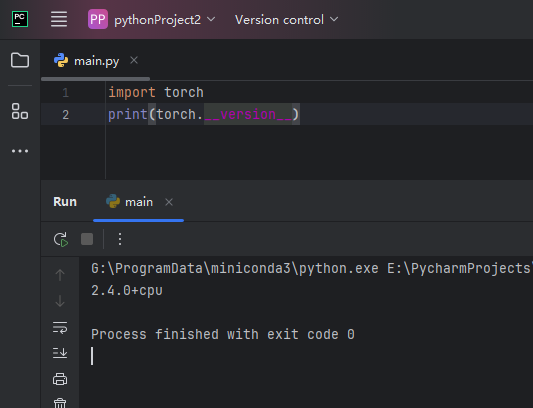

<br />

按经验，如果使用了 pip 安装相关库，而不是使用 conda 命令安装的，需要执行以下命令卸载 pytorch：

```bash
pip uninstall torch torchvision torchaudio
```

```bash
conda uninstall pytorch torchvision torchaudio pytorch-cuda=12.4 -c pytorch -c nvidia
```

<br />

然后执行命令重新安装 pytorch：

```bash
conda install pytorch torchvision torchaudio pytorch-cuda=12.4 -c pytorch -c nvidia
```

<br />

重新执行命令后即可正常：

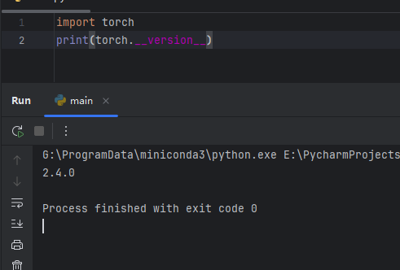

<br />

### transformers 版本错误

由于安装各类库的时候都是安装最新版本安装的，可能有部分库不兼容，执行到以下代码行时，抛出错误。

```python
response, history = model.chat(tokenizer, "你好", history=[])
```

<br />

首先出现以下警告，然后出现报错：

```bash
1Torch was not compiled with flash attention. (Triggered internally at C:\cb\pytorch_1000000000000\work\aten\src\ATen\native\transformers\cuda\sdp_utils.cpp:555.)
  context_layer = torch.nn.functional.scaled_dot_product_attention(query_layer, key_layer, value_layer,
```

<br />

需要将 transformers 版本较级。

```bash
pip install transformers==4.41.2
```

<br />

经历各种曲折，最后终于成功了：

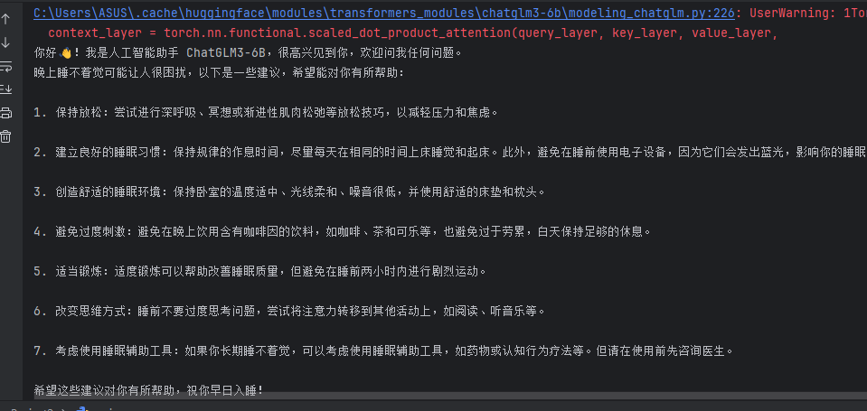

<br />

### Csharp 环境

首先引入 TorchSharp 包，这个是 API 核心包，官方仓库地址：https://github.com/dotnet/TorchSharp。

TorchSharp 并不是通过 ironpython 的方式调用 Python 接口，因为 Pytorch 是建立在大量 C++ 代码上的，Python 只是其中一种前端接口方式，官方还推出了一个使用纯 C++ 11 的接口方式，TorchSharp 是使用 C# 对 C++ 的封装，因此性能上也非常可靠，使用上也比较简单，**不需要依赖 Python 环境**。

如果你对 C++ 版本接口有兴趣，请参考：https://pytorch.org/tutorials/advanced/cpp_frontend.html

<br />

由于 TorchSharp 包只是对 C++ 接口的封装，还需要对应环境的 Torch 驱动才能使用，以下三个按需引入即可。

如果只使用 CPU 不需要 GPU，则使用 TorchSharp-cpu 包，跨平台可用，如果使用 GPU 包，则需要注意安装对应系统的包。

<br />

- [TorchSharp-cpu](https://www.nuget.org/packages/TorchSharp-cpu) (CPU, Linux/Windows/OSX)
- [TorchSharp-cuda-windows](https://www.nuget.org/packages/TorchSharp-cuda-windows) (CPU/CUDA 12.1, Windows)
- [TorchSharp-cuda-linux](https://www.nuget.org/packages/TorchSharp-cuda-linux) (CPU/CUDA 12.1, Linux)


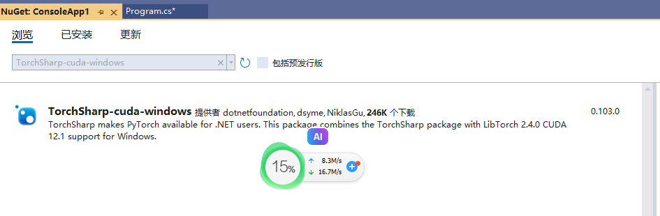

<br />

点击确定安装时，由于需要下载大量的文件，因此安装时间比较长，需要耐心等待。

<br />

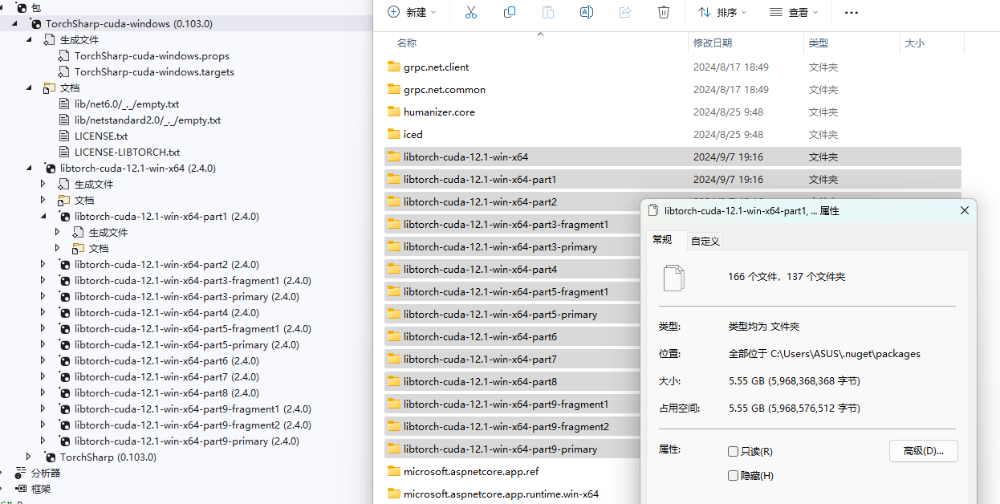

<br />

此外，推荐安装 Maomi.Torch 包，里面包含了一些常用的扩展方法。
