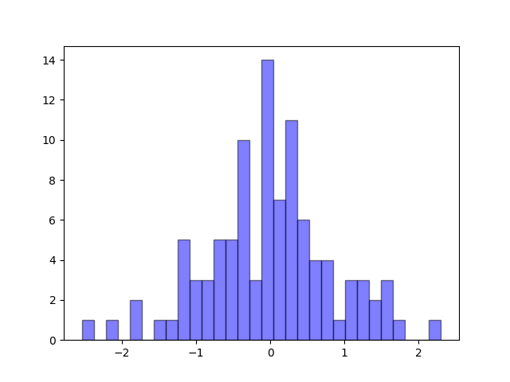
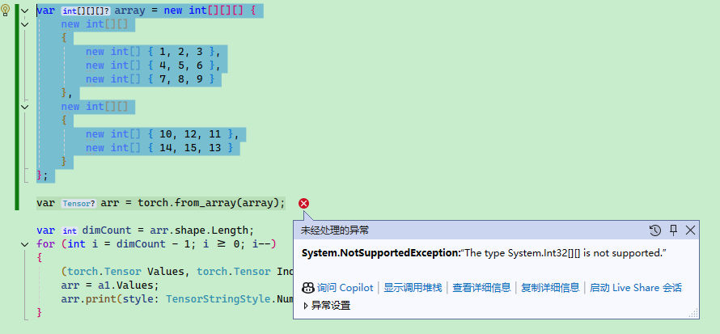

# 1.2 Pytorch 基础


本文内容介绍 Pytorcn 的基础 API，主要是数组的创建方式和运算方式，由于相关内容跟 Numpy 比较相似，并且 Numpy 类型可以转 torch.Tensor，因此对 Numpy 感兴趣的读者可以参考笔者的其它文章：

* Python 之 Numpy 框架入门

> https://www.whuanle.cn/archives/21461
>
> https://www.cnblogs.com/whuanle/p/17855578.html

<br />


提示：学习本文时，如果对线性代数有足够的了解，则学习效果更佳，没有线性代数基础也没关系，后面会学习到。


### 基础使用

由于神经网络中的数值很多以向量或数组等形式存在，不像日常编程中的数值类型那么简单，因此打印数值信息是我们学习了解或调试程序的一种手段，下面我们来观察程序是怎么打印 Pytorch 中复杂数据类型的。

<br />

#### 打印

下面使用 Pytorch 创建一个从 0..9 的数组，接着打印数组。

Python：

```python
import torch
x = torch.arange(10)
print(x)
```

```bash
tensor([0, 1, 2, 3, 4, 5, 6, 7, 8, 9])
```

<br />

C#：

```csharp
using TorchSharp;

var x = torch.arange(10);
x.print(style:TensorStringStyle.Default);
x.print(style:TensorStringStyle.Numpy);
x.print(style:TensorStringStyle.Metadata);
x.print(style:TensorStringStyle.Julia);
x.print(style:TensorStringStyle.CSharp);
```

```bash
[10], type = Int64, device = cpu 0 1 2 3 4 5 6 7 8 9
[0, 1, 2, ... 7, 8, 9]
[10], type = Int64, device = cpu
[10], type = Int64, device = cpu 0 1 2 3 4 5 6 7 8 9
[10], type = Int64, device = cpu, value = long [] {0L, 1L, 2L, ... 7L, 8L, 9L}
```

<br />

Python 打印的结果比较容易理解，C# 默认打印的方式比较难看，所以一般来说，可视化都使用 `TensorStringStyle.Numpy` 枚举。

C# 打印数值时，参数有个 `string? fltFormat = "g5"`，表示精确度的意思，即打印的小数位数。

对于后面的章节来说，默认都引入 Python 的 torch 包名称、C# 的 TorchSharp 命名空间，后续代码示例可能会省略引入代码，读者自行引入。

<br />


#### 基本数据类型

Pytorch 的数据类型跟我们编程语言中的基本类型不太一样，读者要注意区别。

具体详细的官方文档参考链接：

[https://pytorch.org/docs/stable/tensor_attributes.html](https://pytorch.org/docs/stable/tensor_attributes.html)

[https://pytorch.ac.cn/docs/stable/tensor_attributes.html](https://pytorch.ac.cn/docs/stable/tensor_attributes.html)


Pytorch 创建的数据类型以 `torch.Tensor` 表示，`torch.Tensor` 是用来处理机器学习模型中的各种数据的基础结构，包括标量、向量、矩阵以及更高维度的张量。**如果笔者没理解错的话，在 Pytorch 中创建的 Tensor 对象就叫张量。开发者可以通过各种形式的数据在 Pytorch 创建 Tensor**。

> Pytorch 创建的数据类型，都使用 Tensor 对象表示。
>
> 对于这句话的理解，建议看完本文再回头看看。


PyTorch 有十二种不同的数据类型，列表如下：

| 数据类型            | dtype                                 |
| ------------------- | ------------------------------------- |
| 32 位浮点数         | `torch.float32` 或 `torch.float`      |
| 64 位浮点数         | `torch.float64` 或 `torch.double`     |
| 64 位复数           | `torch.complex64` 或 `torch.cfloat`   |
| 128 位复数          | `torch.complex128` 或 `torch.cdouble` |
| 16 位浮点数         | `torch.float16` 或 `torch.half`       |
| 16 位浮点数         | `torch.bfloat16`                      |
| 8 位整数（无符号）  | `torch.uint8`                         |
| 8 位整数（有符号）  | `torch.int8`                          |
| 16 位整数（有符号） | `torch.int16` 或 `torch.short`        |
| 32 位整数（有符号） | `torch.int32` 或 `torch.int`          |
| 64 位整数（有符号） | `torch.int64` 或 `torch.long`         |
| 布尔值              | `torch.bool`                          |

<br />

下面在创建数组时，设置数组的类型。

Python：

```python
float_tensor = torch.ones(1, dtype=torch.float)
double_tensor = torch.ones(1, dtype=torch.double)
complex_float_tensor = torch.ones(1, dtype=torch.complex64)
complex_double_tensor = torch.ones(1, dtype=torch.complex128)
int_tensor = torch.ones(1, dtype=torch.int)
long_tensor = torch.ones(1, dtype=torch.long)
uint_tensor = torch.ones(1, dtype=torch.uint8)
```

<br />

C#：

```csharp
var float_tensor = torch.ones(1, dtype: torch.float32);
var double_tensor = torch.ones(1, dtype: torch.float64);
var complex_float_tensor = torch.ones(1, dtype: torch.complex64);
var complex_double_tensor = torch.ones(1, dtype: torch.complex128);
var int_tensor = torch.ones(1, dtype: torch.int32); ;
var long_tensor = torch.ones(1, dtype: torch.int64);
var uint_tensor = torch.ones(1, dtype: torch.uint8);
```

<br />


在 C# 中， torch.ScalarType 枚举表示 Pytorch 的数据类型，所以可以有以下两种方式指定数据类型。

例如：

```csharp
var arr = torch.zeros(3,3,3, torch.ScalarType.Float32);
arr.print(style: TensorStringStyle.Numpy); 
```

或：

```csharp
var arr = torch.zeros(3,3,3, torch.float32);
arr.print(style: TensorStringStyle.Numpy); 
```


#### CPU 或 GPU 运算

我们知道，AI 模型可以在 CPU 下运行，也可以在 GPU 下运行，Pytorch 的数据也可以这样做，在创建数据类型时就设置绑定的设备，在运算使用会使用对应的设备进行运算。

> 一般使用 `cpu` 表示 CPU，使用 `cuda` 或 `cuda:{显卡序号}` 表示 GPU。


下面编写代码判断 Pytorch 正在使用 GPU 还是 CPU 运行。

<br />

Python：

```python
print(torch.get_default_device())
```

<br />

C#：

```csharp
 Console.WriteLine(torch.get_default_device())
```

<br />

如果当前设备支持 GPU，则使用 GPU 启动 Pytorch，否则使用 CPU 启动 Pytorch。可以通过 `torch.device('cuda')`、`torch.device('cuda:0')` 指定使用 GPU 、指定使用哪个 GPU。

<br />

Python：

```python
if torch.cuda.is_available():
    print("当前设备支持 GPU")
    device = torch.device('cuda')
    # 使用 GPU 启动
    torch.set_default_device(device)
    current_device = torch.cuda.current_device()
    print(f"绑定的 GPU 为：{current_device}")
else:
    # 不支持 GPU，使用 CPU 启动
    device = torch.device('cpu')
    torch.set_default_device(device)

default_device = torch.get_default_device()
print(f"当前正在使用 {default_device}")
```

<br />

C#：

```csharp
if (torch.cuda.is_available())
{
    Console.WriteLine("当前设备支持 GPU");
    var device = torch.device("cuda",index:0);
    // 使用 GPU 启动
    torch.set_default_device(device);
}
else
{
    var device = torch.device("cpu");
    // 使用 CPU 启动
    torch.set_default_device(device);
    Console.WriteLine("当前正在使用 CPU");
}

var default_device = torch.get_default_device();
Console.WriteLine($"当前正在使用 {default_device}");
```

> C# 没有 `torch.cuda.current_device()` 这个方法，建议默认设置使用哪块 GPU，即设置 index 参数。

<br />

另外可以通过使用 `torch.cuda.device_count()` 获取设备有多少个显卡，这里不再赘述。

<br />

Pytorch 还支持针对单独的数据类型设置使用 CPU 还是 GPU，还可以让两者混合运算，这里不再赘述。

<br />


#### Tensor

```
x = torch.tensor(3.0);
```


#### 基本数组

Pytorch 使用 `asarray()` 函数将 obj 值转换为数组，其定义如下：

```python
torch.asarray(obj, *, dtype=None, device=None, copy=None, requires_grad=False) → Tensor
```

> 官方 API 文档：[torch.asarray — PyTorch 2.5 documentation](https://pytorch.org/docs/stable/generated/torch.asarray.html#torch-asarray)


`obj` 可以是以下之一：

* a tensor（张量）
* a NumPy array or a NumPy scalar（NumPy 数组或 NumPy 标量）
* a DLPack capsule
* an object that implements Python’s buffer protocol
* a scalar（标量）
* a sequence of scalars（标量序列）

> 我不会的或者文章用不到的，就不翻译了。

<br />

比如说，传入一个平常的数组类型，转换成 Pytorch 中的数组类型。


Python：

```python
arr = torch.asarray([1,2,3,4,5,6], dtype=torch.float)
print(arr)
```

<br />

C#：

```csharp
var arr = torch.from_array(new float[] { 1, 2, 3, 4, 5 });
arr.print(style: TensorStringStyle.Numpy);
```


请注意，两种语言的版本差异有些大。

前面提到过，可以给单独的数据类型设置使用 CPU 还是 GPU。

```python
device = torch.device("cuda",index=0)
arr = torch.asarray(obj=[1,2,3,4,5,6], dtype=torch.float, device=device)
print(arr)
```


将数据类型转换为使用 CPU 设备：

```python
device = torch.device("cuda",index=0)
arr = torch.asarray(obj=[1,2,3,4,5,6], dtype=torch.float, device=device)
arr = arr.cpu()
print(arr)
```


### 生成数组

#### torch.zeros

用于创建一个元素全为 0 的数组，可以指定数组大小，其定义如下：

```python
torch.zeros(*size, *, out=None, dtype=None, layout=torch.strided, device=None, requires_grad=False) → Tensor
```


Python：

```python
arr = torch.zeros(10, dtype=torch.float)
print(arr)
```


C#：

```python
var arr = torch.zeros(10);
arr.print(style: TensorStringStyle.Numpy);
```


另外，可以指定生成的数组维度，例如下面指定生成 `2*3` 的多维数组。

```csharp
var arr = torch.zeros(2,3, torch.float32);
arr.print(style: TensorStringStyle.Numpy); 
```

> 代码为 C# 语言。


打印：

```bash
[[0, 0, 0] [0, 0, 0]]
```


我们还可以生成多种维度的数组，例如下面生成一个 `3*3*3` 的数组：

```csharp
var arr = torch.zeros(3,3,3, torch.float32);
arr.print(style: TensorStringStyle.Numpy); 
```


为了方便理解，下面将打印结果做了格式化处理。

```bash
[
[[0, 0, 0]  [0, 0, 0]  [0, 0, 0]]
[[0, 0, 0]  [0, 0, 0]  [0, 0, 0]]
[[0, 0, 0]  [0, 0, 0]  [0, 0, 0]]
]
```


#### torch.ones

创建一个全由 1 填充的数组，使用方法跟 torch.zeros 完全一致，因此这里不再赘述。


#### torch.empty

创建一个未初始化的数组，使用方法跟 torch.zeros 完全一致，因此这里不再赘述。

由于其没有初始化内存，因此内存区域会残留数据，元素的值不确定。


#### 复制函数

此外，上面三个函数还有对应的原型复制函数：

```python
torch.ones_like(input, *, dtype=None, layout=None, device=None, requires_grad=False, memory_format=torch.preserve_format) → Tensor
```

```python
torch.zeros_like(input, *, dtype=None, layout=None, device=None, requires_grad=False, memory_format=torch.preserve_format) → Tensor
```

```python
torch.empty_like(input, *, dtype=None, layout=None, device=None, requires_grad=False, memory_format=torch.preserve_format) → Tensor
```


它们的作用是根据数组类型，拷贝一个相同的结构，然后填充对应值。

如下示例，复制数组相同的结构，但是填充的值为 1。

```csharp
var arr = torch.ones_like(torch.zeros(3, 3, 3));
arr.print(style: TensorStringStyle.Numpy);
```

> 该代码语言为 C#。

```bash
[
[[1, 1, 1]  [1, 1, 1]  [1, 1, 1]]
[[1, 1, 1]  [1, 1, 1]  [1, 1, 1]]
[[1, 1, 1]  [1, 1, 1]  [1, 1, 1]]
]
```


#### torch.rand

torch.rand 会生成一个张量，数组会填充来自 `[0,1)` 区间上的均匀分布的随机数。

函数定义如下：

```python
torch.rand(*size, *, generator=None, out=None, dtype=None, layout=torch.strided, device=None, requires_grad=False, pin_memory=False) → Tensor
```


例如生成 `2*3` 大小的，范围在 `[0,1)` 区间的随机数，使用 C# 编写代码：
```csharp
var arr = torch.rand(2,3);
arr.print(style: TensorStringStyle.Numpy);
```

```
[[0.60446, 0.058962, 0.65601] [0.58197, 0.76914, 0.16542]]
```


由于 C# 绘制图形的库不像 Python matplotlib 简单易用，因此下面使用 Python 编写代码绘制均匀分布的随机数。

```python
import torch
import matplotlib.pyplot as plt

arr = torch.rand(100, dtype=torch.float)

print(arr)

x = arr.numpy()
y = x
plt.scatter(x,y)
plt.show()
```

```csharp
using Maomi.Torch;
using Maomi.Plot;
using TorchSharp;

var x = torch.rand(100);

x.print(style: TensorStringStyle.Numpy);

ScottPlot.Plot myPlot = new();
myPlot.Add.Scatter(x, x);
var form = myPlot.Show(400, 300);
```


由图可知，生成的随机数是均匀散布在 `[0,1)` 区间内。


#### torch.randn

生成具有给定形状的标准正态分布（平均值为0，方差为1）的随机样本。随机样本取值范围是[0,1)。

定义如下：

```
torch.randn(*size, *, generator=None, out=None, dtype=None, layout=torch.strided, device=None, requires_grad=False, pin_memory=False) → Tensor
```

> 官方文档：https://pytorch.ac.cn/docs/stable/generated/torch.randn.html#torch.rand


由于 C# 不好绘图，这里使用 Python 编写示例：

```python
import torch
import matplotlib.pyplot as plt

arr = torch.randn(100, dtype=torch.float)

print(arr)

x = arr.numpy()
y = x
plt.hist(x, bins=30, alpha=0.5, color='b', edgecolor='black')

plt.show()
```



> x 坐标轴是数值，y 坐标轴是出现次数。


#### torch.randint

在某个区间内生成随机数。

定义如下：

```python
torch.randint(low=0, high, size, \*, generator=None, out=None, dtype=None, layout=torch.strided, device=None, requires_grad=False) → Tensor
```


比如在 0-100 范围内生成 10 个元素，安装 `5*2` 结构组成，使用 C# 代码编写。

```csharp
var arr = torch.randint(low: 0, high: 100, size: new int[] { 5, 2 });
arr.print(style: TensorStringStyle.Numpy);
```

```bash
[[17, 46] [89, 52] [10, 89] [80, 91] [52, 91]]
```


如果要生成某个区间的浮点数，则可以使用 `torch.rand` ，但是因为 `torch.rand`  生成范围是 `[0,1)`，因此需要自行乘以倍数。例如要生成 `[0,100)` 的随机数。

```csharp
var arr = torch.rand(size: 100, dtype: torch.ScalarType.Float32) * 100;
arr.print(style: TensorStringStyle.Numpy);  
```


#### torch.arange

指定区间以及步长，均匀提取元素生成数组。

定义如下：

```python
torch.arange(start=0, end, step=1, *, out=None, dtype=None, layout=torch.strided, device=None, requires_grad=False) → Tensor
```


比如说，需要生成 `[0,1,2,3,4,5,6,7,8,9]` 这样的数组，可以使用：

```csharp
var arr = torch.arange(start: 0, stop: 10, step: 1);
arr.print(style: TensorStringStyle.Numpy);
```


如果将步长改成 0.5。

```csharp
var arr = torch.arange(start: 0, stop: 10, step: 0.5);
```

```
[0.0000, 0.5000, 1.0000, 1.5000, 2.0000, 2.5000, 3.0000, 3.5000, 4.0000,
        4.5000, 5.0000, 5.5000, 6.0000, 6.5000, 7.0000, 7.5000, 8.0000, 8.5000,
        9.0000, 9.5000]
```


### 数组操作和计算


#### **轴**

在 Pytorch 中，往往使用 dim(dimension) 参数表示轴，轴就是张量的层数。

有以下数组：

```csharp
[[ 1, 2, 3 ], { 4, 5, 6 ]]
```

如果把 `a = [1,2,3]`，`b = [4,5,6]`，则：

```
[a,b]
```


那么当我们要获取 `a` 时，`dim(a) = 0`，`dim(b) = 1`。

 ```csharp
 var arr = torch.from_array(new[,] { { 1, 2, 3 }, { 4, 5, 6 } });
 
 arr.print(style: TensorStringStyle.Numpy);
 
 // 打印维度
 arr.shape.print();
 
 var a = arr[0];
 a.print();
 var b = arr[1];
 b.print();
 ```

```bash
[[1, 2, 3] [4, 5, 6]]
[2, 3]
[3], type = Int32, device = cpu 1 2 3
[3], type = Int32, device = cpu 4 5 6
```


这里我们分两步理解，由于该数组是 `2*3` 数组，可以使用 `.shape.print()` 打印出来。

由于第一层有两个元素，因此可以使用 `Tensor[i]` 获取第一层的第 i 个元素，其中 `i<2`。

同理，由于 a、b 的下一层都有 3 个元素，因此第二层 `n<3`。


例如要将数组的 `3`、`6` 两个元素取出来。

用 C# 可以这样写，但是打印的时候不能选 TensorStringStyle.Numpy ，否则打印不出来。

```csharp
var arr = torch.from_array(new[,] { { 1, 2, 3 }, { 4, 5, 6 } });

var a = arr[0, 2];
a.print(style: TensorStringStyle.CSharp);
var b = arr[1, 2];
b.print(style: TensorStringStyle.CSharp);
```


同理，如果数组有三层，可以这样获取 `3`、`6` 两个元素

```csharp
var arr = torch.from_array(new[, ,] { { { 1, 2, 3 } }, { { 4, 5, 6 } } });

var a = arr[0, 0, 2];
a.print(style: TensorStringStyle.CSharp);
var b = arr[1, 0, 2];
b.print(style: TensorStringStyle.CSharp);
```


如果要取出一部分元素，TorchCsharp 可以使用 `a[i..j]` 的语法截取，示例如下。

```csharp
var arr = torch.from_array(new int[] { 1, 2, 3 });
arr = arr[0..2];
arr.print(style: TensorStringStyle.Numpy);
```

```bash
[1, 2]
```


#### 数组排序

Pytorch 中有一些排序函数：

**sort** ：沿给定维度按值升序对 `input` 张量的元素进行排序。

**argsort**：它是沿指定轴的间接排序，本文不讲解。

**msort**：按值对 `input` 张量沿其第一维以升序排序。`torch.msort(t)` 等效于 `torch.sort(t, dim=0)`。


`sort` 可以降序或升序，参数说明如下：

```
torch.sort(input, dim=-1, descending=False, stable=False, *, out=None)
```

- **input** (张量) – 输入张量。
- **dim** (int,可选) – 要排序的维度
- **descending** (bool,可选) – 控制排序顺序（升序或降序）
- **stable** (boo,可选) – 使排序例程稳定，从而保证等效元素的顺序得以保留。


示例：

```csharp
var arr = torch.arange(start: 0, stop: 10, step: 1);

// 或者使用 torch.sort(arr, descending: true)
(torch.Tensor Values, torch.Tensor Indices) a1 = arr.sort(descending: true);

a1.Values.print(style: TensorStringStyle.Numpy);
```

```bash
[9, 8, 7, ... 2, 1, 0]
```


Values 是排序后的结果，Indices 是排序的规则。


如果数组结构比较复杂，默认不设置参数时，只有最内层数组进行排序。如下代码所示，有两层数组。

```csharp
var arr = torch.from_array(new[,] { { 4, 6, 5 }, { 8, 9, 7 }, { 3, 2, 1 } });

(torch.Tensor Values, torch.Tensor Indices) a1 = arr.sort();

a1.Values.print(style: TensorStringStyle.Numpy);
a1.Indices.print(style: TensorStringStyle.Numpy);
```

```
[[4, 5, 6] [7, 8, 9] [1, 2, 3]]
[[0, 2, 1] [2, 0, 1] [2, 1, 0]]
```

Indices 会记录当前元素在以前的排序位置。


当设置 `arr.sort(dim: 0);` 时，按照第一层排序。

```
[[3, 2, 1] [4, 6, 5] [8, 9, 7]]
[[2, 2, 2] [0, 0, 0] [1, 1, 1]]
```


当设置 `arr.sort(dim: 1);` 时，只有里面一层排序。

```
[[4, 5, 6] [7, 8, 9] [1, 2, 3]]
[[0, 2, 1] [2, 0, 1] [2, 1, 0]]
```


当一个张量的维度比较大时，我们可以这样逐层排序。

```csharp
var arr = torch.from_array(new[, ,] { { { 4, 6, 5 }, { 8, 9, 7 }, { 3, 2, 1 } } });

var dimCount = arr.shape.Length;
for (int i = dimCount - 1; i >= 0; i--)
{
    (torch.Tensor Values, torch.Tensor Indices) a1 = arr.sort(dim: i);
    arr = a1.Values;
    arr.print(style: TensorStringStyle.Numpy);
}
```

```
[[[1, 2, 3]  [4, 5, 6]  [7, 8, 9]]]
```


C# 多维数组没有 Python 那么方便，会要求每一层的元素个数必须一致。

例如下面的数组声明是对的：

```csharp
var array = new int[, , ]
{
    {
        { 10, 12, 11},{ 14, 15, 11 }
    },
    {
        { 4, 6, 5 }, { 8, 9, 7 }
    }
};
```


如果层数元素个数不一致会报错：


另外要注意，C# 有多维数组和交错数组，下面是交错数组的声明方式，TorchSharp 并不支持。

```csharp
var array = new int[][][]
{
    new int[][]
    {
        new int[] { 1, 2, 3 },
        new int[] { 4, 5, 6 },
        new int[] { 7, 8, 9 }
    },
    new int[][]
    {
        new int[] { 10, 12, 11 },
        new int[] { 14, 15, 13 }
    }
};
```




#### 数组运算符

在 PyTorch 中，张量支持许多运算符，下面列举部分加以说明：


**算术运算符**

- `+`：加法，如 `a + b`
- `-`：减法，如 `a - b`
- `*`：元素级乘法，如 `a * b`
- `/`：元素级除法，如 `a / b`
- `//`：元素级整除，如 `a // b` ，TorchCsharp 不支持。
- `%`：取模运算，如 `a % b`
- `**`：幂运算，如 `a ** b`，TorchCsharp 不支持，使用 `.pow(x)` 代替。


**逻辑运算符**

- `==`：元素级相等比较，如 `a == b`
- `!=`：元素级不等于比较，如 `a != b`
- `>`：元素级大于比较，如 `a > b`
- `<`：元素级小于比较，如 `a < b`
- `>=`：元素级大于等于比较，如 `a >= b`
- `<=`：元素级小于等于比较，如 `a <= b`


**位运算符**

- `&`：按位与运算，如 `a & b`
- `|`：按位或运算，如 `a | b`
- `^`：按位异或运算，如 `a ^ b`
- `~`：按位取反运算，如 `~a`
- `<<`：按位左移，如 `a << b`
- `>>`：按位右移，如 `a >> b`


**索引和切片**

- `[i]`：索引运算符，如 `a[i]`
- `[i:j]`：切片运算符，如 `a[i:j]` ，TorchCsharp 使用 `a[i..j]` 语法。
- `[i, j]`：多维索引运算符，如 `a[i, j]`


例如张量每个元素的值 `*10`。

```csharp
var arr = torch.from_array(new int[] { 1, 2, 3 });
arr = arr * 10;
arr.print(style: TensorStringStyle.Numpy);
```

```
[10, 20, 30]
```


此外，还有 Pytorch 还很多函数，后面的章节中会逐渐学习。
