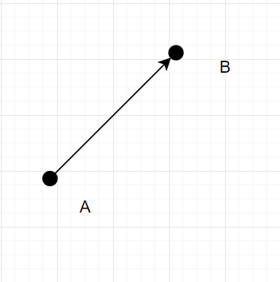
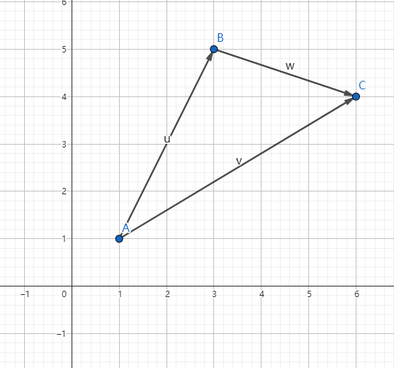
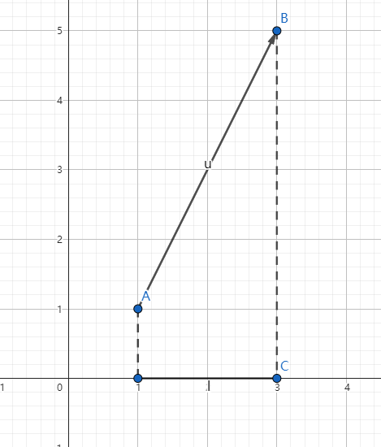
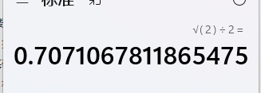
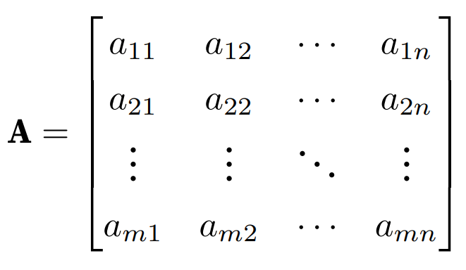
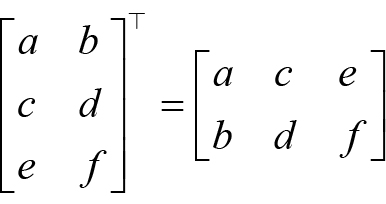

# 线性代数


### 推荐书籍

大家都知道学习 Pytorch 或 AI 需要一定的数学基础，当然也不需要太高，只需要掌握一些基础知识和求解方法，常见需要的数学基础有线性代数、微积分、概率论等，由于高等数学课程里面同时包含了线性代数和微积分的知识，因此读者只需要学习高等数学、概率论两门课程即可。数学不用看得太深，这样太花时间了，能理解意思就行。

 <br />

首先推荐以下两本书，无论是否已经忘记了初高中数学知识，对于数学基础薄弱的读者来说，都可以看。

* 《普林斯顿微积分读本》

* 《普林斯顿概率论读本》

<br />

国内的书主要是一些教材，学习难度会大一些，不过完整看完可以提升数学水平，例如同济大学出版的《高等数学》上下册、《概率论与数理统计》，不过国内的这些教材主要为了刷题解题、考研考试，可能不太适合读者，而且学习起来的时间也太长了。

<br />
接着是推荐《深度学习中的数学》，作者是涌井良幸和涌井贞美，对于入门的读者来说上手难度也大一些，不那么容易看得进去，读者可以在看完本文之后再去阅读这本经典书，相信会更加容易读懂。
<br />

另外，千万不要用微信读书这些工具看数学书，排版乱七八糟的，数学公式是各种抠图，数学符号也是用图片拼凑的，再比如公式里面中文英文符号都不分。

建议直接买实体书，容易深度思考，数学要多答题解题才行。就算买来吃灰，放在书架也可以装逼呀。买吧。

 <br />

本文虽然不要求读者数学基础，但是还是需要知道一些数学符号的，例如求和∑ 、集合交并∩∪等，这些在本文中不会再赘述，读者不理解的时候需要自行搜索资料。

 <br />

## 基础知识

### 标量、向量、矩阵

笔者只能给出大体的概念，至于数学上的具体定义，这里就不展开了。

标量(scalar)：只有大小没有方向的数值，例如体重、身高。

向量(vector)：既有大小也有方向的数值，可以用行或列来表示。

矩阵(matrix)：由多行多列的向量组成。

张量(Tensor)：在 Pytorch 中，torch.Tensor 类型数据结构就是张量，结构跟数组或矩阵相似。

<br />

- Tensor：是PyTorch中的基本数据类型，可以理解为多维数组。 Tensor可以用来表示数据集、模型参数和模型输出等。
- Scalar：是一个特殊类型的Tensor，只有一维。 Scalar用来表示标量值，如学习率、损失值等。
- Vector：是一个特殊类型的Tensor，有一维或两维。 Vector用来表示向量值，如梯度、特征值等。
- Matrix：是一个特殊类型的Tensor，有两维。 Matrix用来表示矩阵值，如权重矩阵、输出矩阵等。

<br />

比如说 1.0、2 这些都是标量，在各种编程语言中都以基础数据类型提供了支持，例如 C# 的基元类型。

<br />

下面将标量转换为 torch.Tensor 类型。

```csharp
var x = torch.tensor(1.0);
var y = torch.tensor(2);

x.print_csharp();
y.print_csharp();
```

```bash
[], type = Float64, device = cpu, value = 1
[], type = Int32, device = cpu, value = 2
```

<br />

将数组转换为 torch.Tensor 类型：

```csharp
var data = new int[ , ]{ {1, 2}, { 3, 4}};
var x_data = torch.tensor(data);

x_data.print_csharp();
```

<br />

由于上一章已经讲解了很多数组的创建方式，因此这里不再赘述。

<br />

### Pytorch 的一些数学函数

Pytorch 通过 torch.Tensor 表示各种数据类型，torch.Tensor 提供超过 100 多种的张量操作，例如算术运算、线性代数、矩阵操作、采样等。

由于篇幅有限，这里就不单独给出，读者请自行参考以下资料：

https://pytorch.org/docs/stable/torch.html

https://pytorch.ac.cn/docs/stable/torch.html

<br />


## 线性代数

<br />

### 向量

#### 向量的概念

在研究力学、物理学等工程应用领域中会碰到两类的量，一类完全由**数值的大小**决定，例如温度、时间、面积、体积、密度、质量等，称为**数量**或**标量**，另一类的量，**只知道数值的大小还不能完全确定所描述量**，例如加速度、速度等，这些量除了大小还有方向，称为向量。

<br />

在平面坐标轴上有两点 $A(x_{1},y_{1})$、$B(x_{2},y_{2})$，以 A 为起点 、B 为终点的线段被称为被称为有向线段，其既有大小也有方向，使用 $\overrightarrow{AB} $ 表示，使用坐标表示为 $(x_{2}-x_{1},y_{2}-y_{1})$，如果不强调方向，也可以使用 $\alpha $ 等符号进行简记。



<br />

A、B 之间的距离称为向量的模，使用 | $\overrightarrow{AB} $ | 或 | $\overrightarrow{BA} $ | 或 | $\alpha $ | 表示。

平面中的向量，其距离公式是：

$$
| \overrightarrow{AB} | = \sqrt{(x_{2}-x_{1})^{2} + (y_{2}-y_{1})^2}
$$
<br />其实原理也很简单，根据勾股定理，AB 的平方等于两个直角边长平方之和，所以：
$$
| \overrightarrow{AB} | ^2 = (x_{2}-x_{1})^{2} + (y_{2}-y_{1})^2
$$
<br />


<br />

去平方就是：
$$
| \overrightarrow{AB} | = \sqrt{(x_{2}-x_{1})^{2} + (y_{2}-y_{1})^2}
$$

<br />


如下图所示，其两点间的距离：

$$
 | \overrightarrow{AB}  | = \sqrt{(4-1)^{2} + (4-1)^2} = \sqrt{18} = 3\sqrt{2} = 4.242640687119285
$$

<br />


<br />

使用 C# 计算向量的模，结果如下

```csharp
var A = torch.from_array(new[] { 1.0, 1.0 });
var B = torch.from_array(new[] { 4.0, 4.0 });
var a = B - A;

var norm = torch.norm(a);
norm.print_csharp();
```

```
[], type = Float64, device = cpu, value = 4.2426
```

> 注意，计算向量的模只能使用浮点型数据，不能使用 int、long 这些整型。

<br />

同理，对于三维空间中的两点 $A(x_{1},y_{1},z_{1})$、$B(x_{2},y_{2},z_{2})$ ，距离公式是：

$$
| \overrightarrow{AB} | = \sqrt{(x_{2}-x_{1})^{2} + (y_{2}-y_{1})^2 + (z_{2}-z_{1})^2}
$$

<br />


#### 向量的加减乘除法

向量的加法很简单，坐标相加即可。

如图所示，平面中有三点 A(1,1)、B(3,5)、C(6,4)。



<br />

得到三个向量分别为：$\overrightarrow{AB} (2,4) $、$\overrightarrow{BC} (3,-1) $、$\overrightarrow{AC} (5,3) $

<br />

根据数学上向量的加法可知，$\overrightarrow{AB} $ + $\overrightarrow{BC} $ = $\overrightarrow{AC} $

```csharp
var B = torch.from_array(new[] { 2.0, 4.0 });
var A = torch.from_array(new[] { 3.0, -1.0 });
var a = A + B;

a.print_csharp();
```

```
[2], type = Float64, device = cpu, value = double [] {5, 3}
```

<br />

同理，在 Pytorch 中，向量减法也是两个 torch.Tensor 类型相减即可。

推广到三维空间，计算方法也是一样的。

```csharp
var B = torch.from_array(new[] { 2.0, 3.0, 4.0 });
var A = torch.from_array(new[] { 3.0, 4.0, 5.0 });
var a = B - A;

a.print_csharp();
```

```
[3], type = Float64, device = cpu, value = double [] {-1, -1, -1}
```

<br />

另外，向量乘以或除以一个标量，直接运算即可，如 $ \overrightarrow{AB} (2,4) $，则 $ 3 * \overrightarrow{AB} (2,4) $ = (6,12)。 

<br />

#### 向量的投影

如图所示， $\overrightarrow{AB} (2,4) $ 是平面上的向量，如果我们要计算向量在 x、y 上的投影是很简单的，例如在 x 轴上的投影是 2，因为 A 点的 x 坐标是 1，B 点的 x 坐标是 3，所以 3 - 1 = 2 为  $\overrightarrow{AB} (2,4) $ 在 x 轴上的投影，5 - 1 = 4 是在 y 轴上的投影。



<br />

在数学上使用 $Projx(u)$ 表示向量 u 在 x 上的投影，同理 $Projy(u)$ 是 u 在 y 上的投影。

如果使用三角函数，我们可以这样计算向量在各个轴上的投影。
$$
Projx(u) = |\overrightarrow{AB}| \cos \alpha = |\overrightarrow{AC}|
$$

$$
Projy(u) = |\overrightarrow{AB}| \sin \alpha = |\overrightarrow{BC}|
$$

<br />

AC、BC 长度是 4，根据勾股定理得出 AB 长度是 $4\sqrt{2} $，由于 $cos \frac{\pi }{2} = \frac{\sqrt{2}} {2}$ ，所以 $Projx(u) = 4$。


<br />

那么在平面中，我们已知向量的坐标，求向量与 x 、y 轴的夹角，可以这样求。
$$
\cos \alpha  = \frac{x}{|v|}
$$

$$
\sin \alpha  = \frac{y}{|v|}
$$

<br />

例如上图中  $\overrightarrow{AB} (4,4) $，x 和 y 都是 4，其中  $|v| = 4\sqrt{2}$，所以 $\cos \alpha  = \frac{4}{4\sqrt{2}} = \frac{\sqrt{2}}{2}$ 

<br />

从 x、y 轴推广到平面中任意两个向量 $\alpha$、$\beta$，求其夹角 $\varphi$ 的公式为：
$$
\cos \varphi = \frac{\alpha \cdot \beta}{|\alpha|\cdot|\beta|}
$$


<br />继续按下图所示，计算 $\overrightarrow{AB}$、$\overrightarrow{AC}$ 之间的夹角，很明显，我们按经验直接可以得出夹角 $\varphi$ 是 45° 。


<br />

但是如果我们要通过投影方式计算出来，则根据 $ \frac{\alpha \cdot \beta}{|\alpha|\cdot|\beta|} $ ，是 C# 计算如下。

```csharp
var AB = torch.from_array(new[] { 4.0, 4.0 });
var AC = torch.from_array(new[] { 4.0, 0.0 });

// 点积
var dot = torch.dot(AB, AC);

// 求每个向量的模
var ab = torch.norm(AB);
var ac = torch.norm(AC);

// 求出 cosφ 的值
var cos = dot / (ab * ac);
cos.print_csharp();

// 使用 torch.acos 计算夹角 (以弧度为单位)
var theta = torch.acos(cos);

// 将弧度转换为角度
var theta_degrees = torch.rad2deg(theta);
theta_degrees.print_csharp();
```

```
[], type = Float64, device = cpu, value = 0.70711
[], type = Float64, device = cpu, value = 45
```



<br />

### 柯西-施瓦茨不等式

$a$、$b$ 是两个向量，根据前面学到的投影和夹角知识，我们可以将以下公式进行转换。
$$
\cos \varphi = \frac{\alpha \cdot \beta}{|\alpha|\cdot|\beta|}
$$

$$
\alpha \cdot \beta = |\alpha|\cdot|\beta| \cos \varphi
$$

由于 $-1 \le \cos \varphi \le 1$，所以：
$$
- |\alpha|\cdot|\beta| \le \alpha \cdot \beta \le  |\alpha|\cdot|\beta| 
$$
<br />

这个就是 柯西-施瓦茨不等式。

<br />

也就是说，当两个向量的夹角最小时，两个向量的方向相同(角度为0)，此时两个向量的乘积达到最大值，角度越大，乘积越小。在深度学习中，可以将两个向量的方向表示为相似程度，例如向量数据库检索文档时，可以算法计算出向量，然后根据相似程度查找最优的文档信息。


<br />

#### 向量的点积

**点积即向量的数量积，点积、数量积、内积，都是同一个东西。**

两个向量的数量积是标量，即一个数值，而向量积是不同的东西，这里只说明数量积。

数量积称为两个向量的数乘，而向量积才是两个向量的乘法。

向量的数乘公式如下：
$$
a\cdot b=\displaystyle\sum_{i=1}^{n} a_{i} b_{i}=a_{1} b_{1}+a_{2} b_{2}+...+a_{n} b_{n}
$$
<br />

加上前面学习投影时列出的公式，如果可以知道向量的模和夹角，我们也可以这样求向量的点积：
$$
\alpha \cdot \beta = |\alpha|\cdot|\beta| \cos \varphi
$$


<br />

例如 $\overrightarrow{AB} (2,4) $、$\overrightarrow{BC} (3,-1) $ 两个向量，如下图所示。


计算其点积如下：

```csharp
var B = torch.from_array(new[] { 2.0, 4.0 });
var A = torch.from_array(new[] { 3.0, -1.0 });

var dot = torch.dot(A, B);

dot.print_csharp();
```

```
[], type = Float64, device = cpu, value = 2
```

<br />

读者可以试试根据点积结果计算出 $\angle ABC$ 的角度。

<br />

#### 向量积

在画坐标轴时，我们默认轴上每个点间距都是 1，此时 x、y、z 上的单位向量都是 1，如果一个向量的模是 1，那么这个向量就是单位向量，所以单位向量可以有无数个。


<br />

在数学中，我们往往会有很多未知数，此时我们使用 $i$、$j$、$k$ 分别表示与 x、y、z 轴上正向一致的三个单位向量，**在数学和物理中，单位向量通常用于表示方向而不关心其大小**。不理解这句话也没关系，忽略。

<br />

在不关心向量大小的情况下，我们使用单位向量可以这样表示两个向量：
$$
a = x_{1}i+y_{1}j+z_{1}k = (x_{1}, y_{1}, z_{1})
$$

$$
b = x_{2}i+y_{2}j+z_{2}k = (x_{2}, y_{2}, z_{2})
$$

<br />

在三维空间中，$i$、$j$、$k$ 分别表示三个轴方向的单位向量。

- $i$ 表示沿 x 轴方向的单位向量。
- $j$ 表示沿 y 轴方向的单位向量。
- $k$ 表示沿 z 轴方向的单位向量。

这种方式表示 a 在 x 轴上有 $x_{1}$ 个单位，在 y 轴上有 $y_{1}$ 个单位，在 z 轴上有 $z_{1}$ 个单位。

一般来说，提供这种向量表示法，我们并不关心向量的大小，我们只关心其方向，如下图所示。


现在我们来求解一个问题，在空间中找到跟 $\overrightarrow{AB} $、$\overrightarrow{BC} $  同时垂直的向量，例如下图的 $\overrightarrow{AD} $，很明显，这样的向量不止一个，有无数个，所以我们这个时候要了解什么是法向量和单位向量。


法向量是一个与平面垂直的向量（这里不涉及曲面、曲线这些），要找出法向量也很简单，有两种方法，一种是坐标表示：
$$
a \times b =
\begin{vmatrix}
  &i  &j &k  \\
  &x_{1} &y_{1} &z_{1} \\
  &x_{2} &y_{2} &z_{2}
\end{vmatrix} = (y_{1}z_{2}-z_{1}y_{2})i - (x_{1}z_{2}-z_{1}x_{2})j + (x_{1}y_{2}-y_{1}x_{2})k
$$

<br />这样记起来有些困难，我们可以这样看，容易记得。

$$
a \times b =
\begin{vmatrix}
  &i  &j &k  \\
  &x_{1} &y_{1} &z_{1} \\
  &x_{2} &y_{2} &z_{2}
\end{vmatrix} = (y_{1}z_{2}-z_{1}y_{2})i + (z_{1}x_{2}-x_{1}z_{2})j + (x_{1}y_{2}-y_{1}x_{2})k
$$

<br />那么法向量 $n$ 的  $x = (y_{1}{z2} -z_{1}y_{2})$ ，y、z 轴同理，就不给出了，x、y、z 分别就是 i、j、k 前面的一块符号公式，所以法向量为：
$$
n(y_{1}z_{2}-z_{1}y_{2},z_{1}x_{2}-x_{1}z_{2},x_{1}y_{2}-y_{1}x_{2})
$$
<br />

任何一条下式满足的向量，都跟 $a$、$b$ 组成的平面垂直。
$$
c = (y_{1}z_{2}-z_{1}y_{2})i + (z_{1}x_{2}-x_{1}z_{2})j + (x_{1}y_{2}-y_{1}x_{2})k
$$


<br />例题如下。

求与 $a = 3i - 2j + 4k$ ，$b = i + j - 2k$ 都垂直的法向量 。

首先提取 $a$ 在每个坐标轴上的分量 $(3,-2,4)$，b 的分量为 $(1,1,-2)$。

则：
$$
a \times b =
\begin{vmatrix}
  &i  &j &k  \\
  &3 &-2 &4 \\
  &1 &1 &-2
\end{vmatrix} = (4-4)i + (4-(-6))j + (3-(-2))k = 10j + 5k
$$

所以法向量 $n(0,10,5)$。

这就是通过向量积求得与两个向量都垂直的法向量的方法。

<br />

你甚至可以使用 C# 手撸这个算法出来：

```csharp
var A = torch.tensor(new double[] { 3.0, -2, 4 });

var B = torch.tensor(new double[] { 1.0, 1.0, -2.0 });
var cross = Cross(A, B);
cross.print();

static Tensor Cross(Tensor A, Tensor B)
{
    if (A.size(0) != 3 || B.size(0) != 3)
    {
        throw new ArgumentException("Both input tensors must be 3-dimensional.");
    }

    var a1 = A[0];
    var a2 = A[1];
    var a3 = A[2];
    var b1 = B[0];
    var b2 = B[1];
    var b3 = B[2];

    var i = a2 * b3 - a3 * b2;
    var j = a3 * b1 - a1 * b3;
    var k = a1 * b2 - a2 * b1;

    return torch.tensor(new double[] { i.ToDouble(), -j.ToDouble(), k.ToDouble() });
}
```

```
[3], type = Float64, device = cpu 0 -10 5
```


由于当前笔者所用的 C# 版本的 cross 函数不对劲，不能直接使用，所以我们也可以利用内核函数直接扩展一个接口出来。

```csharp
public static class MyTorch
{
    [DllImport("LibTorchSharp")]
    public static extern IntPtr THSLinalg_cross(IntPtr input, IntPtr other, long dim);

    public static Tensor cross(Tensor input, Tensor other, long dim = -1)
    {
        var res = THSLinalg_cross(input.Handle, other.Handle, dim);
        if (res == IntPtr.Zero) { torch.CheckForErrors(); }
        return torch.Tensor.UnsafeCreateTensor(res);
    }
}
```

```csharp
var A = torch.tensor(new double[] { 3.0, -2, 4 });

var B = torch.tensor(new double[] { 1.0, 1.0, -2.0 });

var cross = MyTorch.cross(A, B);
cross.print_csharp();
```

```
[3], type = Float64, device = cpu, value = double [] {0, 10, 5}
```

<br />

当前笔者所用版本 other 参数是 Scalar 而不是 Tensor，这里应该是个 bug，最新 main 分支已经修复，但是还没有发布。


<br />

另外，还有一种通过夹角求得法向量的方法，如果知道两个向量的夹角，也可以求向量积，公式如下：
$$
a \times b = |a| \cdot |b| \sin\alpha
$$
<br />一般来说，对于空间求解问题，我们往往是可以计算向量积的，然后通过向量积得出 $|a| \cdot |b| \sin\alpha$ 的结果，而不是通过 $|a| \cdot |b| \sin\alpha$ 求出 $a \times b$ 。

关于此条公式，这里暂时不深入。

<br />

#### 直线和平面表示法

在本小节节中，我们将学习空间中的直线和平面的一些知识。

在空间中的平面，可以使用一般式方程表达：
$$
v = Ax + By + Cz + D
$$
<br />其中 A、B、C 是法向量的坐标，即 $n = \{A,B,C\}$。

<br />

首先，空间中的直线有三种表示方法，分别是对称式方程、参数式方程、截距式方程。

<br />

**直线的对称式方程**

给定空间中的一点 $P_{0}(x_{0},y_{0},z_{0})$ 有一条直线 L 穿过 $p_{0}$ 点，以及和非零向量 $v=\{l,m,n\}$ 平行。


<br />

直线上任意一点和 $p_{0}$ 的向量都和 $v$ 平行，$\overrightarrow{P_{0}P} =\{x - x_{0},y - y_{0}, z - z_{0}\}$，所以其因为其对应的坐标成比例，所以其截距式方程为：
$$
\frac{x-x_{0}}{l} = \frac{y-y_{0}}{m} =\frac{z-z_{0}}{n}
$$
<br />

**直线的参数式方程**

因为：
$$
\frac{x-x_{0}}{l} = \frac{y-y_{0}}{m} =\frac{z-z_{0}}{n} = t
$$

<br />所以：
$$
\begin{cases}x = x_{0} + lt
 \\y = y_{0} + mt
 \\z = z_{0} + nt

\end{cases}
$$

<br />这便是直线的参数式方程。


**直线的一般式方程**

空间中的直线可以看作是两个平面之间的交线，所以直线由两个平面的一般式方程给出：
$$
\begin{cases}v_{1} = A_{1}x + B_{1}y + C_{1}z + D_{1}
 \\ v_{2} = A_{2}x + B_{2}y + C_{2}z + D_{2}

\end{cases}
$$
<br />这些公式在计算以下场景问题时很有帮助，不过本文不再赘述。

<br />

① 空间中任意一点到平面的距离。

② 直线和平面之间的夹角。

③ 平面之间的夹角。

<br />

### 矩阵

矩阵在在线性代数中具有很重要的地位，深度学习大量使用了矩阵的知识，所以读者需要好好掌握。

如下图所示，A 是一个矩阵，具有多行多列，$a_{11}、a_{12}、...、a_{1n}$ 是一个行，$a_{11}、a_{21}、...、a_{m1}$ 是一个列。



<br />在 C# 中，矩阵属于二维数组，即 $m*n$ ，例如要创建一个 $3*3$ 的矩阵，可以这样表示：

```csharp
var A = torch.tensor(new double[,]
{
    { 3.0, -2.0, 4.0 },
    { 3.0, -2.0, 4.0 },
    { 3.0, -2.0, 4.0 }
});

A.print_csharp();
```

<br />

使用 `.T` 将矩阵的行和列倒过来：

```csharp
var A = torch.tensor(new double[,]
{
    { 3.0, -2.0, 4.0 }
});

A.T.print_csharp();
```

<br />生成的是：

```
{
	{3.0},
	{-2.0},
	{4.0}
}
```

如图所示：



<br />

#### 矩阵的加减

矩阵的加减法很简单，就是相同位置的数组加减。

```csharp
var A = torch.tensor(new double[,]
{
    { 1.0, 2.0, 4.0 },
    { 1.0, 2.0, 4.0 },
    { 1.0, 2.0, 4.0 }
});

var B = torch.tensor(new double[,]
{
    { 1.0, 1.0, 2.0 },
    { 1.0, 1.0, 2.0 },
    { 1.0, 1.0, 2.0 }
});

(A+B).print_csharp();
```

结果是：

```
{ 
    {2, 3, 6}, 
    {2, 3, 6}, 
    {2, 3, 6}
}
```

<br />

如果直接将两个矩阵使用 Pytorch 相乘，则是每个位置的数值相乘，这种乘法称为 Hadamard 乘积：

```csharp
var A = torch.tensor(new double[,]
{
    { 1.0, 2.0 }
});

var B = torch.tensor(new double[,]
{
    { 3.0, 4.0 }
});

// 或者 torch.mul(A, B)
(A * B).print_csharp();
```

```
[2x1], type = Float64, device = cpu, value = double [,] { {3}, {8}}
```

<br />

#### 矩阵乘法

我们知道，向量内积可以写成 $x_{2}x_{1}+y_{2}y_{1}+z_{2}z_{1}$，如果使用矩阵，可以写成：
$$
\begin{bmatrix}
&x_{1} &y_{1} &z_{1} \\
\end{bmatrix} \cdot 
\begin{bmatrix}
&x_{2} \\
&y_{2} \\
&z_{2}
\end{bmatrix} = x_{2}x_{1}+y_{2}y_{1}+z_{2}z_{1}
$$
<br />换成实际案例，则是：


$$
\begin{bmatrix}
&1 &2 &3\\
\end{bmatrix} \cdot 
\begin{bmatrix}
&4 \\
&5 \\
&6
\end{bmatrix} = 1*4 + 2*5 + 3*6 = 32
$$
<br />使用 C# 计算结果：

```csharp
var a = torch.tensor(new int[] { 1, 2, 3 });
var b = torch.tensor(new int[,] { { 4 }, { 5 }, { 6 } });

var c = torch.matmul(a,b);
c.print_csharp();
```

```
[1], type = Int32, device = cpu, value = int [] {32}
```

<br />

上面的矩阵乘法方式使用 **A ⊗ B ** 表示，对于两个多行多列的矩阵乘法，则比较复杂，下面单独使用一个小节讲解。

<br />

**A ⊗ B **

矩阵的乘法比较麻烦，在前面，我们看到一个只有行的矩阵和一个只有列的矩阵相乘，结果只有一个值，但是对于多行多列的两个矩阵相乘，矩阵每个位置等于 A 矩阵行和 B 矩阵列相乘之和。

<br />

比如下面是一个简单的 `2*2` 矩阵。


$$
\begin{bmatrix}
&a_{11} &a_{12} \\
&a_{21} &a_{22}
\end{bmatrix} \cdot 
\begin{bmatrix}
&b_{11} &b_{12} \\
&b_{21} &b_{22}
\end{bmatrix}
= 

\begin{bmatrix}
&c_{11} &c_{12} \\
&c_{21} &c_{22}
\end{bmatrix}
$$
<br />因为 $c_{11}$ 是第一行第一列，所以 $c_{11}$ 是 A 矩阵的第一行乘以 B 第一列的内积。
$$
c_{11} =
\begin{bmatrix}
&a_{11} &a_{12}
\end{bmatrix} \cdot 
\begin{bmatrix}
&b_{11} \\
&b_{21}
\end{bmatrix} 
= a_{11}*b_{11}+a_{12}*b_{21}
$$
<br />因为 $c_{12}$ 是第一行第二列，所以 $c_{12}$ 是 A 矩阵的第一行乘以 B 第二列的内积。
$$
c_{12} =
\begin{bmatrix}
&a_{11} &a_{12}
\end{bmatrix} \cdot 
\begin{bmatrix}
&b_{12} \\
&b_{22}
\end{bmatrix} 
= a_{11}*b_{12}+a_{12}*b_{22}
$$

<br />因为 $c_{21}$ 是第二行第一列，所以 $c_{21}$ 是 A 矩阵的第二行乘以 B 第一列的内积。
$$
c_{21} =
\begin{bmatrix}
&a_{21} &a_{22}
\end{bmatrix} \cdot 
\begin{bmatrix}
&b_{22} \\
&b_{21}
\end{bmatrix} 
= a_{21}*b_{11}+a_{22}*b_{21}
$$
<br />因为 $c_{22}$ 是第二行第二列，所以 $c_{22}$ 是 A 矩阵的第二行乘以 B 第二列的内积。
$$
c_{22}  =
\begin{bmatrix}
&a_{21} &a_{22}
\end{bmatrix} \cdot 
\begin{bmatrix}
&b_{12} \\
&b_{22}
\end{bmatrix} 
=  a_{21}*b_{12}+a_{22}*b_{22}
$$

<br />例题如下：
$$
\begin{bmatrix}
&1 &2 \\
&3 &4
\end{bmatrix} \cdot 
\begin{bmatrix}
&5 &6 \\
&7 &8
\end{bmatrix}

= 

\begin{bmatrix}
&(1*5 + 2*7) &(1*6 + 2*8) \\
&(3*5 + 4*7) &(3*6 + 4*8)
\end{bmatrix}
=
\begin{bmatrix}
&19 &22 \\
&43 &50
\end{bmatrix}
$$

<br />使用 C# 计算多行多列的矩阵：

```csharp
var A = torch.tensor(new double[,]
{
    { 1.0, 2.0 },
    { 3.0, 4.0 }
});

var B = torch.tensor(new double[,]
{
     { 5.0 , 6.0 },
     { 7.0 , 8.0 }
});

torch.matmul(A, B).print_csharp();
```

```
{ {19, 22}, {43, 50}}
```

