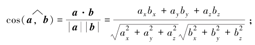

# 1.3 数学基础


### 推荐书籍

大家都知道学习 Pytorch 或 AI 需要一定的数学基础，当然也不需要太高，只需要掌握一些基础知识和求解方法，常见需要的数学基础有线性代数、微积分、概率论等，由于高等数学课程里面同时包含了线性代数和微积分的知识，因此读者只需要学习高等数学、概率论两门课程即可。数学不用看得太深，这样太花时间了，能理解意思就行。


首先推荐以下两本书，无论是否已经忘记了初高中数学知识，对于数学基础薄弱的读者来说，都可以看。

* 《普林斯顿微积分读本》

* 《普林斯顿概率论读本》


国内的书主要是一些教材，学习难度会大一些，不过完整看完可以提升数学水平，例如同济大学出版的《高等数学》上下册、《概率论与数理统计》，不过国内的这些教材主要为了刷题解题、考研考试，可能不太适合读者，而且学习起来的时间也太长了。


接着是推荐《深度学习中的数学》，作者是涌井良幸和涌井贞美，对于入门的读者来说上手难度也大一些，不那么容易看得进去，读者可以在看完本文之后再去阅读这本经典书，相信会更加容易读懂。


另外，千万不要用微信读书这些工具看数学书，排版乱七八糟的，数学公式是各种抠图，数学符号也是用图片拼凑的，再比如公式里面中文英文符号都不分。

建议直接买实体书，容易深度思考，数学要多答题解题才行。就算买来吃灰，放在书架也可以装逼呀。买吧。


本文虽然不要求读者数学基础，但是还是需要知道一些数学符号的，例如求和∑ 、集合交并∩∪等，这些在本文中不会再赘述，读者不理解的时候需要自行搜索资料。


## 基础知识

### 标量、向量、矩阵

笔者只能给出大体的概念，至于数学上的具体定义，这里就不展开了。

标量(scalar)：只有大小没有方向的数值，例如体重、身高。

向量(vector)：既有大小也有方向的数值，可以用行或列来表示。

矩阵(matrix)：由多行多列的向量组成。

张量(Tensor)：在 Pytorch 中，torch.Tensor 类型数据结构就是张量，结构跟数组或矩阵相似。


比如说 1.0、2 这些都是标量，在各种编程语言中都以基础数据类型提供了支持，例如 C# 的基元类型。


下面将标量转换为 torch.Tensor 类型。

```csharp
var x = torch.tensor(1.0);
var y = torch.tensor(2);

x.print_csharp();
y.print_csharp();
```

```bash
[], type = Float64, device = cpu, value = 1
[], type = Int32, device = cpu, value = 2
```


将数组转换为 torch.Tensor 类型：

```csharp
var data = new int[,]{{1, 2}, { 3, 4}};
var x_data = torch.tensor(data);

x_data.print_csharp();
```


由于上一章已经讲解了很多数组的创建方式，因此这里不再赘述。


### Pytorch 的一些数学函数

Pytorch 通过 torch.Tensor 表示各种数据类型，torch.Tensor 提供超过 100 多种的张量操作，例如算术运算、线性代数、矩阵操作、采样等。

由于篇幅有限，这里就不单独给出，读者请自行参考以下资料：

https://pytorch.org/docs/stable/torch.html

https://pytorch.ac.cn/docs/stable/torch.html


## 线性代数


#### 向量

向量具有多个


#### 矩阵


Pytorch：

```
A = torch.arange(20).reshape(5, 4)
print(A)
```

```
tensor([[ 0,  1,  2,  3],
        [ 4,  5,  6,  7],
        [ 8,  9, 10, 11],
        [12, 13, 14, 15],
        [16, 17, 18, 19]])
```


C#：

```
var A = torch.arange(20).reshape(5, 4);
A.print();
```


转置矩阵：

```
A = torch.arange(20).reshape(5, 4)
print(A.T)
```


### 向量

列举向量基础知识。


#### 向量的模


#### 单位向量


#### 向量的投影


#### 数量积/点积

点积即向量的数量积，点积、数量积、内积，都是同一个东西。

两个向量的数量积是标量，即一个数值，而向量积是不同的东西，这里只说明数量积。

数量积称为两个向量的数乘，而向量积才是两个向量的乘法。

求向量

向量：

A = $\vec{P_{0} P_{1}}$  为 (a, b)

B = $\vec{Q_{0} Q_{1}}$  为 (c, d)


求两个向量的数量积。

$\vec{P_{0} P_{1}}$ * $\vec{Q_{0} Q_{1}}$ = ac + bc 

```
A = torch.tensor([1,2])
B = torch.tensor([3,4])
print(torch.sum(A*B))
```


结果是：

```
tensor(11)
```


在 Pytorch 中，可以使用 `.dot()` 函数求点积：

```
A = torch.tensor([1, 2])
B = torch.tensor([3, 4])
print(torch.dot(A, B))
```





#### 向量积

的向量积（或称外积、 叉积）， 记为 ｃ ＝ ａ × ｂ

向量的数量积是用于平面的，而向量积用于立体几何，需要有 x、y、z 轴。

```python
A = torch.tensor([1, 2, 3])
B = torch.tensor([3, 4, 5])
print(torch.cross(A, B))
```


结果：

```
tensor([-2,  4, -2])
```


### 矩阵

#### 矩阵转置

#### 矩阵乘法

#### A ⊗ B

#### 哈达玛积


## 微积分

### 极限

### 导数

#### 求导公式

#### 复合函数求导


### 微分


### 偏导数


### 梯度


### 梯度下降


## 概率论

因为笔者对概率论不熟，所以这里不写了。
