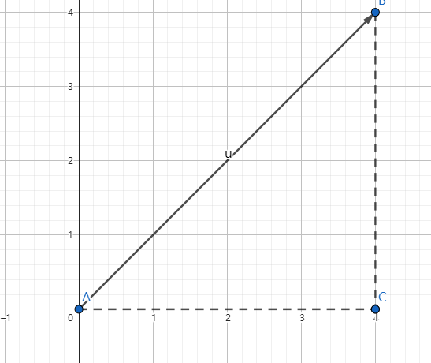
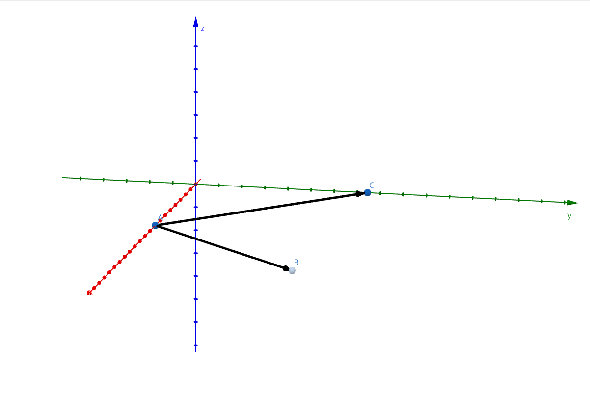

# 1.3 数学基础


### 推荐书籍

大家都知道学习 Pytorch 或 AI 需要一定的数学基础，当然也不需要太高，只需要掌握一些基础知识和求解方法，常见需要的数学基础有线性代数、微积分、概率论等，由于高等数学课程里面同时包含了线性代数和微积分的知识，因此读者只需要学习高等数学、概率论两门课程即可。数学不用看得太深，这样太花时间了，能理解意思就行。

 

首先推荐以下两本书，无论是否已经忘记了初高中数学知识，对于数学基础薄弱的读者来说，都可以看。

* 《普林斯顿微积分读本》

* 《普林斯顿概率论读本》


国内的书主要是一些教材，学习难度会大一些，不过完整看完可以提升数学水平，例如同济大学出版的《高等数学》上下册、《概率论与数理统计》，不过国内的这些教材主要为了刷题解题、考研考试，可能不太适合读者，而且学习起来的时间也太长了。


接着是推荐《深度学习中的数学》，作者是涌井良幸和涌井贞美，对于入门的读者来说上手难度也大一些，不那么容易看得进去，读者可以在看完本文之后再去阅读这本经典书，相信会更加容易读懂。


另外，千万不要用微信读书这些工具看数学书，排版乱七八糟的，数学公式是各种抠图，数学符号也是用图片拼凑的，再比如公式里面中文英文符号都不分。

建议直接买实体书，容易深度思考，数学要多答题解题才行。就算买来吃灰，放在书架也可以装逼呀。买吧。


本文虽然不要求读者数学基础，但是还是需要知道一些数学符号的，例如求和∑ 、集合交并∩∪等，这些在本文中不会再赘述，读者不理解的时候需要自行搜索资料。


## 基础知识

### 标量、向量、矩阵

笔者只能给出大体的概念，至于数学上的具体定义，这里就不展开了。

标量(scalar)：只有大小没有方向的数值，例如体重、身高。

向量(vector)：既有大小也有方向的数值，可以用行或列来表示。

矩阵(matrix)：由多行多列的向量组成。

张量(Tensor)：在 Pytorch 中，torch.Tensor 类型数据结构就是张量，结构跟数组或矩阵相似。


比如说 1.0、2 这些都是标量，在各种编程语言中都以基础数据类型提供了支持，例如 C# 的基元类型。


下面将标量转换为 torch.Tensor 类型。

```csharp
var x = torch.tensor(1.0);
var y = torch.tensor(2);

x.print_csharp();
y.print_csharp();
```

```bash
[], type = Float64, device = cpu, value = 1
[], type = Int32, device = cpu, value = 2
```


将数组转换为 torch.Tensor 类型：

```csharp
var data = new int[,]{{1, 2}, { 3, 4}};
var x_data = torch.tensor(data);

x_data.print_csharp();
```


由于上一章已经讲解了很多数组的创建方式，因此这里不再赘述。


### Pytorch 的一些数学函数

Pytorch 通过 torch.Tensor 表示各种数据类型，torch.Tensor 提供超过 100 多种的张量操作，例如算术运算、线性代数、矩阵操作、采样等。

由于篇幅有限，这里就不单独给出，读者请自行参考以下资料：

https://pytorch.org/docs/stable/torch.html

https://pytorch.ac.cn/docs/stable/torch.html


## 线性代数


### 向量

#### 向量的概念

在研究力学、物理学等工程应用领域中会碰到两类的量，一类完全由**数值的大小**决定，例如温度、时间、面积、体积、密度、质量等，称为**数量**或**标量**，另一类的量，**只知道数值的大小还不能完全确定所描述量**，例如加速度、速度等，这些量除了大小还有方向，称为向量。

在空间中以 A 为起点 、B 为终点的线段被称为被称为有向线段，其既有大小也有方向，使用 $\overrightarrow{AB} $ 表示，如果不强调方向，也可以使用 $\alpha $ 等进行简记。


A、B 之间的距离称为向量的模，使用 | $\overrightarrow{AB} $ | 或 | $\overrightarrow{BA} $ | 或 | $\alpha $ | 表示。

平面中的向量，其距离公式是：

$$
| \overrightarrow{AB} | = \sqrt{(x_{2}-x_{1})^{2} + (y_{2}-y_{1})^2}
$$
其实原理也很简单，根据勾股定理，AB 的平方等于两个直角边长平方之和，所以：
$$
| \overrightarrow{AB} | ^2 = (x_{2}-x_{1})^{2} + (y_{2}-y_{1})^2
$$


去平方就是：
$$
| \overrightarrow{AB} | = \sqrt{(x_{2}-x_{1})^{2} + (y_{2}-y_{1})^2}
$$


如下图所示，其两点间的距离：

$$
 | \overrightarrow{AB}  | = \sqrt{(4-1)^{2} + (4-1)^2} = \sqrt{18} = 3\sqrt{2} = 4.242640687119285
$$


使用 C# 计算向量的模，结果如下

```csharp
var A = torch.from_array(new[] { 1.0, 1.0 });
var B = torch.from_array(new[] { 4.0, 4.0 });
var a = B - A;

var norm = torch.norm(a);
norm.print_csharp();
```

```
[], type = Float64, device = cpu, value = 4.2426
```

> 注意，计算向量的模只能使用浮点型数据，不能使用 int、long 这些整型。


同理，对于空间中的两点 $A(x_{1},y_{1},z_{1})$、$B(x_{2},y_{2},z_{2})$ ，距离公式是：

$$
| \overrightarrow{AB} | = \sqrt{(x_{2}-x_{1})^{2} + (y_{2}-y_{1})^2 + (z_{2}-z_{1})^2} 
$$


#### 向量的加减乘除法

向量的加法很简单，坐标相加即可。

如图所示，A(1,1)、B(3,5)、C(6,4)。

$\overrightarrow{AB} (2,4) $、$\overrightarrow{BC} (3,-1) $、$\overrightarrow{AC} (5,3) $

根据数学上向量的加法可知，$\overrightarrow{AB} $ + $\overrightarrow{BC} $ = $\overrightarrow{AC} $

```csharp
var B = torch.from_array(new[] { 2.0, 4.0 });
var A = torch.from_array(new[] { 3.0, -1.0 });
var a = A + B;

a.print_csharp();
```

```
[2], type = Float64, device = cpu, value = double [] {5, 3}
```


同理，在 Pytorch 中，向量减法也是两个 torch.Tensor 类型相减即可。

推广到三维空间，计算方法也是一样的。

```csharp
var B = torch.from_array(new[] { 2.0, 3.0, 4.0 });
var A = torch.from_array(new[] { 3.0, 4.0, 5.0 });
var a = B - A;

a.print_csharp();
```

```
[3], type = Float64, device = cpu, value = double [] {-1, -1, -1}
```


另外，向量乘以或除以一个标量，直接运算即可，如 $ \overrightarrow{AB} (2,4) $，则 3 * $ \overrightarrow{AB} (2,4) $ = (6,12)。 


#### 向量的投影

如图所示， $\overrightarrow{AB} (2,4) $ 是平面上的向量，如果我们要计算向量在 x、y 上的投影是很简单的，例如在 x 轴上的投影是 2，因为 A 点的 x 坐标是 1，B 点的 x 坐标是 3，所以 3 - 1 = 2 为  $\overrightarrow{AB} (2,4) $ 在 x 轴上的投影，5 - 1 = 4 是在 y 轴上的投影。


在数学上使用 $Projx(u)$ 表示向量 u 在 x 上的投影，同理 $Projy(u)$ 是 u 在 y 上的投影。

如果使用三角函数，我们可以这样计算向量在各个轴上的投影。
$$
Projx(u) = |\overrightarrow{AB}| \cos \alpha = |\overrightarrow{AC}|
$$

$$
Projy(u) = |\overrightarrow{AB}| \sin \alpha = |\overrightarrow{BC}|
$$


AC、BC 长度是 4，根据勾股定理得出 AB 长度是 $4\sqrt{2} $，由于 $cos \frac{\pi }{2} = \frac{\sqrt{2}} {2}$ ，所以 $Projx(u) = 4$。




那么在平面中，我们已知向量的坐标，求向量与 x 、y 轴的夹角，可以这样求。
$$
\cos \alpha  = \frac{x}{|v|}
$$

$$
\sin \alpha  = \frac{y}{|v|}
$$


例如上图中  $\overrightarrow{AB} (4,4) $，x 和 y 都是 4，其中  $|v| = 4\sqrt{2}$，所以 $\cos \alpha  = \frac{4}{4\sqrt{2}} = \frac{\sqrt{2}}{2}$ 


从 x、y 轴推广到平面中任意两个向量，$\alpha$、$\beta$，其夹角为：
$$
\cos \varphi = \frac{\alpha \cdot \beta}{|\alpha|\cdot|\beta|}
$$
继续按下图所示，计算 $\overrightarrow{AB}$、$\overrightarrow{AC}$ 之间的夹角，很明显，我们按经验直接可以得出夹角 $\varphi$ 是 45° 。


但是如果我们要通过投影方式计算出来，则根据 $ \frac{\alpha \cdot \beta}{|\alpha|\cdot|\beta|} $ ，是 C# 计算如下。

```csharp
var AB = torch.from_array(new[] { 4.0, 4.0 });
var AC = torch.from_array(new[] { 4.0, 0.0 });

// 点积
var dot = torch.dot(AB, AC);

// 求每个向量的模
var ab = torch.norm(AB);
var ac = torch.norm(AC);

// 求出 cosφ 的值
var cos = dot / (ab * ac);
cos.print_csharp();

// 使用 torch.acos 计算夹角 (以弧度为单位)
var theta = torch.acos(cos);

// 将弧度转换为角度
var theta_degrees = torch.rad2deg(theta);
theta_degrees.print_csharp();
```

```
[], type = Float64, device = cpu, value = 0.70711
[], type = Float64, device = cpu, value = 45
```


#### 向量的点积

**点积即向量的数量积，点积、数量积、内积，都是同一个东西。**

两个向量的数量积是标量，即一个数值，而向量积是不同的东西，这里只说明数量积。

数量积称为两个向量的数乘，而向量积才是两个向量的乘法。

向量的数乘公式如下：
$$
a\cdot b=\displaystyle\sum_{i=1}^{n} a_{i} b_{i}=a_{1} b_{1}+a_{2} b_{2}+...+a_{n} b_{n}
$$
例如 $\overrightarrow{AB} (2,4) $、$\overrightarrow{BC} (3,-1) $ 两个向量，如下图所示。


计算其点积如下：

```csharp
var B = torch.from_array(new[] { 2.0, 4.0 });
var A = torch.from_array(new[] { 3.0, -1.0 });

var dot = torch.dot(A, B);

dot.print_csharp();
```

```
[], type = Float64, device = cpu, value = 2
```


### 向量积

在坐标轴上，我们默认间距都是 1，此时 x、y、z 上的单位向量都是 1，在数学中，我们往往会有很多未知数，此时我们使用 i、j、k 表示 x、y、z 轴上的单位向量，**在数学和物理中，单位向量通常用于表示方向而不关心其大小**。不理解这句话也没关系，忽略。


在不关心向量大小的情况下，我们使用单位向量可以这样表示两个向量：
$$
a = x_{1}i+y_{1}j+z_{1}k = (x_{1}, y_{1}, z_{1})
$$

$$
b = x_{2}i+y_{2}j+z_{2}k = (x_{2}, y_{2}, z_{2})
$$


如下所示，我们并不关心向量的真正大小，我们只关心其方向，在 x 轴上的每个格的长度为 i，y 轴是 j，z 轴是 k。



现在我们来求解一个问题，在空间中找到跟 $\overrightarrow{AB} $、$\overrightarrow{BC} $  同时垂直的向量，很明显，这样的向量不止一个，有无数个，所以我们这个时候要了解什么是法向量和单位向量。

法向量是一个与平面垂直的向量（这里不涉及曲面、曲线这些），要找出法向量也很简单，有两种方法，一种是坐标表示：
$$
a \times b =
\begin{vmatrix}
  &i  &j &k  \\
  &x_{1} &y_{1} &z_{1} \\
  &x_{2} &y_{2} &z_{2}
\end{vmatrix} = (y_{1}z_{2}-z_{1}y_{2})i - (x_{1}z_{2}-z_{1}x_{2})j + (x_{1}y_{2}-y_{1}x_{2})k
$$


这样记起来有些困难，我们可以这样看，容易记得。


$$
a \times b =
\begin{vmatrix}
  &i  &j &k  \\
  &x_{1} &y_{1} &z_{1} \\
  &x_{2} &y_{2} &z_{2}
\end{vmatrix} = (y_{1}z_{2}-z_{1}y_{2})i + (z_{1}x_{2}-x_{1}z_{2})j + (x_{1}y_{2}-y_{1}x_{2})k
$$


那么法向量 $n$ 的  $x = (y_{1}{z2} -z_{1}y_{2})$ ，y、z 轴同理，就不给出了，x、y、z 分别就是 i、j、k 前面的一块符号公式。


例题如下。

求与 $a = 3i - 2j + 4k$ ，$b = i + j - 2k$ 都垂直的法向量 。

首先提取 a 向量坐标表示是 (3,-2,4)，b 向量的坐标表示是 (1,1,-2)。

则：
$$
a \times b =
\begin{vmatrix}
  &i  &j &k  \\
  &3 &-2 &4 \\
  &1 &1 &-2
\end{vmatrix} = (4-4)i + (4-(-6))j + (3-(-2))k = 10j + 5k
$$


所以法向量 $n(0,10,5)$


这就是通过向量积求得与两个向量都垂直的法向量的方法。


另外，还有一种通过夹角求得法向量的方法。


那么求法向量对现实意义有哪些呢？

例如，下面这道求空间中三角形的高。


#### 矩阵


Pytorch：

```
A = torch.arange(20).reshape(5, 4)
print(A)
```

```
tensor([[ 0,  1,  2,  3],
        [ 4,  5,  6,  7],
        [ 8,  9, 10, 11],
        [12, 13, 14, 15],
        [16, 17, 18, 19]])
```


C#：

```
var A = torch.arange(20).reshape(5, 4);
A.print();
```


转置矩阵：

```
A = torch.arange(20).reshape(5, 4)
print(A.T)
```


### 向量

列举向量基础知识。


#### 向量的模


#### 单位向量


#### 向量的投影


#### 数量积/点积

点积即向量的数量积，点积、数量积、内积，都是同一个东西。

两个向量的数量积是标量，即一个数值，而向量积是不同的东西，这里只说明数量积。

数量积称为两个向量的数乘，而向量积才是两个向量的乘法。

求向量

向量：

A = $\vec{P_{0} P_{1}}$  为 (a, b)

B = $\vec{Q_{0} Q_{1}}$  为 (c, d)


求两个向量的数量积。

$\vec{P_{0} P_{1}}$ * $\vec{Q_{0} Q_{1}}$ = ac + bc 

```
A = torch.tensor([1,2])
B = torch.tensor([3,4])
print(torch.sum(A*B))
```


结果是：

```
tensor(11)
```


在 Pytorch 中，可以使用 `.dot()` 函数求点积：

```
A = torch.tensor([1, 2])
B = torch.tensor([3, 4])
print(torch.dot(A, B))
```


#### 向量积

的向量积（或称外积、 叉积）， 记为 ｃ ＝ ａ × ｂ

向量的数量积是用于平面的，而向量积用于立体几何，需要有 x、y、z 轴。

```python
A = torch.tensor([1, 2, 3])
B = torch.tensor([3, 4, 5])
print(torch.cross(A, B))
```


结果：

```
tensor([-2,  4, -2])
```


### 矩阵

#### 矩阵转置

#### 矩阵乘法

#### A ⊗ B

#### 哈达玛积


## 微积分

### 极限

### 导数

#### 求导公式

#### 复合函数求导


### 微分


### 偏导数


### 梯度


### 梯度下降


## 概率论

因为笔者对概率论不熟，所以这里不写了。
