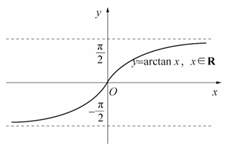
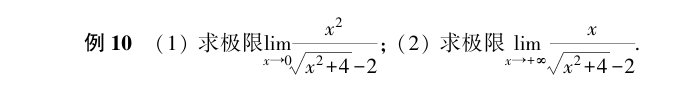
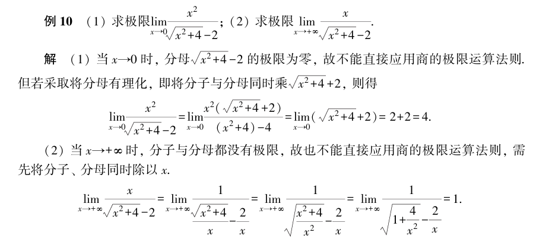
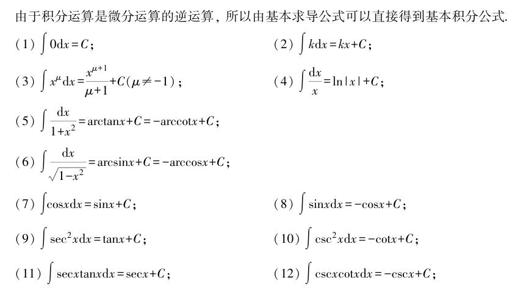
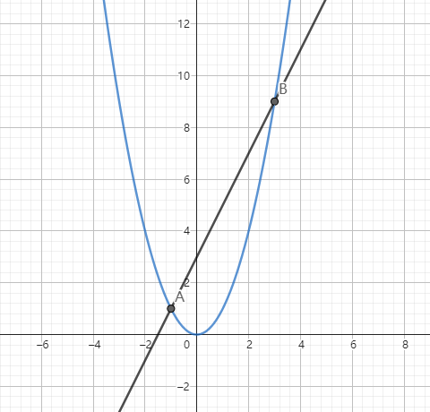
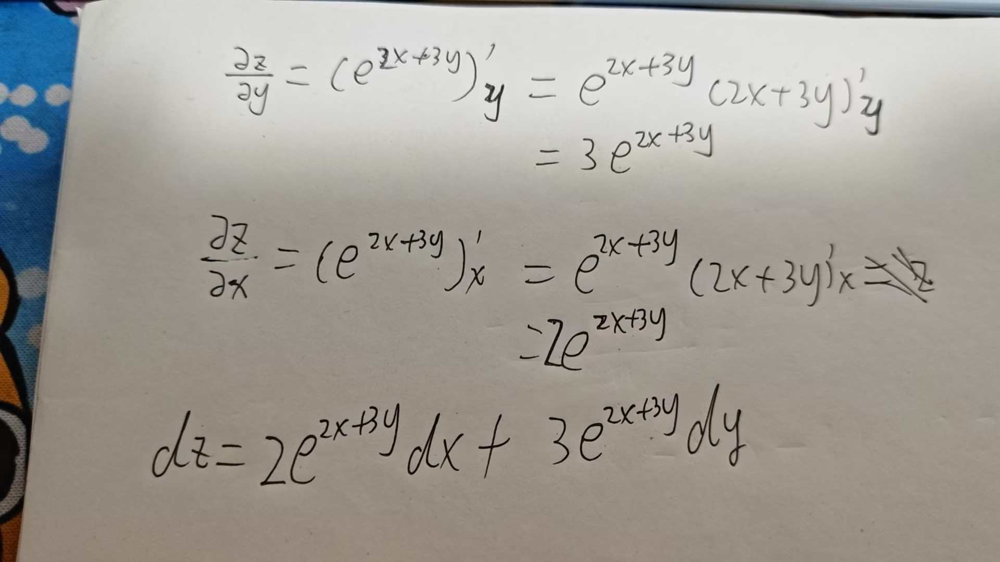
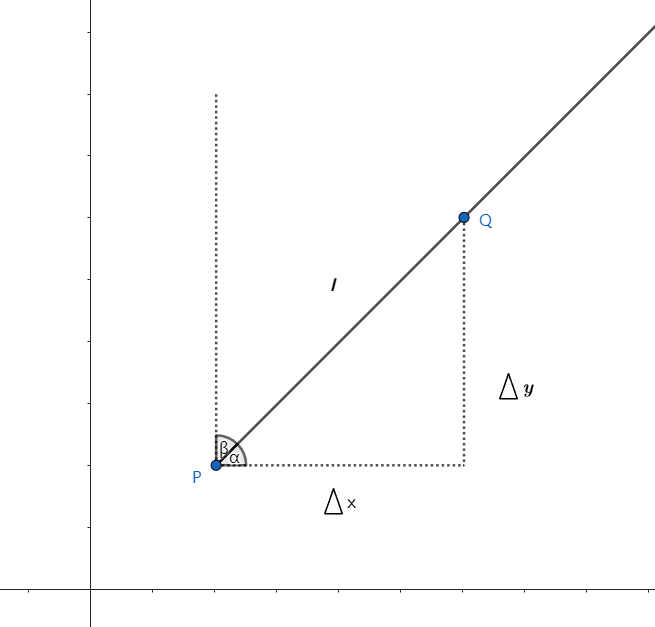

# 微积分


### 推荐书籍

大家都知道学习 Pytorch 或 AI 需要一定的数学基础，当然也不需要太高，只需要掌握一些基础知识和求解方法，常见需要的数学基础有线性代数、微积分、概率论等，由于高等数学课程里面同时包含了线性代数和微积分的知识，因此读者只需要学习高等数学、概率论两门课程即可。数学不用看得太深，这样太花时间了，能理解意思就行。

 

首先推荐以下两本书，无论是否已经忘记了初高中数学知识，对于数学基础薄弱的读者来说，都可以看。

* 《普林斯顿微积分读本》

* 《普林斯顿概率论读本》


国内的书主要是一些教材，学习难度会大一些，不过完整看完可以提升数学水平，例如同济大学出版的《高等数学》上下册、《概率论与数理统计》，不过国内的这些教材主要为了刷题解题、考研考试，可能不太适合读者，而且学习起来的时间也太长了。


接着是推荐《深度学习中的数学》，作者是涌井良幸和涌井贞美，对于入门的读者来说上手难度也大一些，不那么容易看得进去，读者可以在看完本文之后再去阅读这本经典书，相信会更加容易读懂。


另外，千万不要用微信读书这些工具看数学书，排版乱七八糟的，数学公式是各种抠图，数学符号也是用图片拼凑的，再比如公式里面中文英文符号都不分。

建议直接买实体书，容易深度思考，数学要多答题解题才行。就算买来吃灰，放在书架也可以装逼呀。买吧。


本文虽然不要求读者数学基础，但是还是需要知道一些数学符号的，例如求和∑ 、集合交并∩∪等，这些在本文中不会再赘述，读者不理解的时候需要自行搜索资料。


### 极限

极限的符号是 $\lim$ ，在高等数学中，主要是数列极限和函数极限，限于篇幅，本文只讨论函数存在极限时的一些情况。

数学上有无穷大($+\infty$)和无穷小($-\infty $)的概念，大家都知道无穷大的意思，但是比较容易理解错无穷小，**无穷小指的是无限接近 0，而不是负数的无穷大。**


举个例子你就明白了，当 $x \to +\infty$ 时，$\frac{1}{x} $ 的值，我们都知道 x 越大，，$\frac{1}{x} $ 越小，但是不可能为 0，只能越来越接近于 0，所以我们使用 $-\infty $ 表示这种情况。


求解极限，一般会碰到这几种情况，当 x 无穷大时，y 是多少。

例如下图所示，当 x 无穷大时，y 逐渐贴近 x 轴，即 y 越来越接近，我们使用 $y\to 0$ 表示趋近于 0 或者说接近 0。


> 图片来自《高等数学上册》第一章第三节函数极限的定义与计算，同济大学数学系编著。


所以：
$$
\lim_{x \to \infty} f(x) = \lim_{x \to \infty} \frac{1}{x} = 0
$$
使用 C# 表示时，我们使用一个极大的数表示无穷大。

```csharp
var x = torch.tensor(double.MaxValue);
var y = 1 / x;

var lim = (int)y.item<double>();
Console.WriteLine(lim);
```


上面使用了 `y.item<double>()` 将张量转换为标量，我们也可以使用函数 `y.ToScalar().ToInt32();` 转换。


再比如下图所示，当 x 无穷大时，y 越来越接近 $\frac{\pi}{2}$，所以 ：
$$
\lim_{x \to \infty} \arctan x = \frac{\pi}{2}
$$




> 图片来自《高等数学上册》第一章第三节函数极限的定义与计算，同济大学数学系编著。


上面求极限时，是当 $\lim_{x \to \infty} $ 或 $\lim_{x \to 0} $ 时的情况，在实际中更多的是给出某点，求其极限，例如：
$$
\lim_{x \to x_{0}} f(x) = \lim_{x \to x_{0}} \frac{1}{x}
$$


当 $x=1$ 时，我们直接计算其实可以得到 `y=1`，极限就是 1，或者换句话来说，我们求一个函数在 $x_{0}$ 的极限时，如果你可以直接计算出 $y_{0}$ 的值，那么这个值就是该点的极限。

这种函数计算极限很简单，因为可以直接通过 $y=f(x)$ 计算出来。


下面这道题是也是同济大学《高等数学上册》中的两道题。



当 x 解决 0 时，分子是 0，0 除以任何数都是 0，所以极限是 0？肯定不是呀。

当碰到这种 $x\to0$ 分子或分母为 0 的情况，就不能直接计算了。这两道题的解答过程：




由于本文不是数学教程，因此这里不再深入讨论细节。


### 导数

给定一个函数，如何计算函数在某个区间上的变化率？

如图所示，函数 $y = x^{2}$ 在区间 $[1,3]$ 的起点 A 和 终点 B。


那么平均变化率就是：
$$
\frac{\bigtriangleup y}{\bigtriangleup x} = \frac{9-1}{3-1} = \frac{8}{2} = 4
$$
但是当这个 $\bigtriangleup{x}$ 或 $\bigtriangleup{y}$ 非常小时，事情就会变得非常复杂。如果我们要求 $x=9$ 附近的平均变化率，则：
$$
\frac{y + \bigtriangleup y}{x+ \bigtriangleup x} = \frac{9 + \bigtriangleup y}{3 + \bigtriangleup x}
$$


当 $\frac{\bigtriangleup y}{\bigtriangleup x}$ 非常小时，实际上反映了函数在 $x=9$ 时的瞬时变化率。那么这个瞬时变化率，我们可以过 A、B 点使用切线表示。

切线是轻轻接触函数一点的一条线，由图可知，当 x 越来越大时，$y_{2} = x+1$ 比 $y_{1} = x$ 大很多，比如 $5^2$、$4^{2}$、$3^{2}$ 之间的差，越来越大。

那么切线可以反映这种变化率。如图所示，B 点的切线角度比 A 的的切线大。 


因此，出现了一种新的函数，叫原函数的导函数，简称导数，导数也是一个函数，通过导数可以计算原函数任一点的瞬时变化率。

导数的表示符号有多种，例如：
$$
\frac{\bigtriangleup y}{\bigtriangleup x} = f'(x) = y' = \frac{dy}{dx} = \frac{df(x)}{x}= \frac{df}{x}
$$

> d 是微分符号，例如 dy 是对 y 的微分，dx 是对 x 的微分。

如果要求在某点 $x_{0}$ 的瞬时变化率，则：
$$
\frac{\bigtriangleup y}{\bigtriangleup x} \big|_{x_{0}} = f'(x)  \big|_{x_{0}} = y'  \big|_{x_{0}} = \frac{dy}{dx}  \big|_{x_{0}} = \frac{df(x)}{x} \big|_{x_{0}} = \frac{df}{x} \big|_{x_{0}} 
$$


读者应该都有一定的数学基础吧，前面两种应该很容易理解，而后面三种也很重要，在积分和微积分的学习中，我们将会大量使用这种方式。

我们可以这样理解：
$$
dy = \bigtriangleup y
$$

$$
dx = \bigtriangleup x
$$


在 Pytorch 中，我们可以通过微分系统进行计算，例如我们要计算 $d(x^2) \big|_{x=3}$ 。

```csharp
// 定义 y = x^2 函数
var func = (torch.Tensor x) => x.pow(2);

var x = torch.tensor(3.0, requires_grad: true);
var y = func(x);

// 计算导数
y.backward();

// 转换为标量值
var grad = x.grad.ToScalar().ToDouble();
Console.WriteLine(grad);
```


不要搞错，计算导数后，要使用 x 输出导数值，而不是使用 y，因为 y 是函数结果。为什么求导的时候不直接输出求导结果呢？因为 Pytorch 自动求导系统是非常复杂的，计算的是偏导数，对于一元函数来说，对 x 的偏导数就是 y 的导数，在后面的偏导数和梯度时，会更多介绍这方面的知识。

另外创建 x 的张量类型时，需要添加 `requires_grad: true` 参数。


#### 求导公式

下面是同济大学《高等数学》中的一些基本求导公式。


例如，我们求 $y = x^2$ 的导数，使用上图的 （2）式，得到 $y = 2x$。


对于复合函数和复杂函数的求导会很麻烦，这里不再赘述。对于复杂的函数，还存在高阶导数，即导数的导数，二阶导数公式如下：
$$
f''(x) = y'' = \frac{d^2y}{dx^2} = \frac{d^2f(x)}{x^2}= \frac{d^2f}{x^2}
$$


### 微分


下面是同济大学《高等数学》中的一张图。


由图可知，在正方形 A 中，其面积是 $A = (x_{0})^2$，而大正方形的面积是 $(x_{0}+ \bigtriangleup x)^2$，或者通过多个矩形面积相加得出大正方形面积为：
$$
S = x_{0}^2 + 2x_{0} \bigtriangleup x + (\bigtriangleup x)^2
$$


那么，在边长增加了 $\bigtriangleup x$ 的时候，面积增加了多少呢？
$$
\bigtriangleup S = 2x_{0} \bigtriangleup x + (\bigtriangleup x)^2
$$


我们可以使用下面的公式来表示当 $y = f(x)$ 满足一定关系时，其增量的表达式：
$$
\bigtriangleup y = A \bigtriangleup x + O(\bigtriangleup x)
$$


前面在讲解导数时，我们知道 $\bigtriangleup y =f(x + \bigtriangleup x) - f(x)$，所以：
$$
\bigtriangleup y =f(x + \bigtriangleup x) - f(x) = A \bigtriangleup x + O(\bigtriangleup x)
$$


当 $\bigtriangleup x$ 非常小时，并且 $A \not= 0$ 时，可以忽略 $O(\bigtriangleup x)$，我们使用 $A \bigtriangleup x $ 近似计算 $\bigtriangleup y $ 的值，这就是微分的定义，其中 $A = f'(x)$。
$$
dy = f'(x)\bigtriangleup x
$$


举个例子，求 $y = x^3$ 在 $x=1$ 时， $\bigtriangleup x = 0.01$ 和 $\bigtriangleup x = 0.001$  的增量。

上题本质就是求 $x = 1.01$ 和 $x = 1$ 时  $\bigtriangleup y$  以及  $x = 1.001$ 和 $x = 1$ 时  $\bigtriangleup y$  。

先求：
$$
(1.01)^3 = 1.030301
$$

$$
(1.001)^3 = 1.003003001
$$

所以两个增量方便是 0.030301、0.003003001。


但是如果只需要求近似值，那么我们使用微分方式去求，首先求出导数：
$$
y' = dy = (x^3)' = 3x^2
$$
所以：
$$
dy = 3x^2 \bigtriangleup x
$$


所以 $\bigtriangleup x = 0.01$ 时，
$$
dy = 3*(1)^2 * 0.01 = 3 * 0.01 = 0.03
$$


所以 $\bigtriangleup x = 0.001$ 时，
$$
dy = 3*(1)^2 * 0.001 = 3 * 0.001 = 0.003
$$


所以可以这样通过微分 dy 的方式近似计算函数的增量。

因为：
$$
\bigtriangleup y = \frac{dy}{dx}
$$


我们使用 dy 近似代替 $\bigtriangleup y$，这就是微分的应用场景之一。


### 积分

前面介绍了导数，我们知道 $y = x^3$ 的导数是 $y = 3x^2$。

那么反过来，我们知道一个函数 $F(x)$ 的导数是 $y=x^3$，对于幂函数，我们很容易反推出 $\frac{1}{4} x^4$ 的导数是 $x^3$，但是  $\frac{1}{4} x^4 + 1$、 $\frac{1}{4} x^4 + 666$ 的导数都是 $x^3$ ，所以 $x^3$ 的原函数是不确定的，所以反推得出的积分公式，又叫不定积分，我们使用 $C$ 来表示这个不确定的常数。


假设原函数是 F(x)，导数是 $f(x)$ ，由于常数在求导时会被消去，所以求积分时，需要出现加上这个不确定的常数，所以：


$$
\int f(x)dx = F(x) + C
$$
下面是同济大学《高等数学》给出一些积分公式。




前面介绍了微分的作用，这里也给出导数在平面中的简单应用场景。


如图所示，图中的是 $y = x^2$ 函数的封闭区域，和 $x=0$ 、$x=2$ 两个直线围成了一个封闭区域，求 ABC 所围成的封闭区域的面积。


首先求出其原函数为 $y = \frac{1}{3}x^3$。使用积分区间表示求解的面积：
$$
\int_{1}^{2} x^2=\frac{1}{3}x^3 \big|_{1}^{2} =\frac{1}{3}2^3 - \frac{1}{3}1^3=\frac{7}{3}
$$


对于上面求解的问题，使用的是积分公式，如下公式所示，∫ 表示积分符号，$f(x)$ 表示被积函数，$dx$表示积分变量增量(微分)，$a$ 和 $b$ 表示积分的下限和上限，即积分区间。
$$
\int_{a}^{b} f(x) dx
$$


下面再来一道简单的题目，求 $y = 2x+3$ 和 $y = x^2$ 所围成的面积。




首先要求得积分区间，即两者的两个交点，由 $x^2=2x+3$ 得：
$$
x^2 - 2x -3 = 0
$$
根据十字相乘法，得：
$$
(x + 1)(x - 3) = 0
$$
所以 $x_{1} = -1$，$x_{2} = 3$。


我们先求 $y = 2x + 3$ 在这两个点之间围成的面积。
$$
\int_{-1}^{3} 2x+3 = x^2+3x \big|_{-1}^{3} = (9 + 9) - (1 - 3) = 20
$$
求 $y = x^2$ 在这两个点所围成的面积。
$$
\int_{-1}^{3} x^2 = \frac{1}{3}x^3 \big|_{-1}^{3} = 9 - (-\frac{1}{3}) = 9 + \frac{1}{3}
$$


所以围成的面积是：$20 - (9+\frac{1}{3}) = \frac{32}{3}$。


在数学上，我们可以更加方便表示这种两个函数加减的方法，即：
$$
\int_{-1}^{3} (2x+3 - x^2) = \int_{-1}^{3} (2x+3) - \int_{-1}^{3} (x^2)
$$

### 偏导数

偏导数属于多元函数的微分学，最常见的是求解空间问题，在初高中基本只涉及一元函数，在这里我们引入二元函数，记作：
$$
z = f(x,y)
$$

#### 多元函数

下面给出一个二元函数构成的图形。
$$
z=\sqrt{1-x^2-y^2}
$$


下面提个问题，怎么求这个$z=\sqrt{1-x^2-y^2}$ 的定义域？

我们知道 $1 \ge x^2 + y^2 $，在设 $y = 0$ 时，$1 \ge x^2 $，则 $-1 \le x \le 1$，由于 $1-x^2 \ge y^2$，所以 $-\sqrt{1-x^2} \le y \le \sqrt{1 - x^2}$。

关于二元函数的定义域，其实就是求 x、y 的定义域，我们可以求出 x 的定义域是常数组成，但是对于 y，就是由 x 组成的一个区间。


#### 多元函数的值

已知函数 $f(x,y) = \frac{xy}{x^2+y^2}$，求 $f(1,2)$。

其实也很简单，方便使用 $x=1,y=2$ 替代进去即可：
$$
f(1,2) = \frac{2}{1^2+2^2} = \frac{1}{5}
$$


#### 多元函数的极限

前面提到极限的时候，涉及到的都是一元函数，对于多元函数的极限，计算则复杂一些，我们可以使用以下公式表示二元函数在某点的极限值。
$$
\lim_{_{y \longrightarrow y_{0}}^{x \longrightarrow x_{0}}} f(x,y) = A
$$
求二元函数的极限，称为二重极限。

例如求下面函数的二重极限。
$$
\lim_{_{y \longrightarrow 2}^{x \longrightarrow 1}} \ln{(x+y^2)} = \ln{(1+2^2)} = \ln{5}
$$

#### 偏导数

对多元函数求导的时候，由于函数有多个未知变量，例如 $z = x^2 + y^2 $，要针对 x 进行求导，求在 $z=f(x_{0},y_{0})$ 时 x 的导数，这个就叫对 x 的偏导数。

偏导数使用符号 $\partial$ 表示，那么对 x 的偏导数可以记作：
$$
\frac{\partial z}{\partial x} \big|_{y=y_{0}}^{x=x{x0}}
$$
当然还有很多变体，Markdown 敲数学公式超级累，这里贴个图省事儿。


下面给个简单函数的偏导数，方法很简单，当对 x 求偏导数时，把 y 当常数处理即可。
$$
z = x^2 + y^2
$$

$$
\frac{\partial z}{\partial x} = 2x,\frac{\partial z}{\partial y} = 2y
$$

再如：
$$
z = x^2 + yx + y^2
$$

$$
\frac{\partial z}{\partial x} = 2x + y,\frac{\partial z}{\partial y} = 2y +x
$$


前面提到积分可以求解平面中两个函数所组成的封闭区域的面积，偏导数则可以计算空间中立体几何和平面组成的封闭区域面积，这里就不再深入。


#### 全微分

设二元函数 $z = f(x,y)$ 则其全增量公式为：
$$
\bigtriangleup z =A\bigtriangleup x + B \bigtriangleup y + O(\beta)
$$


那么关于 z 的微分：
$$
dz=f_{x}(x,y)dx + f_{y}(x,y)dy
$$
求全微分，其实就是先求出所有偏导数，然后再进行计算。

例如求 $z = e^{2x+3y}$ 的全微分。




给个例题，求函数 $z = f(x,y) = \frac{x^2}{y}$ 在 点 $(1,-2)$ 出，当 $\bigtriangleup x=0.02$，$\bigtriangleup y = -0.01$ 时的全增量。


先求函数的两个偏导数得出。
$$
dz = \frac{2x}{y} \bigtriangleup x - \frac{x^2}{y^2} \bigtriangleup y
$$
将 $\bigtriangleup x=0.02$，$\bigtriangleup y = -0.01$ 代入，得 $-0.0175$。


下面是这个函数的图像。


### 梯度

#### 方向导数

前面提到导数，在一元函数中，$y=f(x)$ ，导数是反映了其在某点的变化率，而在 $z = f(x,y)$ 中，两个偏导数 $\frac{\partial z}{\partial x} $、$\frac{\partial z}{\partial y}$ 则是反映函数沿着平行于 x 轴 、y 轴方向上的变化率。在实际问题中，我们除了要知道函数的变化率外，还要知道函数沿着哪个方向的变化率最大，这就需要引入方向导数的概念。




如上图所示，设 $l$ 是一条有 $P(x,y)$ 引出来的一条射线，$Q(x + \bigtriangleup x,y + \bigtriangleup y)$ 是 $l$ 上的一点，设 $\rho$ 是 $P$、$Q$ 两点之间的距离，则：
$$
\frac{\bigtriangleup z}{\rho}
$$
该公式反映函数在了 $P$、$Q$ 两点之间沿着 $l$ 方向的平均变化率，如果当 $Q$ 趋近于 $P$ 时，极限存在，则该极限值称为点 $P$ 沿方向 $l$ 的方向导数。


由于：
$$
\bigtriangleup x = \rho \cos \alpha , \bigtriangleup y = \rho \cos \beta
$$
所以方向导数可以表示为：
$$
\frac{\partial z}{\partial l} =  \frac{\partial z}{\partial x} \bigtriangleup x + \frac{\partial z}{\partial y} \bigtriangleup y =  \frac{\partial z}{\partial x} \cos \alpha + \frac{\partial z}{\partial y} \cos \beta
$$


#### 梯度

当点 $P$ 固定时，方向 $l$ 变化时，函数的方向导数 $\frac{\partial u}{\partial l} $ 也随之变化，说明了对于固定的点，函数在不同方向上的变化率也有所不同。那么对于点 $P$，在什么方向上可以使得函数的变化率达到最大？这里需要引入梯度的概念。

给定可微的二元函数 $z = f(x,y)$，在点 $(x_{0},y_{0})$ 可以确定一个向量 $e_{1}$：
$$
f_{x}(x_{0},y_{0})i + f_{y}(x_{0},y_{0})j
$$


称为函数 $z =f(x,y)$ 在点 $(x_{0},y_{0})$ 处的梯度，记作 $gradf(x_{0},y_{0})$。

方向导数和梯度的关系是：
$$
\frac{\partial z}{\partial l} = \frac{\partial z}{\partial x} \cos \alpha + \frac{\partial z}{\partial y} \cos \beta = 
gradf(x_{0},y_{0})\cdot e_{1}
$$


如下图所示，当 $\alpha = 0$ 时，$gradf(x_{0},y_{0})$ 和 $e_{1}$ 重合， 由于 $\cos \alpha = 1$，所以方向导数也达到最大值 $|gradf(x_{0},y_{0})|$ 。也就是，沿着梯度方向函数的方向导数可以达到最大值。


例题，求函数 $z = \ln(x^2 + y^2)$ 的梯度。


> 《高等数学工本》陈兆斗。

再来一道实际意义的题目。


> 《高等数学工本》陈兆斗。


使用 C# 求解该题，得：

```csharp
// 定义 u = x^2 + y^2 + z^2 函数在 (2,1,-1) 点的值
var x = torch.tensor(2.0, requires_grad: true);
var y = torch.tensor(1.0, requires_grad: true);
var z = torch.tensor(-1.0, requires_grad: true);
var u = x.pow(2) + y.pow(2) + z.pow(2);

// 求导
u.backward();

var ux = x.grad;
var uy = y.grad;
var uz = z.grad;

Console.WriteLine($"gradu(2,1,-1) = {"{"}{ux.ToScalar().ToDouble()},{uy.ToScalar().ToDouble()},{uz.ToScalar().ToDouble()} {"}"}");
```

```
gradu(2,1,-1) = {4,2,-2 }
```


