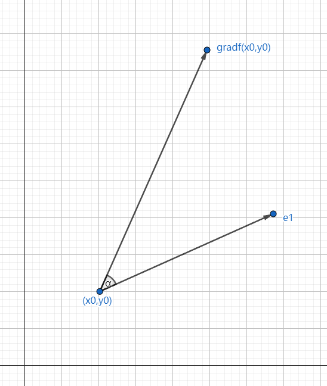
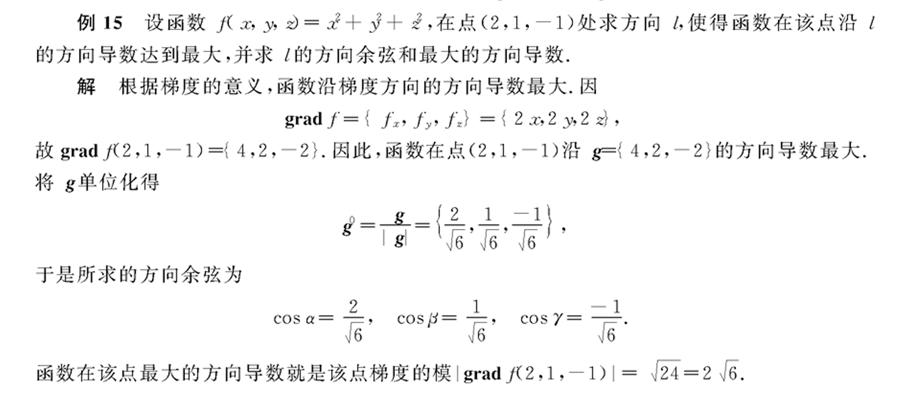

### 梯度

在本节中，我们将学习深度学习里面重点之一的梯度下降法，梯度下降法要学习的知识比较多，本文的内容基本都是为梯度下降法做铺垫。

> 百度百科：方向导数本质上研究的是函数在某点处沿某特定方向上的变化率问题，梯度反映的是空间变量变化趋势的最大值和方向。

<br />

#### 方向导数

前面提到导数，在一元函数中， $y=f(x)$ ，导数是反映了其在某点的变化率，而在 $z = f(x,y)$ 中，两个偏导数 $\frac{\partial z}{\partial x} $ 、 $\frac{\partial z}{\partial y}$ 则是反映函数沿着平行于 x 轴 、y 轴方向上的变化率。偏导数反映的是往某个轴方向的变化率，而方向导数则是某个方向的变化率，而不是某个轴方向。


<br />

如上图所示，设 $l$ 是一条有 $P(x,y)$ 引出来的一条射线， $Q(x + \bigtriangleup x,y + \bigtriangleup y)$ 是 $l$ 上的一点，设 $\rho$ 是 $P$ 、 $Q$ 两点之间的距离，则：

$$
\frac{\bigtriangleup z}{\rho}
$$

<br />

该公式反映函数在了 $P$ 、 $Q$ 两点之间沿着 $l$ 方向的平均变化率，如果当 $Q$ 趋近于 $P$ 时，极限存在，则该极限值称为点 $P$ 沿方向 $l$ 的方向导数。

<br />

由于：

$$
\bigtriangleup x = \rho \cos \alpha , \bigtriangleup y = \rho \cos \beta
$$

<br />
所以方向导数可以表示为：

$$
\begin{align}
\frac{\partial z}{\partial l} &= \\ 
&=  \frac{\partial z}{\partial x} \bigtriangleup x + \frac{\partial z}{\partial y} \bigtriangleup y  \\
&=  \frac{\partial z}{\partial x} \cos \alpha + \frac{\partial z}{\partial y} \cos \beta
\end{align}
$$

<br />

如果使用 $i$ 、 $j$ 表示 x、y 上的分量，也可以表示为：

$$
\frac{\partial z}{\partial l}  = \frac{\partial z}{\partial x}i + \frac{\partial z}{\partial y}j
$$

<br />

如果我们使用向量表示，也可以表示为：

$$
(\frac{\partial z}{\partial x}, \frac{\partial z}{\partial y})
$$

<br />

#### 梯度

梯度是指函数的值在哪个方向增长最快，后面学习的梯度下降则是相反的，是函数值下降最快的方向。

<br />

在空间中的一点，当点 $P$ 固定时，方向 $l$ 变化时，函数的方向导数 $\frac{\partial u}{\partial l} $ 也随之变化，说明了对于固定的点，函数在不同方向上的变化率也有所不同。那么对于点 $P$ ，在什么方向上可以使得函数的变化率达到最大？这里需要引入梯度的概念。

<br />

下图是一个半球。


问，怎么给定任意一点，怎么最快地达到顶部？很明显，垂直往上走，可以最快到底顶部，但是对于实际中凹凸不平的图像来说，是不能直接得出结论的，不过我们这里可以先简单讨论。

就像上面的图形，给定可微的二元函数 $z = f(x,y)$ ，有一点 $(x_{0},y_{0})$ ，这个点可以往各种方向走，每个方向的方向导数都不一样，现在假设有个方向可以让方向导数最大，这个就是梯度 $gradf(x_{0},y_{0}) $。

<br />

如图所示， $A(x_{0},y_{0})$ 往 B 方向可以让 A 最快到达顶点，也就是变化率最大。而 A 有各种方向，其中一个是往 C 走。

往 B 方向的方向导数最大，就是梯度  $gradf(x_{0},y_{0}) $ 。由图所示，从 A 开始的任意一个方向导数，跟 $ \overrightarrow{AB}$ 都有一个夹角，因为是在空间，所以这个夹角表示起来有点麻烦，就是各个方向的余弦值，我们也是有向量表示： $n_{e} = (\cos \alpha ,\cos \beta)$ ，那么方向导数、梯度的关系：

$$
\frac{\partial z}{\partial l}  =gradf(x_{0},y_{0}) \cdot n_{e}
$$

$$
\frac{\partial z}{\partial l} = \frac{\partial z}{\partial x} \cos \alpha + \frac{\partial z}{\partial y} \cos \beta = 
gradf(x_{0},y_{0})\cdot n_{e}
$$


<br />

如下图所示，当 $\alpha = 0$ 时， $gradf(x_{0},y_{0})$ 和 $e_{1}$ 重合， 由于 $\cos \alpha = 1$ ，所以方向导数也达到最大值 $|gradf(x_{0},y_{0})|$ 。也就是，沿着梯度方向的方向导数可以达到最大值。

所以：

$$
\begin{align}
gradf(x_{0},y_{0}) &= \frac{\partial z}{\partial x} \cos \alpha + \frac{\partial z}{\partial y} \cos \beta  \\
&=  \frac{\partial z}{\partial x}i + \frac{\partial z}{\partial y}j \\
&= (\frac{\partial z}{\partial x}, \frac{\partial z}{\partial y})
\end{align}
$$





<br />

例题，求函数 $z = \ln(x^2 + y^2)$ 的梯度。


> 来源：《高等数学工本》陈兆斗。

<br />
再来一道实际意义的题目。




>  来源：《高等数学工本》陈兆斗。

<br />

使用 `C#` 求解该题，得：

```csharp
// 定义 u = x^2 + y^2 + z^2 函数在 (2,1,-1) 点的值
var x = torch.tensor(2.0, requires_grad: true);
var y = torch.tensor(1.0, requires_grad: true);
var z = torch.tensor(-1.0, requires_grad: true);
var u = x.pow(2) + y.pow(2) + z.pow(2);

// 求导
u.backward();

var ux = x.grad;
var uy = y.grad;
var uz = z.grad;

Console.WriteLine($"gradu(2,1,-1) = {"{"}{ux.ToScalar().ToDouble()},{uy.ToScalar().ToDouble()},{uz.ToScalar().ToDouble()} {"}"}");
```

```
gradu(2,1,-1) = {4,2,-2 }
```

<br />

#### 梯度下降法的基本公式

建议读者阅读这篇文章，这样很容易理解什么是梯度下降：https://www.zhihu.com/question/434600945

<br />

前面提到，梯度是向上最快，那么梯度下降就是向下最快，跟梯度相反就是最快咯。

<br />

梯度下降法是神经网络的武器，相信大家在了解深度学习时，也最常出现梯度下降的相关知识，所以本小节将讲解梯度下降法的一些基础知识。

在偏导数求最小值一节中，我们学习到最小值需要满足以下条件：

$$
\frac{\partial z}{\partial x} = 0,\frac{\partial z}{\partial y} = 0
$$

<br />
如果可以直接通过偏导数计算出梯度，那么问题就简单了，直接计算出最小值，都是对于实际场景要计算出来是比较可能的，尤其在神经网络里面。所以大佬们使用另一种方法来求出最小值的近似值，叫梯度下降法。

<br />

画出一个三维图像如图所示：


<br />

假如你正在最高位置，将你蒙上眼睛后，你要从最上面移动到最底的位置，每次只能移动一个格。

我们要最快下降到底部，肯定要选择最徒的路径，但是因为蒙着眼睛，无法跳过一个格知道后面的格的位置，所以只能先从附近的格对比后，找到最徒的格，然后再走下一步。但是不可能所有的格都走一次吧？可以先选几个格，然后判断哪个格最徒，接着走下一步，然后再选几个格，再走下一步。

<br />

在前面学习梯度时，我们知道：

$$
\frac{\partial z}{\partial l} = \frac{\partial z}{\partial x} \bigtriangleup x + \frac{\partial z}{\partial y} \bigtriangleup y 
$$

<br />
即：

$$
\bigtriangleup z = \frac{\partial z}{\partial x} \bigtriangleup x + \frac{\partial z}{\partial y} \bigtriangleup y
$$

<br />
如果我们把这个公式当作两个向量的内积，可以得出：

$$
\bigtriangleup z = (\frac{\partial z}{\partial x},\frac{\partial z}{\partial y}) \cdot  (\bigtriangleup x,\bigtriangleup y)
$$

<br />


<br />

当以下向量方向相反时， $\bigtriangleup z$ 取得最小值。

<br />


<br />

让我们回顾向量知识，当两个向量的方向相反时，向量内积取得最小值。由于：

$$
a \cdot b = |a||b| \cos \theta
$$

<br />
所以向量 b 满足：

$$
b = -ka \qquad
$$

>   (k 为正的常数)


<br />

设 $b= (\bigtriangleup x,\bigtriangleup y)$ ， $a= (\frac{\partial z}{\partial x},\frac{\partial z}{\partial y})$ ， $k=\eta$ ，所以：

$$
(\bigtriangleup x,\bigtriangleup y) = -\eta (\frac{\partial z}{\partial x},\frac{\partial z}{\partial y} ) \qquad   ( \eta 为正的微小常数)
$$


<br />

这个公式称为二变量函数的梯度下降法基本公式，如果推广到三个变量以上：

$$
(\bigtriangleup x_{},\bigtriangleup x_{2},...,\bigtriangleup x_{n}) = -\eta (\frac{\partial x}{\partial x_{1}},\frac{\partial z}{\partial x_{2}},...,,\frac{\partial z}{\partial x_{n}} )
$$


<br />

前面学习方向导数和梯度的时候，我们知道沿着梯度的方向导数最大，此时梯度是 $(\frac{\partial z}{\partial x},\frac{\partial z}{\partial y})$ ，也就是向上是最徒的。

由于 $(\bigtriangleup x,\bigtriangleup y)$ 是跟梯度相反的向量，所以向下是下降最快的，所以这就是梯度下降法求使得下降最快的向量。

<br />

回顾使用偏导数求最小值  $z=x^2 + y^2$ ，求：当 x 从 1 变成 $1+\bigtriangleup x$ 、y 从 2 变到 $2 + \bigtriangleup y$ 时，求出使得这个函数减小最快的向量 $(\bigtriangleup x,\bigtriangleup y)$。

首先求出偏导数：

$$
\frac{\partial z}{\partial x} = 2x \\ 
\frac{\partial z}{\partial y} = 2y
$$

<br />

根据梯度下降法的基本公式得出：

$$
(\bigtriangleup x,\bigtriangleup y) = -\eta (2x,2y ) \qquad (\eta 为正的微小常数)
$$


由题意当 $x=1$ 、 $y=2$ 时，得出：

$$
(\bigtriangleup x,\bigtriangleup y) = -\eta (2,4 ) \qquad 
$$

> ($\eta$ 为正的微小常数)

<br />

在本小节中，还有一个 $\eta$ 没有讲解，它是一个非常小的正数，就像下山问题中的一个格，即移动的步长。在使用计算机进行计算时，需要确定一个合适的 $\eta$ 值， $\eta$ 值过小或过大都会导致一些问题，而在神经网络中， $\eta$ 称为学习率，没有明确的方法求出 $\eta$ 值，只能通过反复实验来寻找合适的值。

<br />

#### 哈密算子 $\bigtriangledown$

当梯度下降法推广到多个变量时，下面的公式会显示非常复杂：

$$
(\bigtriangleup x_{},\bigtriangleup x_{2},...,\bigtriangleup x_{n}) = -\eta (\frac{\partial x}{\partial x_{1}},\frac{\partial z}{\partial x_{2}},...,\frac{\partial z}{\partial x_{n}} )
$$


<br />

所以数学上经常使用 $\bigtriangledown $ 符号简化公式。

$$
\bigtriangledown f = (\frac{\partial x}{\partial x_{1}},\frac{\partial z}{\partial x_{2}},...,\frac{\partial z}{\partial x_{n}} )
$$

<br />
替换到梯度下降法公式就是：

$$
(\bigtriangleup x_{},\bigtriangleup x_{2},...,\bigtriangleup x_{n}) = -\eta \bigtriangledown f 
$$

<br />

#### 梯度下降法求最小值的近似值

在学习梯度下降法的基本公式时，提到了 $\eta$ ，那么继续回顾 $z = x^2 + y^2$ 的问题，我们如果设置学习率 $\eta = 0.1$ ，那么根据梯度下降法，我们怎么使用这个算法求最小值呢？假设初始点是 $(3,2)$ ，根据梯度：

$$
(\bigtriangleup x,\bigtriangleup y) = -0.1 (2x,2y ) \\
\bigtriangleup x = -0.2x \\
\bigtriangleup y = -0.2y
$$

<br />

代入 $(3,2)$ ，得：

| 第几次运算 | 当前位置 | 当前位置 | 梯度  | 梯度  | 位移向量 | 位移向量 | 函数值 |
| ---------- | -------- | -------- | ----- | ----- | -------- | -------- | ------ |
| i          | x        | y        | ∂z/∂x | ∂z/∂y | ∆x       | ∆y       | z      |
| 0          | 3.00     | 2.00     | 6.00  | 4.00  | -0.60    | -0.40    | 13.00  |

<br />

所以，点 $(3.00,2.00)$ 已经移动到 $(2.40,1.60)$ ，所以：

| 第几次运算 | 当前位置 | 当前位置 | 梯度  | 梯度  | 位移向量 | 位移向量 | 函数值 |
| ---------- | -------- | -------- | ----- | ----- | -------- | -------- | ------ |
| i          | x        | y        | ∂z/∂x | ∂z/∂y | ∆x       | ∆y       | z      |
| 0          | 3.00     | 2.00     | 6.00  | 4.00  | -0.60    | -0.40    | 13.00  |
| 1          | 2.40     | 1.60     |       |       |          |          |        |

<br />

重新计算梯度等步骤，得出：

| 第几次运算 | 当前位置 | 当前位置 | 梯度  | 梯度  | 位移向量 | 位移向量 | 函数值 |
| ---------- | -------- | -------- | ----- | ----- | -------- | -------- | ------ |
| i          | x        | y        | ∂z/∂x | ∂z/∂y | ∆x       | ∆y       | z      |
| 0          | 3.00     | 2.00     | 6.00  | 4.00  | -0.60    | -0.40    | 13.00  |
| 1          | 2.40     | 1.60     | 4.80  | 3.20  | -0.48    | -0.32    | 8.32   |

反复执行运算，最终可以算出最小值，如果步骤越少，那么下降的速度最快。

<br />

在 Pytorch 中，梯度下降算法有很多种，这里不再赘述，读者感兴趣可以参考这篇文章：https://zhuanlan.zhihu.com/p/619988672


