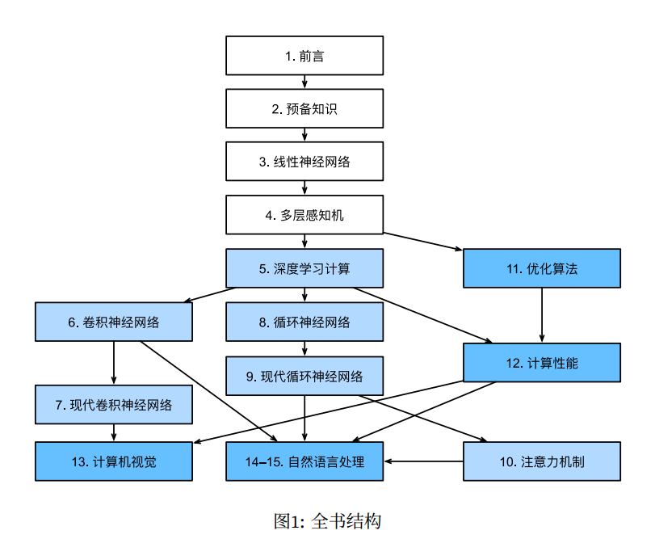
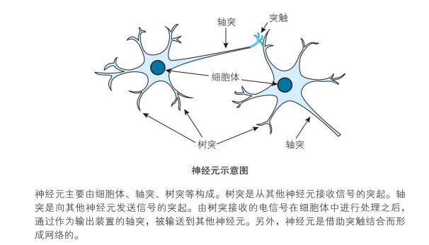
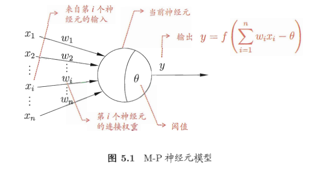
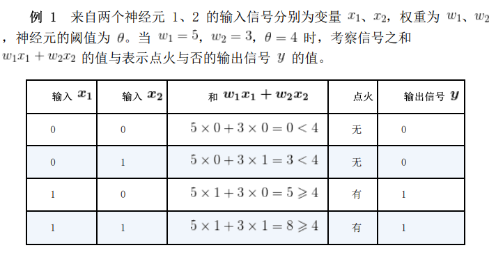

# 神经网络

在本章中，我们将来学习各种基础知识，连接神经网络的一些知识点，将数学和神经网络模型串联起来，为后面学习神经网络编程和模型训练打好基础。

神经网络的知识概念太多了，长话短说吧，但是说来话长。

由于神经网络涉及到很多数学知识和算法，而本书定位为入门级别的教程，加之笔者也是初学者，整个系列教程也是笔者边学边写的，因此这里不深入讲解复杂的细节，只是讲解一些知识到点，知道用来干嘛的就行。

笔者建议看看《深度学习的数学》（作者：涌泉良幸），里面的说明比较详细。

对于深度学习的路线，可以参考《动手深度学习-PyTorch(第二版)》李沐

在线版本：https://zh.d2l.ai/chapter_preface/index.html

https://zh-v2.d2l.ai/d2l-zh-pytorch.pdf

### 使用数学表示神经元

神经网络是以神经元为基础的，这个跟生物上的神经元有所区别。

下图是生物学上的神经元细胞图。

神经元由细胞体、轴突、树突组成，神经元有多个轴突，单细胞体收到刺激后，会通过轴突把信号传递给其它神经元。神经元通过树突接收从其它神经元传递过来的信号。

把神经元通过轴突向其它神经元传递信号的动作称为点火，传递的信号只有 1 和 0，并且同时向所有轴突程度信号，也就是所有被轴突连接到的神经元都会收到通知。

那么，神经元什么时候会点火呢。

神经元是有阈值的，神经元有多个树突，从不同的神经元接收信号，只有当这些信号达到阈值时，才能刺激神经元。

比如说，神经元 A 的信号阈值是 $a$ 有三个树突，分别连接了 $x_{1}$ 、 $x__{2}$  、 $x_{3}$ 三个神经元，每个连接都有权重，那么：
$$

$$

$$
\omega{_{1}}{x_{1}} + \omega{_{2}}{x_{2}} + \omega{_{3}}{x_{3}} < \theta , y = 0\\
\omega{_{1}}{x_{1}} + \omega{_{2}}{x_{2}} + \omega{_{3}}{x_{3}} \ge \theta , y = 1\\
$$

看这个公式，如果把权重和神经元分开，相当于两个向量的内积。

这种情况下，输出值只有 0，1.

单位阶跃函数。

### 激活函数

讲解将公式转换后，激活函数是怎么来的。

一些常用的激活函数，从 pytorch 里面列出。

单独讲解一些激活函数，然后使用代码计算激活函数的结果。

### 神经网络分层

#### 输入层

#### 隐藏层

神经网络的权重的偏置。

#### 输出层

感知机和多层网络

#### 最优化

代价函数

优化器

### 向前传播、向后传播

前向传播（forward）和反向传播（backward）

https://zhuanlan.zhihu.com/p/447113449

说到反向传播，就要聊聊 Pytorch 中的自动微分了。

BP算法的简单理解：如果当前代价函数值距离预期值较远，那么我们通过调整权重�或偏置�的值使新的代价函数值更接近预期值（和预期值相差越大，则权重�或偏置�调整的幅度就越大）。一直重复该过程，直到最终的代价函数值在误差范围内，则算法停止。

### 神经网络

卷积神经网络、循环神经网络、前馈神经网络

