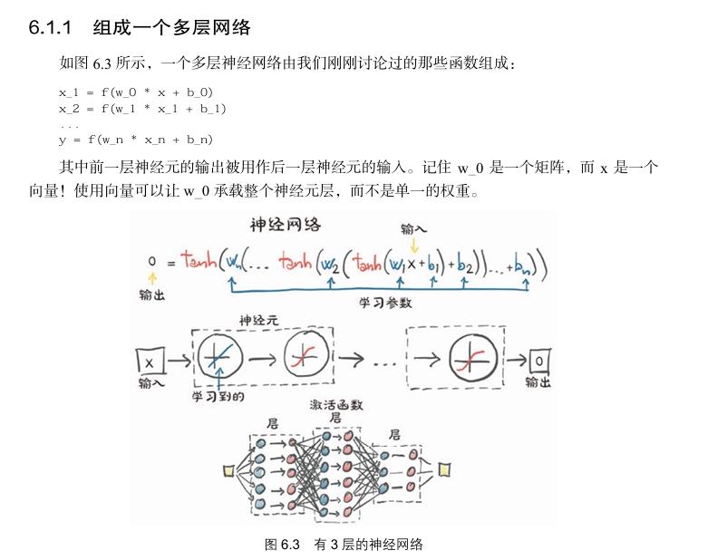
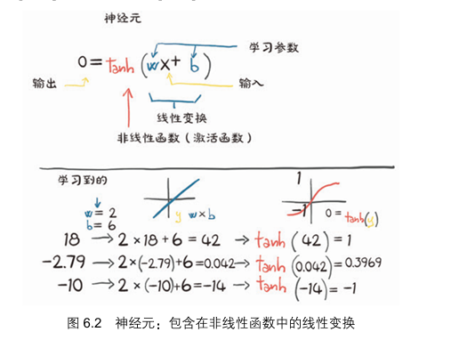
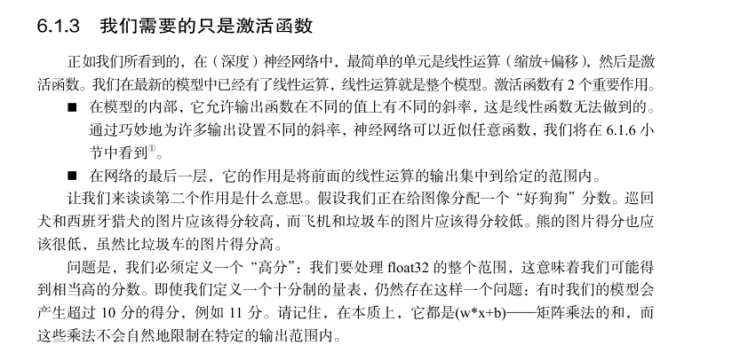
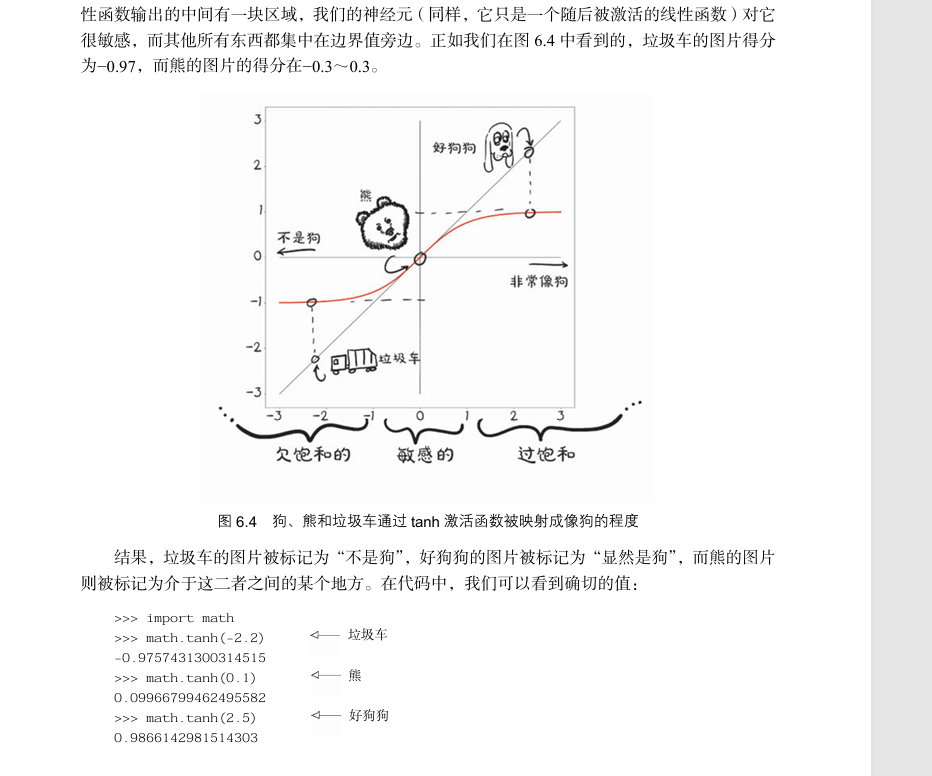

# 神经网络基础知识

> **[info] 提示**
>
> 本章的内容是笔者的笔记整理，知识不一定正确，想了解神经网络基础知识，建议读者参阅以下书籍：
>
> * 《深度学习的数学》，作者：涌泉良幸；
> * 非常推荐《深入浅出神经网络与深度学习》，作者： 迈克尔·尼尔森；
> * 《动手学PyTorch建模与应用》，作者：王国平；
> * 《PyTorch深度学习实战》，作者：[美] 伊莱•史蒂文斯；
> * 《机器学习》，作者：周志华；

在本章中，我们将来学习各种基础知识，连接神经网络的一些知识点，将数学和神经网络模型串联起来，为后面学习神经网络编程和模型训练打好基础。

神经网络的知识概念太多了，长话短说吧，但是说来话长。

由于神经网络涉及到很多数学知识和算法，而本书定位为入门级别的教程，加之笔者也是初学者，整个系列教程也是笔者边学边写的，因此这里不深入讲解复杂的细节，只是讲解一些知识到点，知道用来干嘛的就行。

笔者建议看看《深度学习的数学》（作者：涌泉良幸），里面的说明比较详细。

对于深度学习的路线，可以参考《动手深度学习-PyTorch(第二版)》李沐

在线版本：https://zh.d2l.ai/chapter_preface/index.html

https://zh-v2.d2l.ai/d2l-zh-pytorch.pdf

### 线性网络和多层感知机

神经网络是以神经元为基础的，这个跟生物上的神经元有所区别。下图是生物学上的神经元细胞图。

神经元由细胞体、轴突、树突组成，神经元有多个轴突，单细胞体收到刺激后，会通过轴突把信号传递给其它神经元。神经元通过树突接收从其它神经元传递过来的信号。

把神经元通过轴突向其它神经元传递信号的动作称为点火，传递的信号只有 1 和 0，并且同时向所有轴突程度信号，也就是所有被轴突连接到的神经元都会收到通知。

那么，神经元什么时候会点火呢。

神经元是有阈值的，神经元有多个树突，从不同的神经元接收信号，只有当这些信号达到阈值时，才能刺激神经元。

比如说，神经元 A 的信号阈值是 $a$ 有三个树突，分别连接了 $x_{1}$ 、 $x_{2}$  、 $x_{3}$ 三个神经元，每个连接都有权重，那么：
$$

$$

$$
\omega{_{1}}{x_{1}} + \omega{_{2}}{x_{2}} + \omega{_{3}}{x_{3}} < \theta , y = 0\\
\omega{_{1}}{x_{1}} + \omega{_{2}}{x_{2}} + \omega{_{3}}{x_{3}} \ge \theta , y = 1\\
$$

看这个公式，如果把权重和神经元分开，相当于两个向量的内积。

这种情况下，输出值只有 0，1。

我们把这种模型称为线性模型。

关于神经元的模型和公式有多个变种，这里就不细聊了。

如果使用矩阵乘法表示，也可以写成：
$$
[\omega{_{1}},\omega{_{2}},...,\omega{_{n}}] * [x_{1},x_{2},...,x_{n}] = \omega{_{1}}{x_{1}} + \omega{_{2}}{x_{2}} + ... + \omega{_{n}}{x_{n}}
$$

$$
y = \omega{_{1}}{x_{1}} + \omega{_{2}}{x_{2}} + ... + \omega{_{n}}{x_{n}} - \theta
$$

### 神经网络

对应一个神经网络来说，会由多个层组成：输入层、隐藏层、输出层。

比如说，如果我们要设置一个模型识别图片进行分类，一个简化的例子是以图片大小为 `28*28`，用二维数组表示的话，即784个像素值。不过一般我们把这28*28的二维数组转换为一层线性数据，即784个神经元。也就是说，输入层的大小就是 784。

在实际应用中，我们常常会对图片做预处理，比如缩放图片的大小至固定值，转换为黑白图片，再转换为线性数据方便神经网络处理。

### 多层感知机（MLP）

多层感知机由多个感知机组成，每个感知机层由多个神经元构成。多层感知机包括输入层、一个或多个隐藏层以及输出层。通过一层一层的输入、计算和输出，神经网络能够提取和组合数据中的特征，并进行预测。

### 激活函数

有一类函数叫单位阶跃函数，如果我们将前面的神经元输入输出函数修改为：
$$
\omega{_{1}}{x_{1}} + \omega{_{2}}{x_{2}} + \omega{_{3}}{x_{3}} - \theta < 0, y = 0\\
\omega{_{1}}{x_{1}} + \omega{_{2}}{x_{2}} + \omega{_{3}}{x_{3}} - \theta \ge 0 , y = 1\\
$$

我们设 $z = \omega{_{1}}{x_{1}} + \omega{_{2}}{x_{2}} + \omega{_{3}}{x_{3}} - \theta$  ， 上面的关系为 $u$ ，则：
$$
y = u(z) = \left\{
\begin{aligned}
0 \quad (z < 0) \\
1 \quad (z \ge 0)
\end{aligned}
\right.
$$

尽管单位阶跃函数很直观，但在深度学习中，通常使用其它的激活函数来引入非线性。常见的激活函数包括：

当然，在深度学习中，输出并不是只有 0 和 1。

如果我们把 $u$ 替换为其它函数，那么：
$$
y = a(z) = a(\omega{_{1}}{x_{1}} + \omega{_{2}}{x_{2}} + \omega{_{3}}{x_{3}} - \theta)
$$
在数学上一般使用 $b$ 来表示 $-\theta$， $b$ 称为偏置。

所以：
$$
y = a(z) = a(\omega{_{1}}{x_{1}} + \omega{_{2}}{x_{2}} + \omega{_{3}}{x_{3}} + b)
$$

这里的函数 $a$ 被称为激活函数。

神经网络中激活函数的作用。

激活函数的作用是使得输出 y 是一个非线性函数。

下面给出几个激活函数。

讲解将公式转换后，激活函数是怎么来的。

一些常用的激活函数，从 pytorch 里面列出。

单独讲解一些激活函数，然后使用代码计算激活函数的结果。

非线性使得整个网络能够逼近更复杂的函数。

没有这些特性，网络要么退回到线性模型，要么变得难以训练。

### 神经网络的训练步骤

### 网络的定义

多层神经网络是怎么逐步传递的

单位阶跃函数。

### 神经网络分层

#### 输入层

#### 隐藏层

神经网络的权重的偏置。

#### 输出层

感知机和多层网络

#### 最优化

代价函数

优化器

### 向前传播、向后传播

前向传播（forward）和反向传播（backward）

https://zhuanlan.zhihu.com/p/447113449

说到反向传播，就要聊聊 Pytorch 中的自动微分了。

BP算法的简单理解：如果当前代价函数值距离预期值较远，那么我们通过调整权重�或偏置�的值使新的代价函数值更接近预期值（和预期值相差越大，则权重�或偏置�调整的幅度就越大）。一直重复该过程，直到最终的代价函数值在误差范围内，则算法停止。

### 神经网络

卷积神经网络、循环神经网络

### 卷积神经网络经典模型架构简介

GoogleNet 等模型
