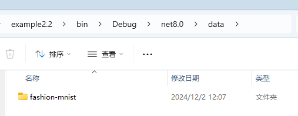
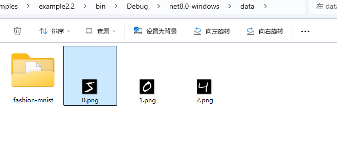
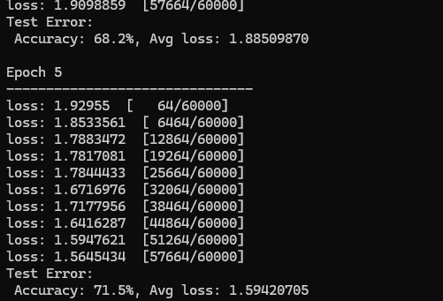

# 开始使用 Torch

本章内容主要基于 Pytorch 官方入门教程编写，使用 C# 代码代替 Python，主要内容包括处理数据、创建模型、优化模型参数、保存模型、加载模型，读者通过本章内容开始了解 TorchSharp 框架的使用方法。

<br />

官方教程：

https://pytorch.org/tutorials/beginner/basics/quickstart_tutorial.html


### 准备

创建一个控制台项目，示例代码参考 `example2.2`，通过 nuget 引入以下类库：

```
TorchSharp
TorchSharp-cuda-windows
TorchVision
Maomi.Torch
```


首先添加以下代码，查找最适合当前设备的工作方式，主要是选择 GPU 开发框架，例如 CUDA、MPS，CPU，有 GPU 就用 GPU，没有 GPU 降级为 CPU。

```csharp
using Maomi.Torch;

Device defaultDevice = MM.GetOpTimalDevice();
torch.set_default_device(defaultDevice);

Console.WriteLine($"当前正在使用 {defaultDevice}");
```


### 下载数据集

训练模型最重要的一步是准备数据，但是准备数据集是一个非常繁杂和耗时间的事情，对于初学者来说也不现实，所以 Pytorch 官方在框架集成了一些常见的数据集，开发者可以直接通过 API 使用这些提前处理好的数据集和标签。

Pytorch 使用 `torch.utils.data.Dataset` 表示数据集抽象接口，存储了数据集的样本和对应标签；`torch.utils.data.DataLoader` 表示加载数据集的抽象接口，主要是提供了迭代器。这两套接口是非常重要的，对于开发者自定义的数据集，需要实现这两套接口，自定义加载数据集方式。 

<br />

Pytorch 有三大领域的类库，分别是 TorchText、TorchVision、TorchAudio，这三个库都自带了一些常用开源数据集，但是 .NET 里社区仓库只提供了 TorchVision，生态严重落后于 Pytorch。TorchVision 是一个工具集，可以从 Fashion-MNIST 等下载数据集以及进行一些数据类型转换等功能。

<br />

在本章中，使用的数据集叫 FashionMNIST，Pytorch 还提供了很多数据集，感兴趣的读者参考：https://pytorch.org/vision/stable/datasets.html

<br />

现在开始讲解如何通过 TorchSharp 框架加载 FashionMNIST 数据集，首先添加引用：

```csharp
using TorchSharp;
using static TorchSharp.torch;
using datasets = TorchSharp.torchvision.datasets;
using transforms = TorchSharp.torchvision.transforms;
```


然后通过接口加载训练数据集和测试数据集：

```csharp
// 指定训练数据集
var training_data = datasets.FashionMNIST(
    root: "data",   // 数据集在那个目录下
    train: true,    // 加载该数据集，用于训练
    download: true, // 如果数据集不存在，是否下载
    target_transform: transforms.ConvertImageDtype(ScalarType.Float32) // 指定特征和标签转换，将标签转换为Float32
    );

// 指定测试数据集
var test_data = datasets.FashionMNIST(
    root: "data",   // 数据集在那个目录下
    train: false,    // 加载该数据集，用于训练
    download: true, // 如果数据集不存在，是否下载
    target_transform: transforms.ConvertImageDtype(ScalarType.Float32) // 指定特征和标签转换，将标签转换为Float32
    );
```

<br />

部分参数解释如下：

- `root` 是存放训练/测试数据的路径。
- `train` 指定训练或测试数据集。
- `download=True` 如果 `root` 中没有数据，则从互联网下载数据。
- `transform` 和 `target_transform` 指定特征和标签转换。

<br />

注意，与 Python 版本有所差异， Pytorch 官方给出了 `ToTensor()` 函数用于将图像转换为 torch.Tensor 张量类型，但是由于 C# 版本并没有这个函数，因此只能手动指定一个转换器。

<br />

启动项目，会自动下载数据集，接着在程序运行目录下会自动创建一个 data 目录，里面是数据集文件，包括用于训练的数据和测试的数据集。



<br />

文件内容如下所示，子目录 test_data 里面的是测试数据集，用于检查模型训练情况和优化。

```
│   t10k-images-idx3-ubyte.gz
│   t10k-labels-idx1-ubyte.gz
│   train-images-idx3-ubyte.gz
│   train-labels-idx1-ubyte.gz
│
└───test_data
        t10k-images-idx3-ubyte
        t10k-labels-idx1-ubyte
        train-images-idx3-ubyte
        train-labels-idx1-ubyte
```


### 显示图片

数据集是 Dataset 类型，继承了 `Dataset<Dictionary<string, Tensor>>` 类型，Dataset 本质是列表，我们把 Dataset 列表的 item 称为数据，每个 item 都是一个字典类型，**每个字典由 data、label 两个 key 组成**。

在上一节，已经编写好如何加载数据集，将训练数据和测试数据分开加载，为了了解 Dataset ，读者可以通过以下代码将数据集的结构打印到控制台。


```csharp
for (int i = 0; i < training_data.Count; i++)
{
    var dic = training_data.GetTensor(i);
    var img = dic["data"];
    var label = dic["label"];
    label.print();
}
```

<br />

通过观察控制台，可以知道，每个数据元素都是一个字典，**每个字典由 data、label 两个 key 组成**,`dic["data"]` 是一个图片，而 label 就是表示该图片的文本值是什么。

<br />

Maomi.Torch 框架提供了将张量转换为图片并显示的方法，例如下面在窗口显示数据集前面的三张图片：

```csharp
for (int i = 0; i < training_data.Count; i++)
{
    var dic = training_data.GetTensor(i);
    var img = dic["data"];
    var label = dic["label"];

    if (i > 2)
    {
        break;
    }

    img.ShowImage();
}
```

> 使用 Maomi.ScottPlot.Winforms 库，还可以通过 `img.ShowImageToForm()` 接口通过窗口的形式显示图片。

<br />

你也可以直接转存为图片：

```
img.SavePng($"data/{i}.png");
```



### 加载数据集

由于 FashionMNIST 数据集有 6 万张图片，一次性加载所有图片比较消耗内存，并且一次性训练对 GPU 的要求也很高，因此我们需要分批处理数据集。

<br />

`torch.utils.data` 中有数据加载器，可以帮助我们分批加载图片集到内存中，开发时使用迭代器直接读取，不需要关注分批情况。

如下面所示，分批加载数据集，批处理大小是 64 张图片。

```csharp
// 分批加载图像，打乱顺序
var train_loader = torch.utils.data.DataLoader(training_data, batchSize: 64, shuffle: true, device: defaultDevice);

// 分批加载图像，不打乱顺序
var test_loader = torch.utils.data.DataLoader(test_data, batchSize: 64, shuffle: false, device: defaultDevice);
```

<br />

注意，分批是在 DataLoader 内部发生的，我们可以理解为缓冲区大小，对于开发者来说，并不需要关注分批情况。


### 定义网络

接下来定义一个神经网络，神经网络有多个层，通过神经网络来训练数据，通过数据的训练可以的出参数、权重等信息，这些信息会被保存到模型中，加载模型时，必须要有对应的网络结构，比如神经网络的层数要相同、每层的结构一致。

该网络通过接受 `28*28` 大小的图片，经过处理后输出 10 个分类值，每个分类结果都带有其可能的概率，概率最高的就是识别结果。

<br />

将以下代码存储到 NeuralNetwork.cs 中。

```csharp
using TorchSharp.Modules;
using static TorchSharp.torch;
using nn = TorchSharp.torch.nn;

public class NeuralNetwork : nn.Module<Tensor, Tensor>
{
    // 传递给基类的参数是模型的名称
    public NeuralNetwork() : base(nameof(NeuralNetwork))
    {
        flatten = nn.Flatten();
        linear_relu_stack = nn.Sequential(
            nn.Linear(28 * 28, 512),
            nn.ReLU(),
            nn.Linear(512, 512),
            nn.ReLU(),
            nn.Linear(512, 10));

        // C# 版本需要调用这个函数，将模型的组件注册到模型中
        RegisterComponents();
    }

    Flatten flatten;
    Sequential linear_relu_stack;

    public override Tensor forward(Tensor input)
    {
        // 将输入一层层处理并传递给下一层
        var x = flatten.call(input);
        var logits = linear_relu_stack.call(x);
        return logits;
    }
}
```

> 注意，网络中只能定义字段，不要定义属性；不要使用 `_` 开头定义字段；


然后继续在 Program 里继续编写代码，初始化神经网络，并使用 GPU 来加载网络。

```csharp
var model = new NeuralNetwork();
model.to(defaultDevice);
```


### 优化模型参数

为了训练模型，需要定义一个损失函数和一个优化器，损失函数的主要作用是衡量模型的预测结果与真实标签之间的差异，即误差或损失，有了损失函数后，通过优化器可以指导模型参数的调整，使预测结果能够逐步靠近真实值，从而提高模型的性能。Pytorch 自带很多损失函数，这里使用计算交叉熵损失的损失函数。

```csharp
// 定义损失函数、优化器和学习率
var loss_fn = nn.CrossEntropyLoss();
var optimizer = torch.optim.SGD(model.parameters(), learningRate : 1e-3);
```

<br />

同时，优化器也很重要，是用于调整模型参数以最小化损失函数的模块。

因为损失函数比较多，但是优化器就那么几个，所以这里简单列一下 Pytorch 中自带的一些优化器。

* **SGD（随机梯度下降）**：通过按照损失函数的梯度进行线性步长更新权重；
* **Adam（自适应矩估计）** ：基于一阶和二阶矩估计的优化算法，它能自适应地调整学习率，对大多数问题效果较好；
* **RMSprop**：适用于处理非平稳目标，能够自动进行学习率的调整；
* **AdamW（带权重衰减的 Adam）** ：在 Adam 的基础上添加了权重衰减（weight decay），防止过拟合。


### 训练模型

接下来讲解训练模型的步骤，如下代码所示。

下面是详细步骤：

* 每读取一张图片，就使用神经网络进行**识别**(`.call()` 函数)，`pred` 为**识别结果**；
* 通过损失函数判断网络的识别结果和标签值的误差；
* 通过损失函数反向传播，计算网络的梯度等；
* 通过 SGD 优化器，按照损失函数的梯度进行线性步长更新权重，`optimizer.step()` 会调整模型的权重，根据计算出来的梯度来更新模型的参数，使模型逐步接近优化目标。
* 因为数据是分批处理的，因此计算当前批次的梯度后，需要使用 `optimizer.zero_grad()` 重置当前所有梯度。
* 计算训练成果，即打印当前训练进度和损失值。

```csharp
static void Train(DataLoader dataloader, NeuralNetwork model, CrossEntropyLoss loss_fn, SGD optimizer)
{
    var size = dataloader.dataset.Count;
    model.train();

    int batch = 0;
    foreach (var item in dataloader)
    {
        var x = item["data"];
        var y = item["label"];

        // 第一步
        // 训练当前图片
        var pred = model.call(x);

        // 通过损失函数得出与真实结果的误差
        var loss = loss_fn.call(pred, y);

        // 第二步，反向传播
        loss.backward();

        // 计算梯度并优化参数
        optimizer.step();

        // 清空优化器当前的梯度
        optimizer.zero_grad();

        // 每 100 次打印损失值和当前训练的图片数量
        if (batch % 100 == 0)
        {
            loss = loss.item<float>();
            
            // Pytorch 框架会在 x.shape[0] 存储当前批的位置
            var current = (batch + 1) * x.shape[0];
            
            Console.WriteLine("loss: {loss.item<float>(),7}  [{current,5}/{size,5}]");
        }

        batch++;
    }
}
```

> torch.Tensor 类型的 `.shape` 属性比较特殊，是一个数组类型，主要用于存储当前类型的结构，要结合上下文才能判断，例如在当前训练中，`x.shape` 值是 `[64,1,28,28]`，`shape[1]` 是图像的通道，1 是灰色，3 是彩色(RGB三通道)；`shape[2]`、`shape[3]` 分别是图像的长度和高度。

<br />

通过上面步骤可以看出，“训练” 是一个字面意思，跟人类的学习不一样，这里是先使用模型识别一个图片，然后计算误差，更新模型参数和权重，然后进入下一次调整。

<br />

训练模型的同时，我们还需要评估模型的准确率等信息，评估时需要使用测试图片来验证训练结果。

<br />

```csharp
static void Test(DataLoader dataloader, NeuralNetwork model, CrossEntropyLoss loss_fn)
{
    var size = (int)dataloader.dataset.Count;
    var num_batches = (int)dataloader.Count;

    // 将模型设置为评估模式
    model.eval();

    var test_loss = 0F;
    var correct = 0F;

    using (var n = torch.no_grad())
    {
        foreach (var item in dataloader)
        {
            var x = item["data"];
            var y = item["label"];

            // 使用已训练的参数预测测试数据
            var pred = model.call(x);

            // 计算损失值
            test_loss += loss_fn.call(pred, y).item<float>();
            correct += (pred.argmax(1) == y).type(ScalarType.Float32).sum().item<float>();
        }
    }

    test_loss /= num_batches;
    correct /= size;
    Console.WriteLine("Test Error: \n Accuracy: {(100 * correct):F1}%, Avg loss: {test_loss:F8} \n");
}
```

<br />


下图是后面训练打印的日志，可以看出准确率是逐步上升的。



<br />


在 Program 中添加训练代码，我们使用训练数据集进行五轮训练，每轮训练都输出识别结果。

```csharp
// 训练的轮数
var epochs = 5;

foreach (var epoch in Enumerable.Range(0, epochs))
{
    Console.WriteLine($"Epoch {epoch + 1}\n-------------------------------");
    Train(train_loader, model, loss_fn, optimizer);
    Test(train_loader, model, loss_fn);
}

Console.WriteLine("Done!");
```


### 保存和加载模型

经过训练后的模型，可以直接保存和加载，代码很简单，如下所示：

```csharp
model.save("model.dat");
Console.WriteLine("Saved PyTorch Model State to model.dat");

model.load("model.dat");
```


### 使用模型识别图片

要使用模型识别图片，只需要使用 `var pred = model.call(x);` 即可，但是因为模型并不能直接输出识别结果，而是根据网络结构输出到每个神经元中，每个神经元都表示当前概率。在前面定义的网络中，`nn.Linear(512, 10))` 会输出 10 个分类结果，每个分类结果都带有概率，那么我们将概率最高的一个结果拿出来，就相当于图片的识别结果了。

代码如下所示，步骤讲解如下：

* 因为模型和网络并不使用字符串表示每个分类结果，所以需要手动配置分类表。
* 然后从测试数据集中选取第一个图片和标签，识别图片并获得序号。
* 从分类字符串中通过序号获得分类名称。

```csharp
var classes = new string[] {
    "T-shirt/top",
    "Trouser",
    "Pullover",
    "Dress",
    "Coat",
    "Sandal",
    "Shirt",
    "Sneaker",
    "Bag",
    "Ankle boot",
};

// 设置为评估模式
model.eval();

// 加载测试数据中的第一个图片以及其标签
var x = test_data.GetTensor(0)["data"];
var y = test_data.GetTensor(0)["label"];

using (torch.no_grad())
{
    x = x.to(defaultDevice);
    var pred = model.call(x);
    var predicted = classes[pred[0].argmax(0).ToInt32()];
    var actual = classes[y.ToInt32()];
    Console.WriteLine("Predicted: \"{predicted}\", Actual: \"{actual}\"");
}
```


当然，使用 Maomi.Torch 的接口，可以很方便读取图片使用模型识别：

```csharp
var img = MM.LoadImage("0.png");
using (torch.no_grad())
{
    img = img.to(defaultDevice);
    var pred = model.call(img);

    // 转换为归一化的概率
    var array = torch.nn.functional.softmax(pred, dim: 0);
    var max = array.ToFloat32Array().Max();
    var predicted = classes[pred[0].argmax(0).ToInt32()];
    
    Console.WriteLine("识别结果 {predicted}，概率 {max * 100}%");
}
```

