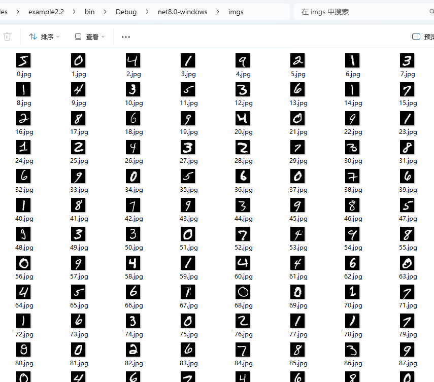
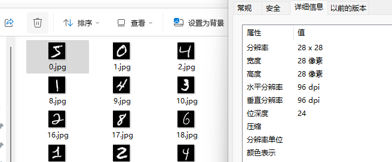

# 训练

本章主要参考《破解深度学习》的第四章。

搭建神经网络的步骤：


在本章将会实现一个数字分类器。


在上一章中，我们学习了如何下载和加载数据集，如果将数据集里面的图片导出，我们可以发现里面都是单个数字。

你可以使用 Maomi.Torch 包中的扩展方法将数据集转存到本地目录中。

```csharp
for (int i = 0; i < training_data.Count; i++)
{
    var dic = training_data.GetTensor(i);
    var img = dic["data"];
    var label = dic["label"];

    img.SaveJpeg($"imgs/{i}.jpg");
}
```





每个图片的大小是 `28*28=784`。




我们直接知道，由于数据集的图片都是 0-9 的数字，因此模型训练结果的输出应该是 10 个。


第一步，定义我们的模型，这是一个全连接网络。


```csharp
using TorchSharp;
using static TorchSharp.torch;
using TorchSharp.Modules;
using TorchSharp.Data;
using nn = TorchSharp.torch.nn;
using optim = TorchSharp.torch.optim;
using datasets = TorchSharp.torchvision.datasets;
using transforms = TorchSharp.torchvision.transforms;
using System.Drawing;

public class MLP : nn.Module<Tensor, Tensor>, IDisposable
{
    private readonly int _inputSize;
    private readonly int _hiddenSize;
    private readonly int _numClasses;

    private TorchSharp.Modules.Linear fc1;
    private TorchSharp.Modules.ReLU relu;
    private TorchSharp.Modules.Linear fc2;
    private TorchSharp.Modules.Linear fc3;

    /// <summary>
    /// 
    /// </summary>
    /// <param name="inputSize">输入层大小，图片的宽*高.</param>
    /// <param name="hiddenSize">隐藏层大小.</param>
    /// <param name="outputSize">输出层大小，例如有多少个分类.</param>
    /// <param name="device"></param>
    public MLP(int inputSize, int hiddenSize, int outputSize, Device device) : base(nameof(MLP))
    {
        _inputSize = inputSize;
        _hiddenSize = hiddenSize;
        _numClasses = outputSize;

        // 定义激活函数和线性层
        relu = nn.ReLU();
        fc1 = nn.Linear(inputSize, hiddenSize, device: device);
        fc2 = nn.Linear(hiddenSize, hiddenSize, device: device);
        fc3 = nn.Linear(hiddenSize, outputSize, device: device);

        RegisterComponents();

    }

    public override torch.Tensor forward(torch.Tensor input)
    {
        // 一层一层传递
        // 第一层读取输入，然后传递给激活函数，
        // 第二层读取第一层的输出，然后传递给激活函数，
        // 第三层读取第二层的输出，然后生成输出结果
        var @out = fc1.call(input);
        @out = relu.call(@out);
        @out = fc2.call(@out);
        @out = relu.call(@out);
        @out = fc3.call(@out);
        return @out;
    }

    protected override void Dispose(bool disposing)
    {
        base.Dispose(disposing);
        fc1.Dispose();
        relu.Dispose();
        fc2.Dispose();
        fc3.Dispose();
    }
}
```


分批处理数据集：

```csharp
var default_device = torch.get_default_device();
Console.WriteLine($"当前正在使用 {default_device}");

// 1. 加载数据集

// 从 MNIST 数据集下载数据或者加载已经下载的数据
using var train_data = datasets.MNIST("./mnist/data", train: true, download: true, target_transform: transforms.ConvertImageDtype(ScalarType.Float32));
using var test_data = datasets.MNIST("./mnist/data", train: false, download: true, target_transform: transforms.ConvertImageDtype(ScalarType.Float32));

Console.WriteLine("Train data size: " + train_data.Count);
Console.WriteLine("Test data size: " + test_data.Count);

var batch_size = 100;

// 分批加载图像，打乱顺序
var train_loader = torch.utils.data.DataLoader(train_data, batchSize: batch_size, shuffle: true, defaultDevice);

// 分批加载图像，不打乱顺序
var test_loader = torch.utils.data.DataLoader(test_data, batchSize: batch_size, shuffle: false, defaultDevice);
```


创建模型：

```

// 输入层大小，按图片的宽高计算
var input_size = 28 * 28;

// 隐藏层大小，大小不固定，可以自己调整
var hidden_size = 512;

// 手动配置分类结果个数
var num_classes = 10;

var model = new MLP(input_size, hidden_size, num_classes, defaultDevice);
```


创建损失函数：

```
// 创建损失函数
var criterion = nn.CrossEntropyLoss();

// 学习率
var learning_rate = 0.001;
// 优化器
var optimizer = optim.Adam(model.parameters(), lr: learning_rate);
```


开始训练模型，对数据集进行 10 轮训练：

```csharp
// 训练的轮数
var num_epochs = 10;

foreach (var epoch in Enumerable.Range(0, num_epochs))
{
    int i = 0;
    foreach (var item in train_loader)
    {
        var images = item["data"];
        var lables = item["label"];

        images = images.reshape(-1, 28 * 28);
        var outputs = model.call(images);

        var loss = criterion.call(outputs, lables);

        optimizer.zero_grad();

        loss.backward();

        optimizer.step();

        i++;
        if ((i + 1) % 300 == 0)
        {
            Console.WriteLine($"Epoch [{(epoch + 1)}/{num_epochs}], Step [{(i + 1)}/{train_data.Count / batch_size}], Loss: {loss.ToSingle():F4}");
        }
    }
}
```


测试训练效果：

```

using (torch.no_grad())
{
    long correct = 0;
    long total = 0;

    foreach (var item in test_loader)
    {
        var images = item["data"];
        var labels = item["label"];

        images = images.reshape(-1, 28 * 28);
        var outputs = model.call(images);

        var (_, predicted) = torch.max(outputs, 1);
        total += labels.size(0);
        correct += (predicted == labels).sum().item<long>();
    }
    Console.WriteLine($"Accuracy of the network on the 10000 test images: {100 * correct / total} %");
}

```


保存训练后的模型：

```csharp
model.save("mnist_mlp_model.pkl");
```


对于 MNIST 数据集，有人已经预计算了整个训练集的像素值的均值和标准差：


- 均值 μ=0.1307*μ*=0.1307
- 标准差 σ=0.3081*σ*=0.3081


重新加载模型：

```csharp
var default_device = torch.get_default_device();
Console.WriteLine($"当前正在使用 {default_device}");

// 输入层大小，按图片的宽高计算
var input_size = 28 * 28;

// 隐藏层大小，大小不固定，可以自己调整
var hidden_size = 512;

// 手动配置分类结果个数
var num_classes = 10;

var model = new MLP(input_size, hidden_size, num_classes, defaultDevice);
model.load("mnist_mlp_model.pkl");

// 把模型转为test模式
model.eval();
```


使用 Maomi.Torch 导入图片并转为 Tensor，然后将 `28*28` 转换为以为的 `784`。

```csharp
// 加载图片为张量
torch.Tensor image = TensorImageExtensions.LoadImage("0.jpg");
image = image.reshape(-1, 28 * 28);
```


转换图片：

```

var transform = transforms.ConvertImageDtype(ScalarType.Float32);

var img = transform.call(image).unsqueeze(0);

```


最后使用模型加载图片并进行识别：

```
using (torch.no_grad())
{
    var oputput = model.call(image);
    var prediction = oputput.argmax(dim: 1, keepdim: true);
    Console.WriteLine("Predicted Digit: " + prediction.item<long>().ToString());
}
```


输出为 5。

不过这样的模型只能识别图片为 `28*28`大小的。

