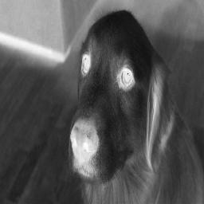
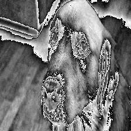

# 使用预训练模型

https://github.com/deep-learning-with-pytorch/dlwpt-code


添加引用：


```xml
TorchSharp
TorchSharp-cuda-windows
TorchVision
Maomi.Torch
```


Pytorch 默认已经内置了很多网络，这些网络可以在 `TorchSharp.torchvision.models` 里面找到，当实例化网络时会自动下载模型。

```
alexnet
googlenet
inception_v3
mobilenet_v2
mobilenet_v3_large
mobilenet_v3_small
resnet18
resnet34
resnet50
wide_resnet50_2
resnext50_32x4d
resnet101
resnext101_32x8d
resnext101_64x4d
wide_resnet101_2
resnet152
vgg11
vgg11_bn
vgg13
vgg13_bn
vgg16
vgg16_bn
vgg19
vgg19_bn
```


相同模型后面的数字表示网络层数，例如 resnet50 表示具有 50 层的网络。


首先我们尝试 resnet101 网络。

```csharp
using Maomi.Torch;
using TorchSharp;
using static TorchSharp.torchvision;
using model = TorchSharp.torchvision.models;

var device = mm.GetOpTimalDevice();
torch.set_default_device(device);

var resnet101 = model.resnet101(device: device);
var parameterCount = 0L;
foreach (var item in resnet101.parameters())
{
    parameterCount += item.numel();
}
Console.WriteLine(parameterCount);

```

可以看到 `parameterCount=44549160`，该网络模型居然有四千四百多万个参数。


处理图像。

在本例中，我们定义了一个预处理函数，将输入图像缩放到256×256个像素，围绕中心将 图像裁剪为224×224个像素，并将其转换为一个张量，对其RGB分量（红色、绿色和蓝色）进 行归一化处理，使其具有定义的均值和标准差。张量是一种PyTorch多维数组，在本例中，是一 个包含颜色、高度和宽度的三维数组。如果我们想让网络产生有意义的答案，那么这些转换就需 要与训练期间向网络提供的内容相匹配。在7.1.3小节中，当开始制作自己的图像识别模型时， 我们再更深入地讨论转换。

```

var preprocess = transforms.Compose(
    transforms.Resize(256),
    transforms.CenterCrop(224),
    transforms.ConvertImageDtype(torch.ScalarType.Float32),
    transforms.Normalize(means: new double[] { 0.485, 0.456, 0.406 },
    stdevs: new double[] { 0.229, 0.224, 0.225 })
    );
```


这里使用书本中的图片做测试。

图片下载地址 https://github.com/deep-learning-with-pytorch/dlwpt-code/blob/master/data/p1ch2/bobby.jpg


将图片转换为预设的大小，然后我们将图片导出到本地查看转换后的图形是怎么样的。

```csharp
// 加载图形并缩放裁剪
var img = MM.LoadImage("bobby.jpg", 3, 256, 256);
img.SaveJpeg("boddy_preprocessed_1.jpg");
// 使用转换函数处理图形
img = preprocess.call(img);
img.SaveJpeg("boddy_preprocessed_2.jpg");
```






然后我们可以按照网络期望的方式对输入的张量进行重塑、裁剪和归一化处理。

```
var batch_t = torch.unsqueeze(img, 0);
```


启动模型并进行识别：

```csharp
var resnet101 = model.resnet101(device: device);
resnet101.eval();

var batch_t = torch.unsqueeze(img, 0);

var @out =  resnet101.call(img);
@out.print();
```


完整的代码如下：

````csharp
var device = MM.GetOpTimalDevice();
torch.set_default_device(device);

var preprocess = transforms.Compose(
    transforms.Resize(256),
    transforms.CenterCrop(224),
    transforms.ConvertImageDtype(torch.ScalarType.Float32),
    transforms.Normalize(means: new double[] { 0.485, 0.456, 0.406 }, stdevs: new double[] { 0.229, 0.224, 0.225 })
    );

// 加载图形并缩放裁剪
var img = MM.LoadImageByChannel3("bobby.jpg",  256, 256);

// 使用转换函数处理图形
img = preprocess.call(img);

var resnet101 = model.resnet101(device: device);
resnet101.eval();

var batch_t = torch.unsqueeze(img, 0);

var @out =  resnet101.call(img);
@out.print();
````

