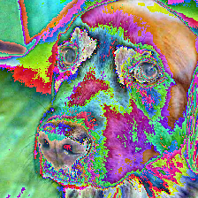

# 使用预训练模型

本章主要参考 《深度学习实战》(伊莱史蒂文斯) 中的示例，使用 resnet101 网络模型加载预训练的模型，识别图片中的动物。

>  ResNet-101 是残差网络，用于图像分类与预测。

<br />

Pytorch 默认已经内置了很多网络，这些网络可以在 `TorchSharp.torchvision.models` 里面找到，当实例化网络时会自动下载模型，都是 TorchSharp 不包含模型下载功能，因为 TorchSharp 跟 Pytorch 的模型格式不兼容，因此笔者怎么对部分模型做了转换，可参考仓库 https://huggingface.co/whuanle/torchcsharp

Maomi.Torch 默认提供的模型如下：

```
alexnet
googlenet
inception_v3
mobilenet_v2
mobilenet_v3_large
mobilenet_v3_small
resnet18
resnet34
resnet50
wide_resnet50_2
resnext50_32x4d
resnet101
resnext101_32x8d
resnext101_64x4d
wide_resnet101_2
resnet152
vgg11
vgg11_bn
vgg13
vgg13_bn
vgg16
vgg16_bn
vgg19
vgg19_bn
```

<br />

相同模型后面的数字表示网络层数，例如 resnet50 表示具有 50 层的网络。

<br />

创建一个控制台项目，示例代码参考 `example2.4`，通过 nuget 引入以下类库：

```
TorchSharp
TorchSharp-cuda-windows
TorchVision
Maomi.Torch
```

<br />

引入以下依赖：

```
ing Maomi.Torch;
using TorchSharp;
using TorchSharp.Modules;
using static TorchSharp.torchvision;
using model = TorchSharp.torchvision.models;
```


### 使用预训练模型

如下代码所示，使用 TorchSharp.torchvision.models 创建一个 resnet101 网络模型实例，然后通过 Maomi.Torch 提供的扩展方法，从 huggingface 中下载模型文件，并自动加载到内存中，resnet101 大约有四千多万个参数。

```csharp
var defaultDeface = MM.GetOpTimalDevice();
torch.set_default_device(defaultDeface);

var resnet101 = model.resnet101(device: defaultDeface);
resnet101 = resnet101.LoadResnet101();
resnet101.to(defaultDeface);
resnet101.eval();
```

<br />

如果使用的是国内网络，访问 huggingface 受阻，可以使用 ModelScope 下载模型文件。

```csharp
var resnet101 = model.resnet101(device: defaultDeface);

MM.ReposityBase = MM.ModelScope;

resnet101 = resnet101.LoadResnet101();
resnet101.to(defaultDeface);
resnet101.eval();
```


默认模型会被下载到 `{User}/.cache/torchcsharp` 下，通过修改 `CSTORCH_HOME` 环境变量可以切换模型下载目录。

如果你想了解模型的参数数量，可以使用以下代码计算总参数数量：

```csharp
var parameterCount = 0L;
foreach (var item in resnet101.parameters())
{
    parameterCount += item.numel();
}
Console.WriteLine(parameterCount);
```

可以看到 `parameterCount=44549160`，该网络模型有四千四百多万个参数。

<br />

### 处理图像

由于 resnet101 网络模型的架构特点，我们不能直接使用模型识别图片，而是将图片整理成与输入层区配的结构，因此需要使用以下函数转换图片，并最终进行层归一化。

```csharp
var preprocess = transforms.Compose(
    transforms.Resize(256),
    transforms.CenterCrop(224),
    transforms.ConvertImageDtype(torch.ScalarType.Float32),
    transforms.Normalize(means: new double[] { 0.485, 0.456, 0.406 }, stdevs: new double[] { 0.229, 0.224, 0.225 })
    );

// 加载图形并缩放裁剪
var img = MM.LoadImage("bobby.jpg");
img.to(defaultDeface);

// 使用转换函数处理图形
img = preprocess.call(img);

img = img.reshape(3, img.shape[2], img.shape[3]);
var batch_t = torch.unsqueeze(img, 0);
```

<br />

通过 `transforms.Compose` 整合多个转换函数，生成一个对图像的预处理函数，对输入的图像张量进行重塑、裁剪和归一化处理，首先将图像缩放到 `256*256` 大小，然后围绕中心将 图像裁剪为224×224个像素，并将其转换为一个张量类型，最后对其 RGB 分量（红色、绿色和蓝色）进行归一化处理，使其具有定义的均值和标准差。

<br />

为什么经过 `preprocess` 转换图像后，还需要使用 `img.reshape(3, img.shape[2], img.shape[3])` 再处理一次图像，这是因为 TorchSharp 框架没有 Pytorch 那么简便，Pytorch 里面是弱类型和带有自动类型转换，C# 版本则麻烦一些，需要手动处理。

<br />

使用 Maomi.Torch 扩展方法，可以很容易将转换过程中的 torch.Tensor 类型以图像的显示显示出来：

```csharp
img.ShowImage();
```

<br />

经过变换和层归一化的图像如下：



### 使用预训练模型识别图像

最后使用预训练模型识别经过处理后的图像，根据输出结果排序概率最大的五种情况，然后使用标签文件区配识别结果，最终以文字的显示输出信息。

<br />

```csharp
var @out = resnet101.call(batch_t);
@out.print();

List<string> labels = new();
using (StreamReader sr = new StreamReader("imagenet_classes.txt"))
{
    string? line;
    while ((line = sr.ReadLine()) != null)
    {
        labels.Add(line.Trim());
    }
}

// 计算输出结果的分数。默认是 0.0-1.0，所以 *100 得出百分比
var percentage = torch.nn.functional.softmax(@out, dim: 1)[0] * 100;

// 对识别结果和分数进行排序
var (_, indices) = torch.sort(@out, descending: true);

// 输出概率前五的物品名称
for (int i = 0; i < 5; i++)
{
    Console.WriteLine("result:" + labels[(int)indices[0][i]] + ",chance:" + percentage[(int)indices[0][i]].item<float>().ToString() + "%");
}
```

<br />输出：

```
result:golden retriever,chance:92.15422%
result:Labrador retriever,chance:7.12242%
result:redbone,chance:0.16837709%
result:tennis ball,chance:0.16251208%
result:cocker spaniel, English cocker spaniel, cocker,chance:0.15211052%
```

