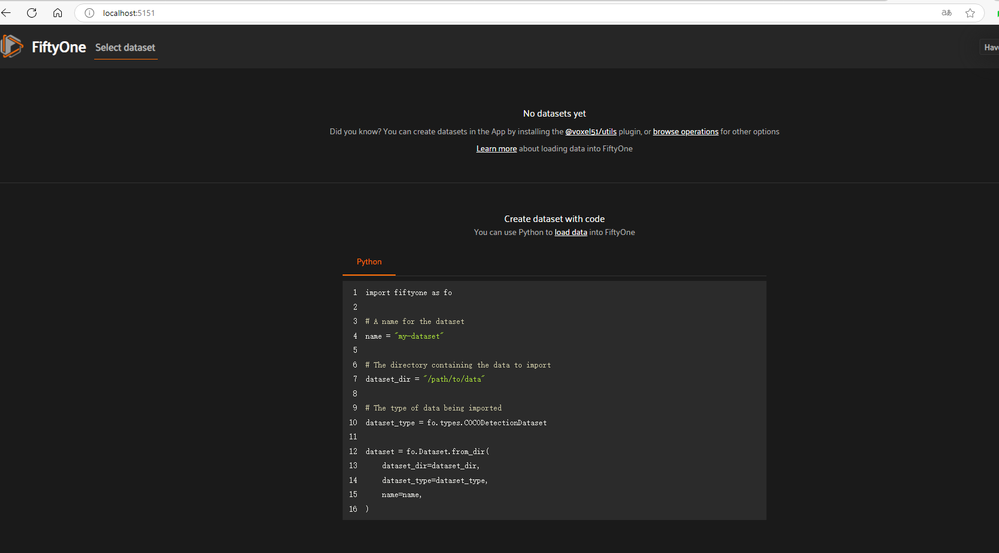

[FiftyOne Installation — FiftyOne 1.3.0 documentation](https://docs.voxel51.com/getting_started/install.html)


详细安装教程

[fiftyone · PyPI](https://pypi.org/project/fiftyone/)


```
pip install fiftyone
```


安装 ffmpeg，需要使用超级管理员打开 powershell 或 cmd，执行命令安装：

```
choco install ffmpeg
```


找一个空目录创建 main.py 和 fiftyone.bat 两个文件，内容分别为：

```python
import fiftyone as fo

session = fo.launch_app()
session.wait()
```


```
@echo off
python main.py
pause
```


由于此时没有导入数据集，Fiftyone 界面是空白状态。

