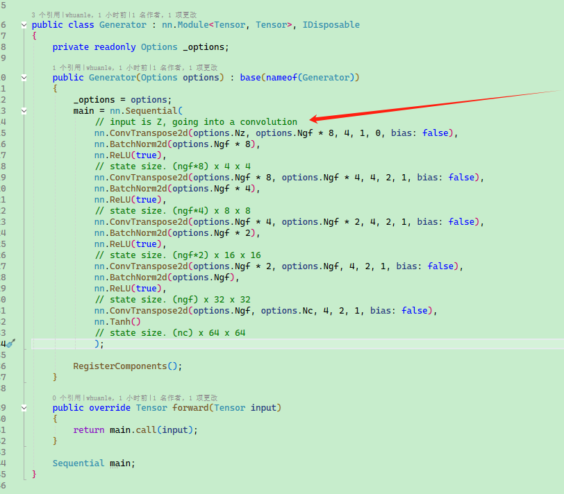
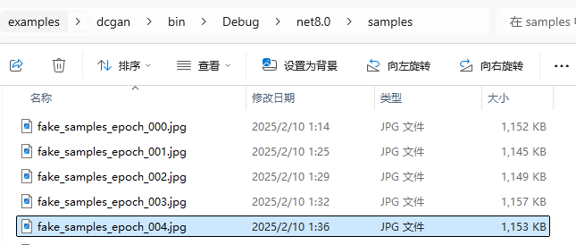
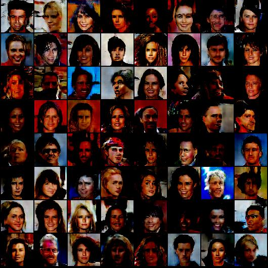

# 通过**生成**对抗网络(GAN)训练和生成头像

[TOC]

### 说明

本文根据 Pytorch 官方文档的示例移植而来，部分文字内容和图片来自 Pytorch 文档，文章后面不再单独列出引用说明。

官方文档地址：

https://pytorch.org/tutorials/beginner/dcgan_faces_tutorial.html

> 社区中文翻译版本：https://pytorch.ac.cn/tutorials/beginner/dcgan_faces_tutorial.html

<br />

Pytorch 示例项目仓库：

https://github.com/pytorch/examples

对应 Python 版本示例：https://github.com/pytorch/tutorials/blob/main/beginner_source/dcgan_faces_tutorial.py

<br />

本文项目参考 dcgan 项目：https://github.com/whuanle/Maomi.Torch/tree/main/examples/dcgan


### 简介

本教程将通过一个示例介绍生成对抗网络(DCGAN)，在教程中，我们将训练一个生成对抗网络 (GAN) 模型来生成新的名人头像。这里的大部分代码来自 [pytorch/examples](https://github.com/pytorch/examples) 中的 DCGAN 实现，然后笔者通过 C# 移植了代码实现，本文档将对该实现进行详尽的解释，并阐明该模型的工作原理和原因，阅读本文不需要 GAN 的基础知识，原理部分比较难理解，不用将精力放在这上面，主要是根据代码思路走一遍即可。

<br />

生成式对抗网络，简单来说就像笔者喜欢摄影，但是摄影水平跟专业摄影师有差距，然后不断苦练技术，每拍一张照片就让朋友判断是笔者拍的还是专业摄影师拍的，如果朋友一眼就发现是我拍的，说明水平还不行。然后一直练，一直拍，直到朋友区分不出照片是笔者拍的，还是专业摄影师拍的，这就是生成式对抗网络。

设计生成式对抗网络，需要设计生成网络和判断网络，生成网络读取训练图片并训练转换生成输出结果，然后由判断器识别，检查生成的图片和训练图片的差异，如果判断器可以区分出生成的图片和训练图片的差异，说明还需要继续训练，直到判断器区分不出来。


### 什么是 GAN

GANs 是一种教深度学习模型捕捉训练数据分布的框架，这样我们可以从相同的分布生成新的数据。GANs 由 Ian Goodfellow 于 2014 年发明，并首次在论文 [Generative Adversarial Nets](https://papers.nips.cc/paper/5423-generative-adversarial-nets.pdf) 中描述。它们由两个不同的模型组成，一个是*生成器*，另一个是*判别器*。生成器的任务是生成看起来像训练图像的“假”图像。判别器的任务是查看图像，并输出它是否是真实训练图像或来自生成器的假图像。在训练期间，生成器不断尝试通过生成越来越好的假图像来欺骗判别器，而判别器则努力成为一名更好的侦探，正确分类真实图像和假图像。这场博弈的平衡点是生成器生成完美的假图像，看起来似乎直接来自训练数据，而判别器总是以 50% 的置信度猜测生成器的输出是真实的还是假的。

现在，让我们定义一些将在整个教程中使用的符号，从判别器开始。设 $x$ 为表示图像的数据。$D(x)$ 是判别器网络，输出 $x$ 来自训练数据而不是生成器的（标量）概率。这里，由于我们处理的是图像，$D(x)$ 的输入是 CHW 尺寸为 3x64x64 的图像。直观上，当 $x$ 来自训练数据时，$D(x)$ 应该是高的，而当 $x$ 来自生成器时，$D(x)$ 应该是低的。$D(x)$ 也可以视为传统的二分类器。

对于生成器的符号，设 $z$ 为从标准正态分布中采样的潜在空间向量。$G(z)$ 表示将潜在向量 $z$ 映射到数据空间的生成器函数。$G$ 的目标是估计训练数据来自的分布 ($p_{data}$)，以便从该估计分布中生成假样本 ($p_g$)。

因此，$D(G(z))$ 是生成器输出 $G$ 为真实图像的概率（标量）。如 [Goodfellow 的论文](https://papers.nips.cc/paper/5423-generative-adversarial-nets.pdf) 中所描述，$D$ 和 $G$ 进行一个极小极大博弈，其中 $D$ 尽量最大化它正确分类真实和假的概率 ($logD(x)$)，而 $G$ 尽量最小化 $D$ 预测其输出为假的概率 ($log(1-D(G(z)))$)。在这篇论文中，GAN 损失函数为

$$\underset{G}{\text{min}} \underset{D}{\text{max}}V(D,G) = \mathbb{E}_{x\sim p_{data}(x)}\big[logD(x)\big] + \mathbb{E}_{z\sim p_{z}(z)}\big[log(1-D(G(z))\big]$$

理论上，这个极小极大博弈的解是 $p_g = p_{data}$，而判别器随机猜测输入是真实的还是假的。然而，GANs 的收敛理论仍在积极研究中，实际上模型并不总是能够训练到这一点。


### 什么是 DCGAN

DCGAN 是上述 GAN 的直接扩展，不同之处在于它在判别器和生成器中明确使用了卷积层和反卷积层。Radford 等人在论文[《利用深度卷积生成对抗网络进行无监督表示学习》](https://arxiv.org/pdf/1511.06434.pdf)中首次描述了这种方法。判别器由步幅卷积层、[批量归一化](https://pytorch.org/docs/stable/nn.html#torch.nn.BatchNorm2d)层以及[LeakyReLU](https://pytorch.org/docs/stable/nn.html#torch.nn.LeakyReLU)激活函数组成。输入是一个 3x64x64 的输入图像，输出是一个标量概率，表示输入是否来自真实的数据分布。生成器由[反卷积](https://pytorch.org/docs/stable/nn.html#torch.nn.ConvTranspose2d)层、批量归一化层和[ReLU](https://pytorch.org/docs/stable/nn.html#relu)激活函数组成。输入是从标准正态分布中抽取的潜在向量 $z$，输出是一个 3x64x64 的 RGB 图像。步幅的反卷积层允许将潜在向量转换为具有与图像相同形状的体积。在论文中，作者还提供了一些如何设置优化器、如何计算损失函数以及如何初始化模型权重的建议，这些将在后续章节中解释。

<br />

然后引入依赖并配置训练参数：

```csharp
using dcgan;
using Maomi.Torch;
using System.Diagnostics;
using TorchSharp;
using TorchSharp.Modules;
using static TorchSharp.torch;

// 使用 GPU 启动
Device defaultDevice = MM.GetOpTimalDevice();
torch.set_default_device(defaultDevice);

// Set random seed for reproducibility
var manualSeed = 999;

// manualSeed = random.randint(1, 10000) # use if you want new results
Console.WriteLine("Random Seed:" + manualSeed);
random.manual_seed(manualSeed);
torch.manual_seed(manualSeed);

Options options = new Options()
{
    Dataroot = "E:\\datasets\\celeba",
    // 设置这个可以并发加载数据集，加快训练速度
    Workers = 10,
    BatchSize = 128,
};
```

> 稍后讲解如何下载图片数据集。

<br />

用于训练的人像图片数据集大概是 22万张，不可能一次性全部加载，所以需要设置 BatchSize 参数分批导入、分批训练，如果读者的 GPU 性能比较高，则可以设置大一些。


### 参数说明

前面提到了 Options 模型类定义训练模型的参数，下面给出每个参数的详细说明。

> 注意字段名称略有差异，并且移植版本并不是所有参数都用上。

- `dataroot` - 数据集文件夹根目录的路径。我们将在下一节中详细讨论数据集。
- `workers` - 用于使用 `DataLoader` 加载数据的工作线程数。
- `batch_size` - 训练中使用的批大小。DCGAN 论文使用 128 的批大小。
- `image_size` - 用于训练的图像的空间大小。此实现默认为 64x64。如果需要其他大小，则必须更改 D 和 G 的结构。有关更多详细信息，请参阅 [此处](https://github.com/pytorch/examples/issues/70)。
- `nc` - 输入图像中的颜色通道数。对于彩色图像，此值为 3。
- `nz` - 潜在向量的长度。
- `ngf` - 与通过生成器传递的特征图的深度有关。
- `ndf` - 设置通过判别器传播的特征图的深度。
- `num_epochs` - 要运行的训练 epoch 数。训练时间越长可能会带来更好的结果，但也会花费更长的时间。
- `lr` - 训练的学习率。如 DCGAN 论文中所述，此数字应为 0.0002。
- `beta1` - Adam 优化器的 beta1 超参数。如论文中所述，此数字应为 0.5。
- `ngpu` - 可用的 GPU 数量。如果此值为 0，则代码将在 CPU 模式下运行。如果此数字大于 0，则它将在那几个 GPU 上运行。

<br />

首先定义一个全局参数模型类，并设置默认值：

```csharp
public class Options
{
    /// <summary>
    /// Root directory for dataset
    /// </summary>
    public string Dataroot { get; set; } = "data/celeba";

    /// <summary>
    /// Number of workers for dataloader
    /// </summary>
    public int Workers { get; set; } = 2;

    /// <summary>
    /// Batch size during training
    /// </summary>
    public int BatchSize { get; set; } = 128;

    /// <summary>
    /// Spatial size of training images. All images will be resized to this size using a transformer.
    /// </summary>
    public int ImageSize { get; set; } = 64;

    /// <summary>
    /// Number of channels in the training images. For color images this is 3
    /// </summary>
    public int Nc { get; set; } = 3;

    /// <summary>
    /// Size of z latent vector (i.e. size of generator input)
    /// </summary>
    public int Nz { get; set; } = 100;

    /// <summary>
    /// Size of feature maps in generator
    /// </summary>
    public int Ngf { get; set; } = 64;

    /// <summary>
    /// Size of feature maps in discriminator
    /// </summary>
    public int Ndf { get; set; } = 64;

    /// <summary>
    /// Number of training epochs
    /// </summary>
    public int NumEpochs { get; set; } = 5;

    /// <summary>
    /// Learning rate for optimizers
    /// </summary>
    public double Lr { get; set; } = 0.0002;

    /// <summary>
    /// Beta1 hyperparameter for Adam optimizers
    /// </summary>
    public double Beta1 { get; set; } = 0.5;

    /// <summary>
    /// Number of GPUs available. Use 0 for CPU mode.
    /// </summary>
    public int Ngpu { get; set; } = 1;
}
```


### 数据集处理

本教程中，我们将使用 [Celeb-A Faces 数据集](http://mmlab.ie.cuhk.edu.hk/projects/CelebA.html) 来训练模型，可以从链接网站或在 [Google Drive](https://drive.google.com/drive/folders/0B7EVK8r0v71pTUZsaXdaSnZBZzg) 下载。

数据集官方地址：https://mmlab.ie.cuhk.edu.hk/projects/CelebA.html

可以通过 Google 网盘或百度网盘下载：

https://drive.google.com/drive/folders/0B7EVK8r0v71pWEZsZE9oNnFzTm8?resourcekey=0-5BR16BdXnb8hVj6CNHKzLg&usp=sharing

https://pan.baidu.com/s/1CRxxhoQ97A5qbsKO7iaAJg

> 提取码：`rp0s`

<br />

注意，本文只需要用到图片，不需要用到标签，不用下载所有文件，只需要下载 `CelebA/Img/img_align_celeba.zip` 即可。下载后解压到一个空目录中，其目录结构示例：

```sh
/path/to/celeba
    -> img_align_celeba  
        -> 188242.jpg
        -> 173822.jpg
        -> 284702.jpg
        -> 537394.jpg
           ...
```

<br />

然后在 `Options.Dataroot` 参数填写 `/path/to/celeba` 即可，导入数据集时会自动搜索该目录下的子目录，将子目录作为图像的分类名称，然后向子目录加载所有图像文件。

<br />

这是一个重要步骤，因为我们将使用 `ImageFolder` 数据集类，该类要求数据集根文件夹中有子目录。现在，我们可以创建数据集，创建数据加载器，设置运行设备，并最终可视化一些训练数据。

<br />

```csharp
// 创建一个 samples 目录用于输出训练过程中产生的输出效果
if(Directory.Exists("samples"))
{
    Directory.Delete("samples", true);
}

Directory.CreateDirectory("samples");

// 加载图像并对图像做转换处理
var dataset = MM.Datasets.ImageFolder(options.Dataroot, torchvision.transforms.Compose(
    torchvision.transforms.Resize(options.ImageSize),
    torchvision.transforms.CenterCrop(options.ImageSize),
    torchvision.transforms.ConvertImageDtype(ScalarType.Float32),
    torchvision.transforms.Normalize(new double[] { 0.5, 0.5, 0.5 }, new double[] { 0.5, 0.5, 0.5 }))
);

// 分批加载图像
var dataloader = torch.utils.data.DataLoader(dataset, batchSize: options.BatchSize, shuffle: true, num_worker: options.Workers, device: defaultDevice);

var netG = new dcgan.Generator(options).to(defaultDevice);
```

<br />

在设置好输入参数并准备好数据集后，我们现在可以进入实现部分。我们将从权重初始化策略开始，然后详细讨论生成器、判别器、损失函数和训练循环。

<br />

### 权重初始化

根据 DCGAN 论文，作者指出所有模型权重应从均值为 0，标准差为 0.02 的正态分布中随机初始化。`weights_init` 函数以已初始化的模型为输入，重新初始化所有卷积层、转置卷积层和批量归一化层以满足此标准。此函数在模型初始化后立即应用于模型。

<br />

```csharp
static void weights_init(nn.Module m)
{
    var classname = m.GetType().Name;
    if (classname.Contains("Conv"))
    {
        if (m is Conv2d conv2d)
        {
            nn.init.normal_(conv2d.weight, 0.0, 0.02);
        }
    }
    else if (classname.Contains("BatchNorm"))
    {
        if (m is BatchNorm2d batchNorm2d)
        {
            nn.init.normal_(batchNorm2d.weight, 1.0, 0.02);
            nn.init.zeros_(batchNorm2d.bias);
        }
    }
}

```

<br />

网络模型会有多层结构，模型训练时到不同的层时会自动调用 weights_init 函数初始化，作用对象不是模型本身，而是网络模型的层。




### 生成器

生成器 $G$ 旨在将潜在空间向量 ( $z$ ) 映射到数据空间。由于我们的数据是图像，将 $z$ 转换为数据空间意味着最终要创建一个与训练图像具有相同大小的 RGB 图像 (即 3x64x64)。在实践中，这是通过一系列步幅为二维的卷积转置层来实现的，每一层都配有一个 2d 批量规范化层和一个 relu 激活函数。生成器的输出通过一个 tanh 函数返回到输入数据范围 $[-1,1]$ 。值得注意的是在 conv-transpose 层之后存在批量规范化函数，因为这是 DCGAN 论文的重要贡献之一。这些层有助于训练期间梯度的流动。下图显示了 DCGAN 论文中的生成器。


<br />请注意，我们在输入部分设置的输入（`nz`，`ngf`，和 `nc`）如何影响代码中生成器的架构。`nz` 是 z 输入向量的长度，`ngf` 与在生成器中传播的特征图的大小有关，而 `nc` 是输出图像中的通道数（对于 RGB 图像设置为 3）。下面是生成器的代码。

<br />

定义图像生成的网络模型：

```csharp
public class Generator : nn.Module<Tensor, Tensor>, IDisposable
{
    private readonly Options _options;

    public Generator(Options options) : base(nameof(Generator))
    {
        _options = options;
        main = nn.Sequential(
            // input is Z, going into a convolution
            nn.ConvTranspose2d(options.Nz, options.Ngf * 8, 4, 1, 0, bias: false),
            nn.BatchNorm2d(options.Ngf * 8),
            nn.ReLU(true),
            // state size. (ngf*8) x 4 x 4
            nn.ConvTranspose2d(options.Ngf * 8, options.Ngf * 4, 4, 2, 1, bias: false),
            nn.BatchNorm2d(options.Ngf * 4),
            nn.ReLU(true),
            // state size. (ngf*4) x 8 x 8
            nn.ConvTranspose2d(options.Ngf * 4, options.Ngf * 2, 4, 2, 1, bias: false),
            nn.BatchNorm2d(options.Ngf * 2),
            nn.ReLU(true),
            // state size. (ngf*2) x 16 x 16
            nn.ConvTranspose2d(options.Ngf * 2, options.Ngf, 4, 2, 1, bias: false),
            nn.BatchNorm2d(options.Ngf),
            nn.ReLU(true),
            // state size. (ngf) x 32 x 32
            nn.ConvTranspose2d(options.Ngf, options.Nc, 4, 2, 1, bias: false),
            nn.Tanh()
            // state size. (nc) x 64 x 64
            );

        RegisterComponents();
    }

    public override Tensor forward(Tensor input)
    {
        return main.call(input);
    }

    Sequential main;
}
```

<br />

初始化模型：

```csharp
var netG = new dcgan.Generator(options).to(defaultDevice);
netG.apply(weights_init);
Console.WriteLine(netG);
```


### 判别器

如前所述，判别器 $D$ 是一个二分类网络，它以图像为输入并输出一个标量概率，即输入图像是真实的（而非伪造的）的概率。这里，$D$ 接受一个 3x64x64 的输入图像，通过一系列的 Conv2d、BatchNorm2d 和 LeakyReLU 层进行处理，并通过 Sigmoid 激活函数输出最终的概率。根据问题的需要，可以扩展这一架构以包含更多层数，但使用跨步卷积、BatchNorm 和 LeakyReLUs 是有意义的。DCGAN 论文提到，使用跨步卷积而非池化来进行下采样是一个好习惯，因为它使网络能够学习其自己的池化函数。此外，批量规范化和 leaky relu 函数促进了健康的梯度流动，这对 $G$ 和 $D$ 的学习过程至关重要。

<br />

定义判别器网络模型：

```csharp
public class Discriminator : nn.Module<Tensor, Tensor>, IDisposable
{
    private readonly Options _options;

    public Discriminator(Options options) : base(nameof(Discriminator))
    {
        _options = options;

        main = nn.Sequential(
            // input is (nc) x 64 x 64
            nn.Conv2d(options.Nc, options.Ndf, 4, 2, 1, bias: false),
            nn.LeakyReLU(0.2, inplace: true),
            // state size. (ndf) x 32 x 32
            nn.Conv2d(options.Ndf, options.Ndf * 2, 4, 2, 1, bias: false),
            nn.BatchNorm2d(options.Ndf * 2),
            nn.LeakyReLU(0.2, inplace: true),
            // state size. (ndf*2) x 16 x 16
            nn.Conv2d(options.Ndf * 2, options.Ndf * 4, 4, 2, 1, bias: false),
            nn.BatchNorm2d(options.Ndf * 4),
            nn.LeakyReLU(0.2, inplace: true),
            // state size. (ndf*4) x 8 x 8
            nn.Conv2d(options.Ndf * 4, options.Ndf * 8, 4, 2, 1, bias: false),
            nn.BatchNorm2d(options.Ndf * 8),
            nn.LeakyReLU(0.2, inplace: true),
            // state size. (ndf*8) x 4 x 4
            nn.Conv2d(options.Ndf * 8, 1, 4, 1, 0, bias: false),
            nn.Sigmoid()
            );

        RegisterComponents();
    }

    public override Tensor forward(Tensor input)
    {
        var output =  main.call(input);

        return output.view(-1, 1).squeeze(1);
    }

    Sequential main;
}
```

<br />

初始化模型：

```csharp
var netD = new dcgan.Discriminator(options).to(defaultDevice);
netD.apply(weights_init);
Console.WriteLine(netD);
```


### 损失函数和优化器

设置好 $D$ 和 $G$ 后，我们可以通过损失函数和优化器指定它们的学习方式。我们将使用二元交叉熵损失函数（[BCELoss](https://pytorch.org/docs/stable/generated/torch.nn.BCELoss.html#torch.nn.BCELoss)），它在 PyTorch 中定义如下：

$$
\ell(x, y) = L = \{l_1,\dots,l_N\}^\top, \quad l_n = - \left[ y_n \cdot \log x_n + (1 - y_n) \cdot \log (1 - x_n) \right]
$$


<br />

请注意，这个函数提供了目标函数中两个对数分量，即 $log(D(x))$ 和 $log(1-D(G(z)))$ 的计算。我们可以通过 $y$ 输入来指定使用 BCE 方程的哪一部分。这将在即将到来的训练循环中完成，但是了解我们可以通过改变 $y$（即 GT 标签）选择希望计算的分量非常重要。

接下来，我们将真实标签定义为 1，假的标签定义为 0。这些标签将在计算 $D$ 和 $G$ 的损失时使用，这也是原始 GAN 论文中使用的约定。最后，我们设置两个独立的优化器，一个用于 $D$，另一个用于 $G$。根据 DCGAN 论文的规定，两者都是 Adam 优化器，学习率为 0.0002，Beta1 = 0.5。为了追踪生成器的学习进展，我们将生成一个从高斯分布中抽取的固定批次的潜在向量（即 fixed_noise）。在训练循环中，我们将定期将这个 fixed_noise 输入 $G$，并且在迭代过程中，我们将看到图像从噪声中形成。

<br />

```csharp
var criterion = nn.BCELoss();
var fixed_noise = torch.randn(new long[] { options.BatchSize, options.Nz, 1, 1 }, device: defaultDevice);
var real_label = 1.0;
var fake_label = 0.0;
var optimizerD = torch.optim.Adam(netD.parameters(), lr: options.Lr, beta1: options.Beta1, beta2: 0.999);
var optimizerG = torch.optim.Adam(netG.parameters(), lr: options.Lr, beta1: options.Beta1, beta2: 0.999);
```


### 训练

最后，在我们定义了GAN框架的所有部分之后，我们可以开始训练它了。请注意，训练GANs在某种程度上是一门艺术，因为不正确的超参数设置会导致模式崩溃，并且很难解释出了什么问题。在这里，我们将紧密遵循 [Goodfellow的论文](https://papers.nips.cc/paper/5423-generative-adversarial-nets.pdf) 中的算法1，同时遵循一些在[ganhacks](https://github.com/soumith/ganhacks)中显示的最佳实践。具体来说，我们将“为真实和虚假的图像构建不同的小批量”，并调整G的目标函数以最大化 $log(D(G(z)))$ 。训练分为两个主要部分：第一部分更新判别器，第二部分更新生成器。

**第1部分 - 训练判别器**

回顾一下，训练判别器的目标是最大化正确分类给定输入为真实或虚假的概率。根据Goodfellow的说法，我们希望“通过上升随机梯度来更新判别器”。实际上，我们希望最大化 $log(D(x)) + log(1-D(G(z)))$ 。根据 [ganhacks](https://github.com/soumith/ganhacks) 的独立小批量建议，我们将分两步计算这一点。首先，我们将从训练集中构建一个真实样本的小批量，前向传递通过 $D$，计算损失 ( $log(D(x))$ ) ，然后反向传递计算梯度。其次，我们将使用当前的生成器构建一个虚假样本的小批量，将此批次前向传递通过 $D$，计算损失 ( $log(1-D(G(z)))$ )，并通过反向传递*累积*梯度。现在，随着从全真和全假批次累积的梯度，我们调用判别器优化器的一步。

**第2部分 - 训练生成器**

如原论文所述，我们希望通过最小化 $log(1-D(G(z)))$ 来训练生成器，以便生成更好的虚假样本。如前所述，Goodfellow 显示这在学习过程中尤其是早期不会提供足够的梯度。作为解决方案，我们希望最大化 $log(D(G(z)))$ 。在代码中，我们通过以下方法实现这一点：使用判别器对第1部分生成器的输出进行分类，使用真实标签作为GT计算G的损失，在反向传递中计算G的梯度，最后用优化器一步更新G的参数。使用真实标签作为损失函数的GT标签可能看起来违反直觉，但这允许我们使用 `BCELoss` 的 $log(x)$ 部分（而不是 $log(1-x)$ 部分），这正是我们所需要的。

最后，我们将进行一些统计报告，并且在每个epoch结束时，我们将通过生成器推送我们的固定噪声批次，以便直观地跟踪G的训练进度。报告的训练统计数据包括：

-   **Loss\_D** - 判别器损失，计算为全真和全假批次损失的总和 ( $log(D(x)) + log(1 - D(G(z)))$ )。
-   **Loss\_G** - 生成器损失，计算为 $log(D(G(z)))$
-   **D(x)** - 判别器对全真批次的平均输出（跨批次）。这应该从接近 1 开始，然后在G变好时理论上收敛到 0.5。想想这是为什么。
-   **D(G(z))** - 判别器对全假批次的平均输出。第一个数字是 D 更新之前的，第二个数字是 D 更新之后的。这些数字应该从接近0开始，并在 G 变好时收敛到 0.5。想想这是为什么。

**注意：** 这一步可能需要一段时间，具体取决于你运行了多少个epochs以及是否从数据集中删除了一些数据。

<br />

```csharp
var img_list = new List<Tensor>();
var G_losses = new List<double>();
var D_losses = new List<double>();

Console.WriteLine("Starting Training Loop...");

Stopwatch stopwatch = new();
stopwatch.Start();
int i = 0;
// For each epoch
for (int epoch = 0; epoch < options.NumEpochs; epoch++)
{
    foreach (var item in dataloader)
    {
        var data = item[0];

        netD.zero_grad();
        // Format batch
        var real_cpu = data.to(defaultDevice);
        var b_size = real_cpu.size(0);
        var label = torch.full(new long[] { b_size }, real_label, dtype: ScalarType.Float32, device: defaultDevice);
        // Forward pass real batch through D
        var output = netD.forward(real_cpu);
        // Calculate loss on all-real batch
        var errD_real = criterion.call(output, label);
        // Calculate gradients for D in backward pass
        errD_real.backward();
        var D_x = output.mean().item<float>();

        // Train with all-fake batch
        // Generate batch of latent vectors
        var noise = torch.randn(new long[] { b_size, options.Nz, 1, 1 }, device: defaultDevice);
        // Generate fake image batch with G
        var fake = netG.call(noise);
        label.fill_(fake_label);
        // Classify all fake batch with D
        output = netD.call(fake.detach());
        // Calculate D's loss on the all-fake batch
        var errD_fake = criterion.call(output, label);
        // Calculate the gradients for this batch, accumulated (summed) with previous gradients
        errD_fake.backward();
        var D_G_z1 = output.mean().item<float>();
        // Compute error of D as sum over the fake and the real batches
        var errD = errD_real + errD_fake;
        // Update D
        optimizerD.step();

        ////////////////////////////
        // (2) Update G network: maximize log(D(G(z)))
        ////////////////////////////
        netG.zero_grad();
        label.fill_(real_label);  // fake labels are real for generator cost
        // Since we just updated D, perform another forward pass of all-fake batch through D
        output = netD.call(fake);
        // Calculate G's loss based on this output
        var errG = criterion.call(output, label);
        // Calculate gradients for G
        errG.backward();
        var D_G_z2 = output.mean().item<float>();
        // Update G
        optimizerG.step();

        // ex: [0/25][4/3166] Loss_D: 0.5676 Loss_G: 7.5972 D(x): 0.9131 D(G(z)): 0.3024 / 0.0007
        Console.WriteLine($"[{epoch}/{options.NumEpochs}][{i%dataloader.Count}/{dataloader.Count}] Loss_D: {errD.item<float>():F4} Loss_G: {errG.item<float>():F4} D(x): {D_x:F4} D(G(z)): {D_G_z1:F4} / {D_G_z2:F4}");

        // 每处理 100 批，输出一次图片效果
        if (i % 100 == 0)
        {
            real_cpu.SaveJpeg("samples/real_samples.jpg");
            fake = netG.call(fixed_noise);
            fake.detach().SaveJpeg("samples/fake_samples_epoch_{epoch:D3}.jpg");
        }

        i++;
    }


    netG.save("samples/netg_{epoch}.dat");
    netD.save("samples/netd_{epoch}.dat");
}
```

<br />

最后打印训练结果和输出：

```csharp
Console.WriteLine("Training finished.");
stopwatch.Stop();
Console.WriteLine("Training Time: {stopwatch.Elapsed}");

netG.save("samples/netg.dat");
netD.save("samples/netd.dat");
```

<br />

按照官方示例推荐进行 25 轮训练，由于笔者使用使用 4060TI 8G 机器训练，训练 25 轮大概时间：

```
Training finished.
Training Time: 00:49:45.6976041
```

<br />

每轮训练结果的图像：



<br />第一轮训练生成：


<br />

第 25 轮生成的：


<br />

虽然还是有些抽象，但生成结果比之前好一些了。


在 dcgan_out 项目中开业看到，使用 5 轮训练结果输出的模型，生成图像：

```csharp
Device defaultDevice = MM.GetOpTimalDevice();
torch.set_default_device(defaultDevice);

// Set random seed for reproducibility
var manualSeed = 999;

// manualSeed = random.randint(1, 10000) # use if you want new results
Console.WriteLine("Random Seed:" + manualSeed);
random.manual_seed(manualSeed);
torch.manual_seed(manualSeed);


Options options = new Options()
{
    Dataroot = "E:\\datasets\\celeba",
    Workers = 10,
    BatchSize = 128,
};

var netG = new dcgan.Generator(options);
netG.to(defaultDevice);
netG.load("netg.dat");

// 生成随机噪声
var fixed_noise = torch.randn(64, options.Nz, 1, 1, device: defaultDevice);

// 生成图像
var fake_images = netG.call(fixed_noise);

fake_images.SaveJpeg("fake_images.jpg");
```

<br />虽然还是有些抽象，但确实还行。

