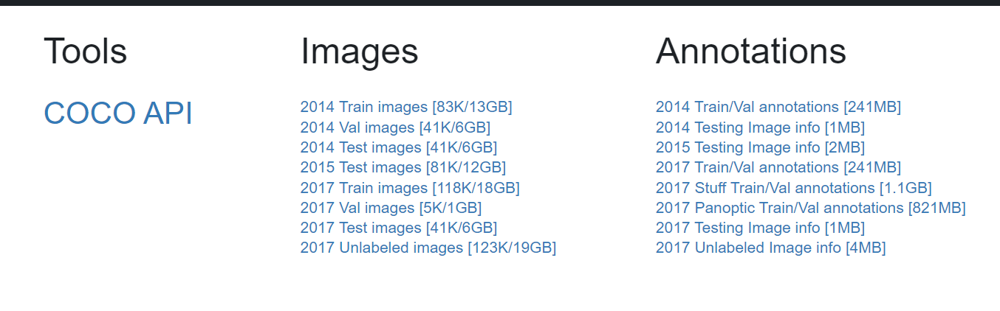

COCO数据集是一个大型的、丰富的物体检测，分割和字幕数据集。这个数据集以scene understanding为目标，主要从复杂的日常场景中截取，图像中的目标通过精确的segmentation进行位置的标定。图像包括91类目标，328,000影像和2,500,000个label。目前为止有语义分割的最大数据集，提供的类别有80 类，有超过33 万张图片，其中20 万张有标注，整个数据集中个体的数目超过150 万个。

[COCO - Common Objects in Context](https://cocodataset.org/#download)


training  validation testing images




由于国内网络下载实在太慢，因此我们通过 OpenDataLab 开源数据集仓库平台下载，

[数据集-OpenDataLab](https://opendatalab.com/OpenDataLab/COCO_2017)


执行命令下载：

```
openxlab dataset get --dataset-repo OpenDataLab/COCO_2017
```


由于整个仓库接近 50G，下载和解压需要很长时间，所以需要耐心等待，在等待过程中，先把代码写一下。

